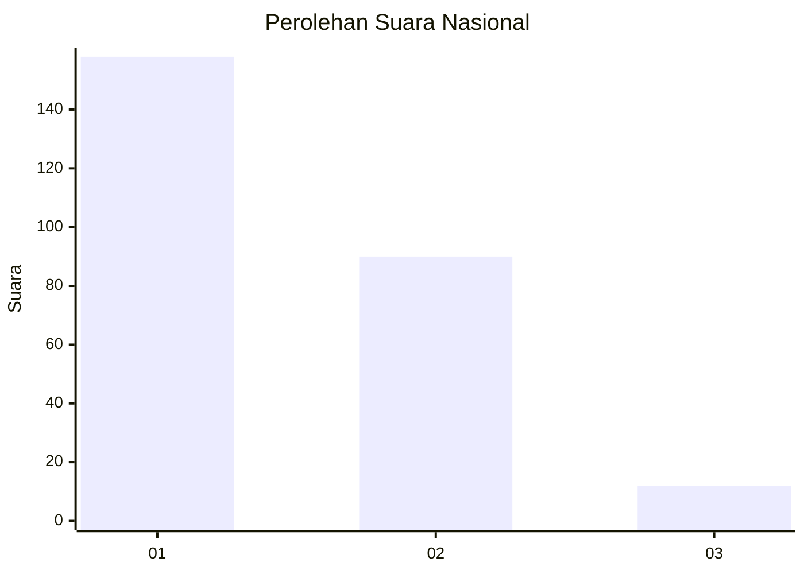
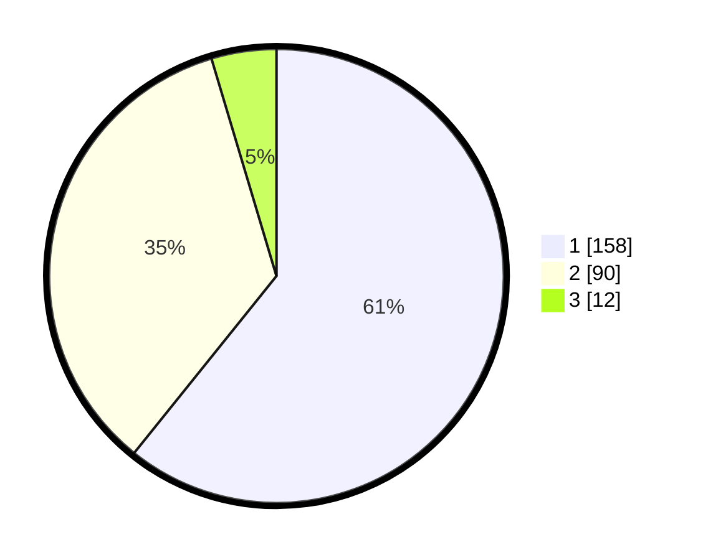

# Hasil

## Grafik

## Tabel

| No. | Nama Paslon    | Suara | Suara (raw) | Persentase |
|:--- |:-------------- | -----:| -----------:| ----------:|
| 1   | ANIES MUHAIMIN | 158   | [158][p-1]  | 60,77      |
| 2   | PRABOWO GIBRAN | 90    | [90][p-2]   | 34,62      |
| 3   | GANJAR MAHFUD  | 12    | [12][p-3]   | 4,62       |

[p-1]: https://github.com/gigit-pemilu/pemilu-2024/blob/main/pilpres/hitung-suara/sub/73-sulawesi-selatan/sub/10-pangkajene-dan-kepulauan/sub/06-bungoro/sub/2008-biring-ere/sub/003-tps/sub/paslon-1.txt
[p-2]: https://github.com/gigit-pemilu/pemilu-2024/blob/main/pilpres/hitung-suara/sub/73-sulawesi-selatan/sub/10-pangkajene-dan-kepulauan/sub/06-bungoro/sub/2008-biring-ere/sub/003-tps/sub/paslon-2.txt
[p-3]: https://github.com/gigit-pemilu/pemilu-2024/blob/main/pilpres/hitung-suara/sub/73-sulawesi-selatan/sub/10-pangkajene-dan-kepulauan/sub/06-bungoro/sub/2008-biring-ere/sub/003-tps/sub/paslon-3.txt

## Foto C Plano

https://sirekap-obj-formc.kpu.go.id/b7da/pemilu/ppwp/73/10/06/20/08/7310062008003-20240215-085216--a210ae1d-9033-4bfb-8cb5-2e918f95bbe3.jpg

https://sirekap-obj-formc.kpu.go.id/b7da/pemilu/ppwp/73/10/06/20/08/7310062008003-20240215-085546--c344b5ff-948c-4eb9-98c5-99ba3d7d136b.jpg

https://sirekap-obj-formc.kpu.go.id/b7da/pemilu/ppwp/73/10/06/20/08/7310062008003-20240215-085711--bd245e6f-110d-4064-a199-d012d842a881.jpg

## Metadata

| Key        | Value               |
| ---------- | ------------------- |
| Time Stamp | 2024-02-15 15:00:29 |

