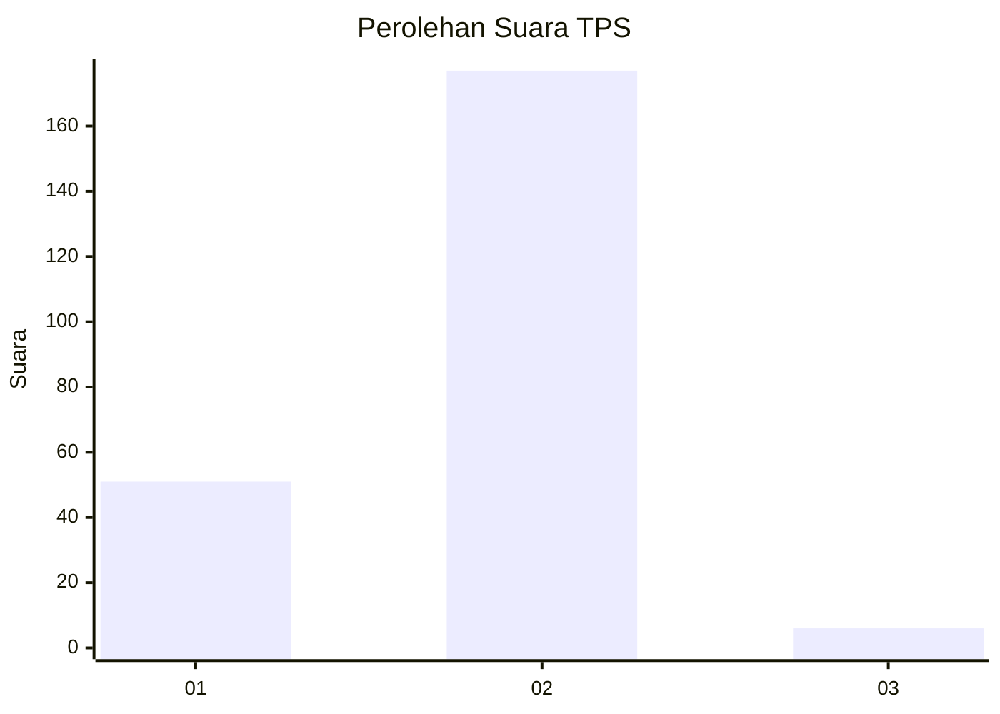
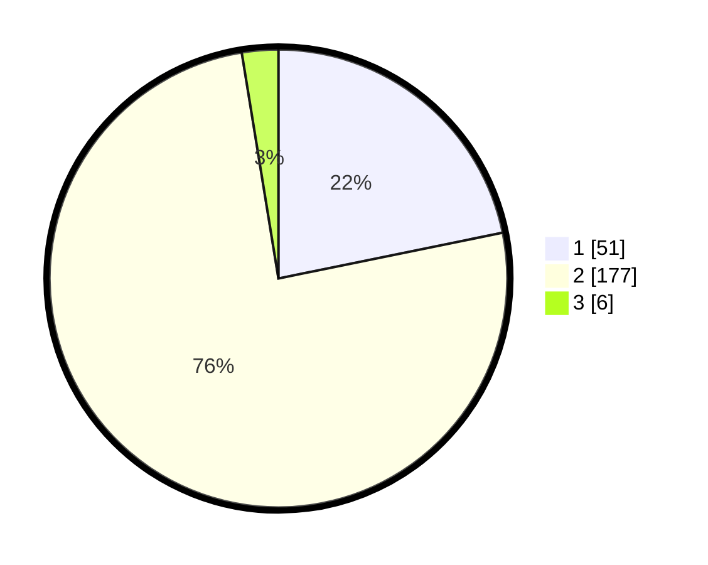

# Hasil

## Grafik

## Tabel

| No. | Nama Paslon    | Suara | Suara (raw) | Persentase |
|:--- |:-------------- | -----:| -----------:| ----------:|
| 1   | ANIES MUHAIMIN | 51    | [51][p-1]   | 21,79      |
| 2   | PRABOWO GIBRAN | 177   | [177][p-2]  | 75,64      |
| 3   | GANJAR MAHFUD  | 6     | [6][p-3]    | 2,56       |

[p-1]: https://github.com/gigit-pemilu/pemilu-2024-73-sulawesi-selatan/blob/main/pilpres/hitung-suara/sub/73-sulawesi-selatan/sub/10-pangkajene-dan-kepulauan/sub/09-segeri/sub/1001-bonto-matene/sub/006-tps/sub/paslon-1.txt
[p-2]: https://github.com/gigit-pemilu/pemilu-2024-73-sulawesi-selatan/blob/main/pilpres/hitung-suara/sub/73-sulawesi-selatan/sub/10-pangkajene-dan-kepulauan/sub/09-segeri/sub/1001-bonto-matene/sub/006-tps/sub/paslon-2.txt
[p-3]: https://github.com/gigit-pemilu/pemilu-2024-73-sulawesi-selatan/blob/main/pilpres/hitung-suara/sub/73-sulawesi-selatan/sub/10-pangkajene-dan-kepulauan/sub/09-segeri/sub/1001-bonto-matene/sub/006-tps/sub/paslon-3.txt

## Foto C Plano

https://sirekap-obj-formc.kpu.go.id/ff82/pemilu/ppwp/73/10/09/10/01/7310091001006-20240214-141606--2e460dd1-9264-4429-af41-796a5fd74fe0.jpg

https://sirekap-obj-formc.kpu.go.id/ff82/pemilu/ppwp/73/10/09/10/01/7310091001006-20240214-141901--af2b03cd-a143-4075-a4eb-423dc9ed5de1.jpg

https://sirekap-obj-formc.kpu.go.id/ff82/pemilu/ppwp/73/10/09/10/01/7310091001006-20240214-155242--b8d4fc06-96fb-4aa4-90dd-1fe78749d14f.jpg

## Metadata

| Key        | Value               |
| ---------- | ------------------- |
| Time Stamp | 2024-02-15 15:00:29 |

