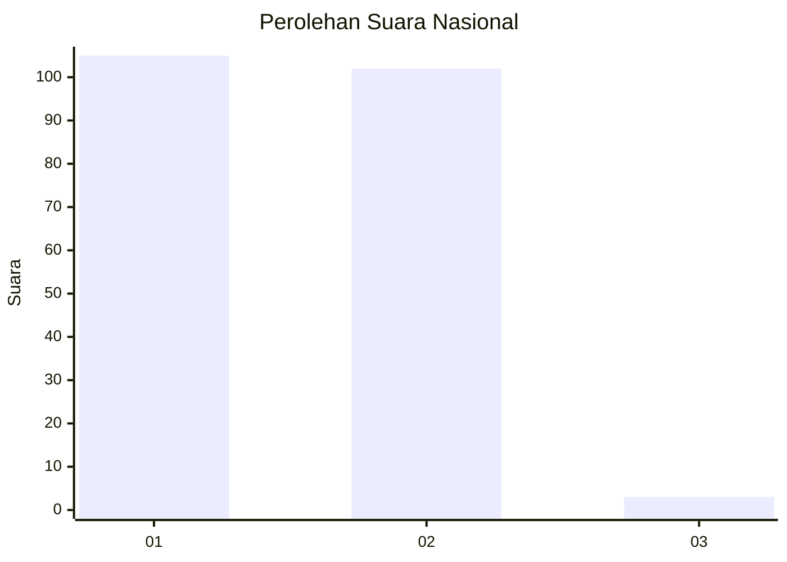
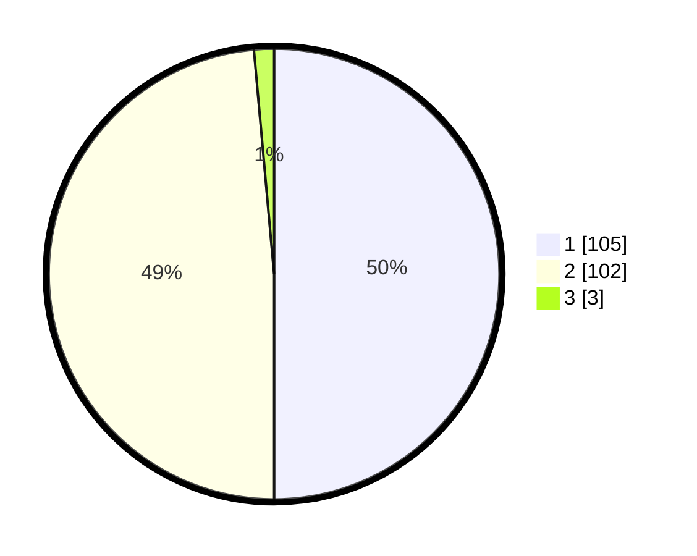

# Hasil

## Grafik

## Tabel

| No. | Nama Paslon    | Suara | Suara (raw) | Persentase |
|:--- |:-------------- | -----:| -----------:| ----------:|
| 1   | ANIES MUHAIMIN | 105   | [105][p-1]  | 50,00      |
| 2   | PRABOWO GIBRAN | 102   | [102][p-2]  | 48,57      |
| 3   | GANJAR MAHFUD  | 3     | [3][p-3]    | 1,43       |

[p-1]: https://github.com/gigit-pemilu/pemilu-2024/blob/main/pilpres/hitung-suara/sub/73-sulawesi-selatan/sub/10-pangkajene-dan-kepulauan/sub/10-minasa-tene/sub/1001-minasa-te'ne/sub/004-tps/sub/paslon-1.txt
[p-2]: https://github.com/gigit-pemilu/pemilu-2024/blob/main/pilpres/hitung-suara/sub/73-sulawesi-selatan/sub/10-pangkajene-dan-kepulauan/sub/10-minasa-tene/sub/1001-minasa-te'ne/sub/004-tps/sub/paslon-2.txt
[p-3]: https://github.com/gigit-pemilu/pemilu-2024/blob/main/pilpres/hitung-suara/sub/73-sulawesi-selatan/sub/10-pangkajene-dan-kepulauan/sub/10-minasa-tene/sub/1001-minasa-te'ne/sub/004-tps/sub/paslon-3.txt

## Foto C Plano

https://sirekap-obj-formc.kpu.go.id/a972/pemilu/ppwp/73/10/10/10/01/7310101001004-20240215-014409--ca759374-0552-4c2e-a3e7-34ccde6f8138.jpg

https://sirekap-obj-formc.kpu.go.id/a972/pemilu/ppwp/73/10/10/10/01/7310101001004-20240215-014506--34427ffc-2a89-40f1-bdad-b6721462bd69.jpg

https://sirekap-obj-formc.kpu.go.id/a972/pemilu/ppwp/73/10/10/10/01/7310101001004-20240215-014631--d88044d9-7eef-4ff8-b2f9-dce8111de996.jpg

## Metadata

| Key        | Value               |
| ---------- | ------------------- |
| Time Stamp | 2024-02-15 17:00:25 |

