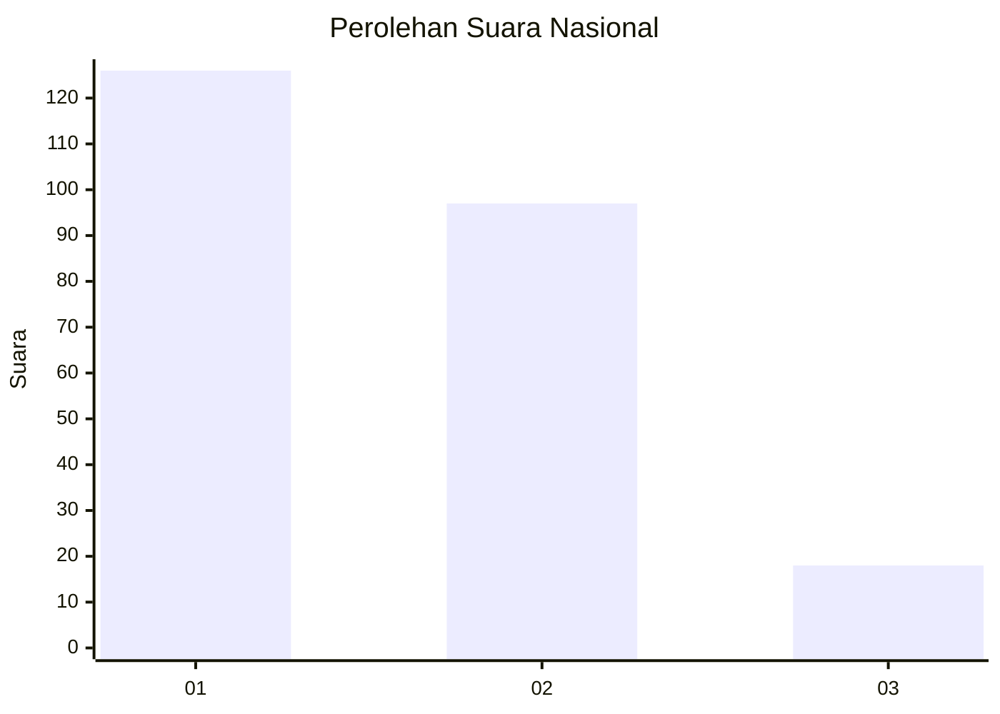
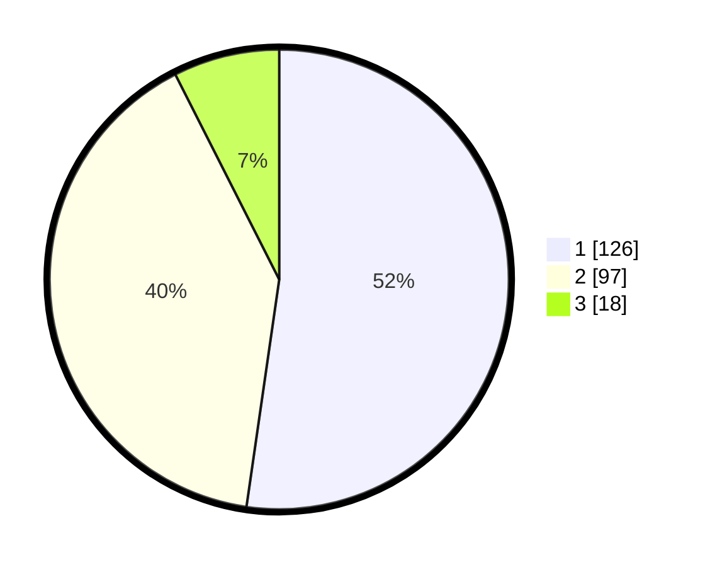

# Hasil

## Grafik

## Tabel

| No. | Nama Paslon    | Suara | Suara (raw) | Persentase |
|:--- |:-------------- | -----:| -----------:| ----------:|
| 1   | ANIES MUHAIMIN | 126   | [126][p-1]  | 52,28      |
| 2   | PRABOWO GIBRAN | 97    | [97][p-2]   | 40,25      |
| 3   | GANJAR MAHFUD  | 18    | [18][p-3]   | 7,47       |

[p-1]: https://github.com/gigit-pemilu/pemilu-2024/blob/main/pilpres/hitung-suara/sub/73-sulawesi-selatan/sub/10-pangkajene-dan-kepulauan/sub/10-minasa-tene/sub/1001-minasa-te'ne/sub/005-tps/sub/paslon-1.txt
[p-2]: https://github.com/gigit-pemilu/pemilu-2024/blob/main/pilpres/hitung-suara/sub/73-sulawesi-selatan/sub/10-pangkajene-dan-kepulauan/sub/10-minasa-tene/sub/1001-minasa-te'ne/sub/005-tps/sub/paslon-2.txt
[p-3]: https://github.com/gigit-pemilu/pemilu-2024/blob/main/pilpres/hitung-suara/sub/73-sulawesi-selatan/sub/10-pangkajene-dan-kepulauan/sub/10-minasa-tene/sub/1001-minasa-te'ne/sub/005-tps/sub/paslon-3.txt

## Foto C Plano

https://sirekap-obj-formc.kpu.go.id/5a03/pemilu/ppwp/73/10/10/10/01/7310101001005-20240215-043432--9107778a-3b48-4d14-8cfe-6f1c77cf963d.jpg

https://sirekap-obj-formc.kpu.go.id/5a03/pemilu/ppwp/73/10/10/10/01/7310101001005-20240215-043255--f4ae5071-f9a2-43ed-976c-8ca7031ba0c6.jpg

https://sirekap-obj-formc.kpu.go.id/5a03/pemilu/ppwp/73/10/10/10/01/7310101001005-20240215-042908--8c19ad26-6336-49f4-a421-8bb54ba12c37.jpg

## Metadata

| Key        | Value               |
| ---------- | ------------------- |
| Time Stamp | 2024-02-15 20:00:44 |

