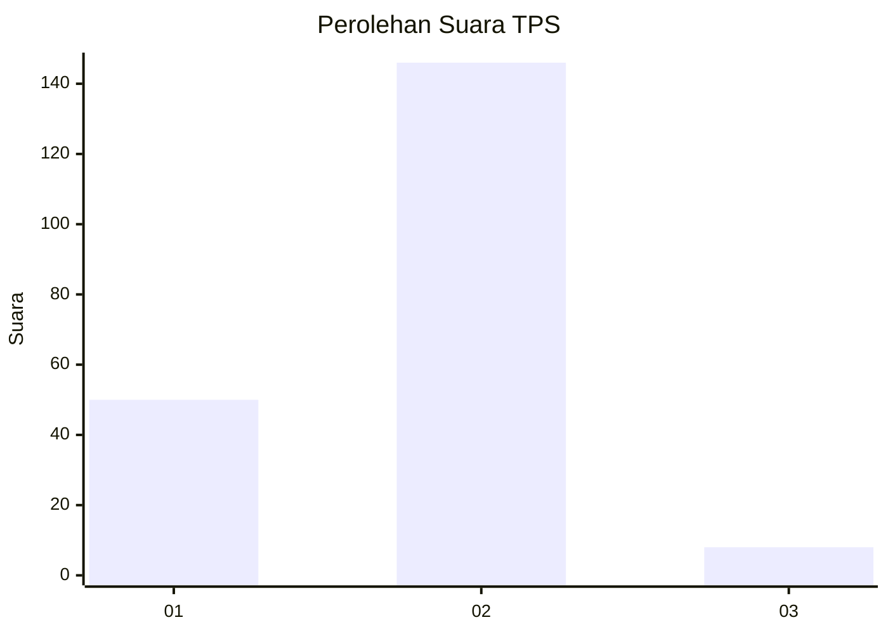
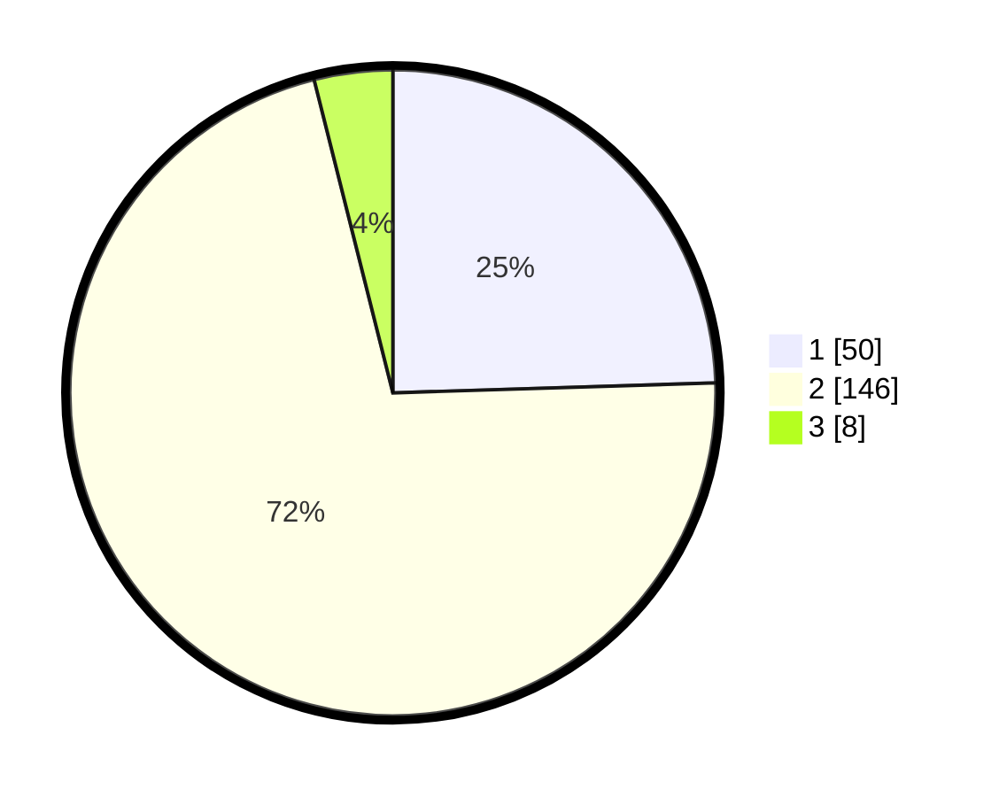

# Hasil

## Grafik

## Tabel

| No. | Nama Paslon    | Suara | Suara (raw) | Persentase |
|:--- |:-------------- | -----:| -----------:| ----------:|
| 1   | ANIES MUHAIMIN | 50    | [50][p-1]   | 24,51      |
| 2   | PRABOWO GIBRAN | 146   | [146][p-2]  | 71,57      |
| 3   | GANJAR MAHFUD  | 8     | [8][p-3]    | 3,92       |

[p-1]: https://github.com/gigit-pemilu/pemilu-2024-73-sulawesi-selatan/blob/main/pilpres/hitung-suara/sub/73-sulawesi-selatan/sub/10-pangkajene-dan-kepulauan/sub/13-liukang-tupabbiring-utara/sub/2001-mattiro-kanja/sub/002-tps/sub/paslon-1.txt
[p-2]: https://github.com/gigit-pemilu/pemilu-2024-73-sulawesi-selatan/blob/main/pilpres/hitung-suara/sub/73-sulawesi-selatan/sub/10-pangkajene-dan-kepulauan/sub/13-liukang-tupabbiring-utara/sub/2001-mattiro-kanja/sub/002-tps/sub/paslon-2.txt
[p-3]: https://github.com/gigit-pemilu/pemilu-2024-73-sulawesi-selatan/blob/main/pilpres/hitung-suara/sub/73-sulawesi-selatan/sub/10-pangkajene-dan-kepulauan/sub/13-liukang-tupabbiring-utara/sub/2001-mattiro-kanja/sub/002-tps/sub/paslon-3.txt

## Foto C Plano

https://sirekap-obj-formc.kpu.go.id/b47c/pemilu/ppwp/73/10/13/20/01/7310132001002-20240217-200136--932144a0-fe9f-4e82-bfdc-860ebd16112a.jpg

https://sirekap-obj-formc.kpu.go.id/b47c/pemilu/ppwp/73/10/13/20/01/7310132001002-20240217-200224--69232002-33ed-4205-b2ef-7127e63a5d4b.jpg

https://sirekap-obj-formc.kpu.go.id/b47c/pemilu/ppwp/73/10/13/20/01/7310132001002-20240217-200339--b9389aec-ff6c-4e03-b5c0-b29921fbcff7.jpg

## Metadata

| Key        | Value               |
| ---------- | ------------------- |
| Time Stamp | 2024-02-19 06:16:00 |

