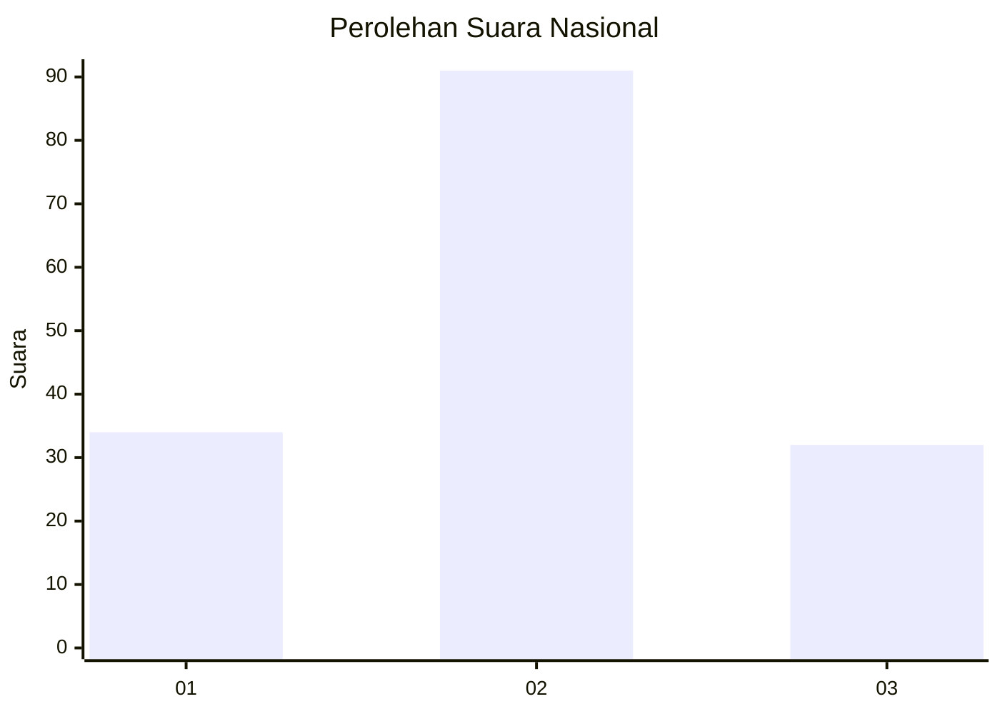
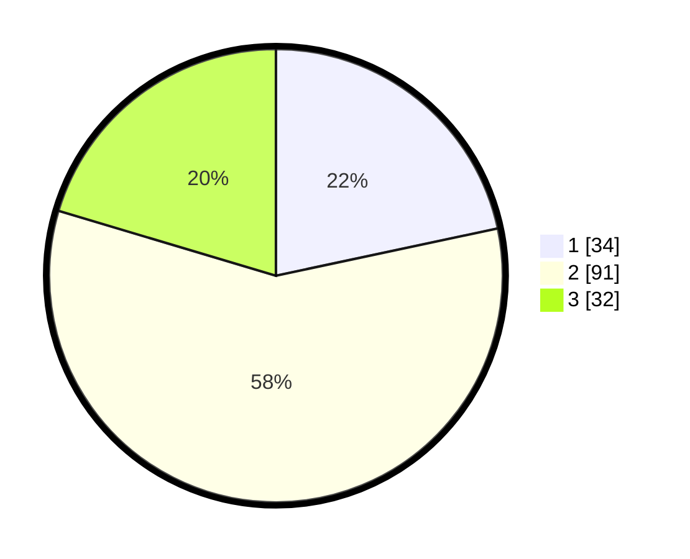

# Hasil

## Grafik

## Tabel

| No. | Nama Paslon    | Suara | Suara (raw) | Persentase |
|:--- |:-------------- | -----:| -----------:| ----------:|
| 1   | ANIES MUHAIMIN | 34    | [34][p-1]   | 21,66      |
| 2   | PRABOWO GIBRAN | 91    | [91][p-2]   | 57,96      |
| 3   | GANJAR MAHFUD  | 32    | [32][p-3]   | 20,38      |

[p-1]: https://github.com/gigit-pemilu/pemilu-2024/blob/main/pilpres/hitung-suara/sub/73-sulawesi-selatan/sub/10-pangkajene-dan-kepulauan/sub/13-liukang-tupabbiring-utara/sub/2001-mattiro-kanja/sub/003-tps/sub/paslon-1.txt
[p-2]: https://github.com/gigit-pemilu/pemilu-2024/blob/main/pilpres/hitung-suara/sub/73-sulawesi-selatan/sub/10-pangkajene-dan-kepulauan/sub/13-liukang-tupabbiring-utara/sub/2001-mattiro-kanja/sub/003-tps/sub/paslon-2.txt
[p-3]: https://github.com/gigit-pemilu/pemilu-2024/blob/main/pilpres/hitung-suara/sub/73-sulawesi-selatan/sub/10-pangkajene-dan-kepulauan/sub/13-liukang-tupabbiring-utara/sub/2001-mattiro-kanja/sub/003-tps/sub/paslon-3.txt

## Foto C Plano

https://sirekap-obj-formc.kpu.go.id/841d/pemilu/ppwp/73/10/13/20/01/7310132001003-20240217-220004--a2ddbd29-9f8a-49bd-81c6-6fd78df9ba6a.jpg

https://sirekap-obj-formc.kpu.go.id/841d/pemilu/ppwp/73/10/13/20/01/7310132001003-20240217-220713--f8d6361b-3c93-4455-a7bc-c5de25d2b02f.jpg

https://sirekap-obj-formc.kpu.go.id/841d/pemilu/ppwp/73/10/13/20/01/7310132001003-20240217-220805--1a9abc20-912e-4c2d-8af0-3312e83151b2.jpg

## Metadata

| Key        | Value               |
| ---------- | ------------------- |
| Time Stamp | 2024-02-19 06:16:00 |

