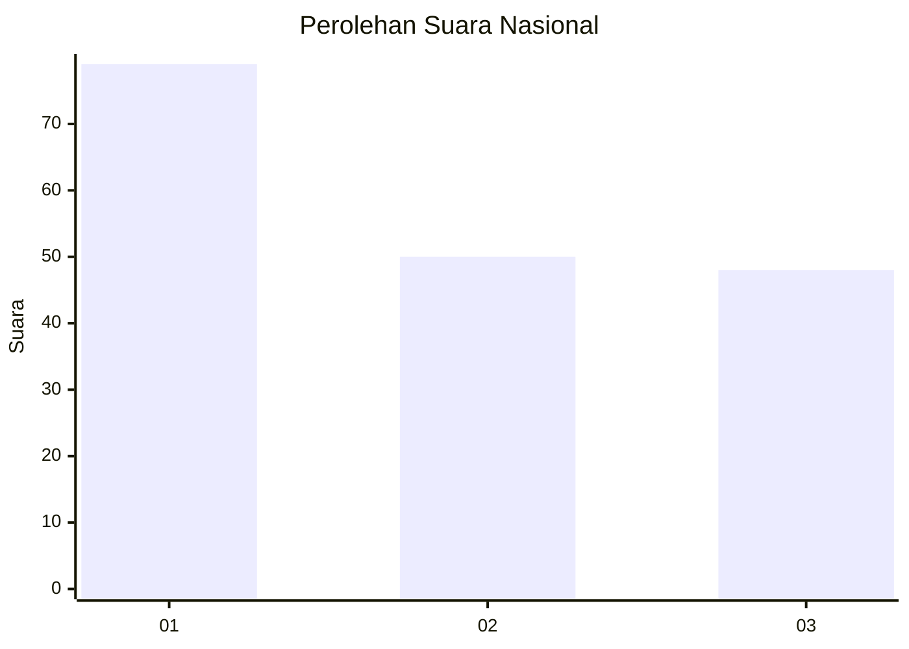
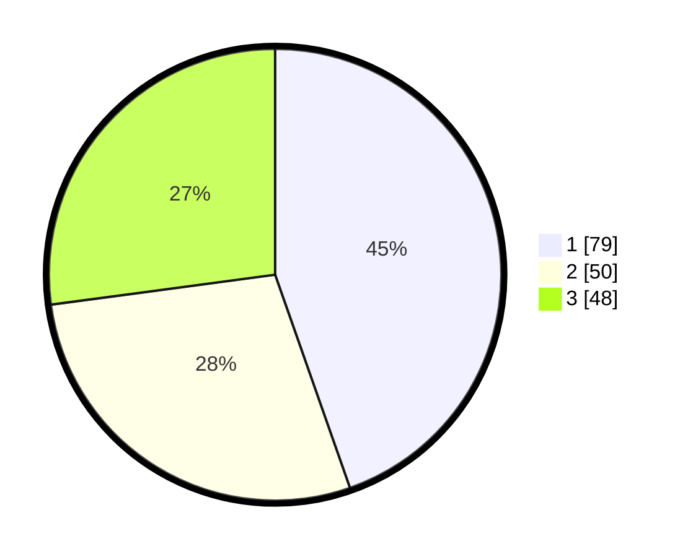

# Hasil

## Grafik

## Tabel

| No. | Nama Paslon    | Suara | Suara (raw) | Persentase |
|:--- |:-------------- | -----:| -----------:| ----------:|
| 1   | ANIES MUHAIMIN | 79    | [79][p-1]   | 44,63      |
| 2   | PRABOWO GIBRAN | 50    | [50][p-2]   | 28,25      |
| 3   | GANJAR MAHFUD  | 48    | [48][p-3]   | 27,12      |

[p-1]: https://github.com/gigit-pemilu/pemilu-2024/blob/main/pilpres/hitung-suara/sub/73-sulawesi-selatan/sub/10-pangkajene-dan-kepulauan/sub/13-liukang-tupabbiring-utara/sub/2001-mattiro-kanja/sub/004-tps/sub/paslon-1.txt
[p-2]: https://github.com/gigit-pemilu/pemilu-2024/blob/main/pilpres/hitung-suara/sub/73-sulawesi-selatan/sub/10-pangkajene-dan-kepulauan/sub/13-liukang-tupabbiring-utara/sub/2001-mattiro-kanja/sub/004-tps/sub/paslon-2.txt
[p-3]: https://github.com/gigit-pemilu/pemilu-2024/blob/main/pilpres/hitung-suara/sub/73-sulawesi-selatan/sub/10-pangkajene-dan-kepulauan/sub/13-liukang-tupabbiring-utara/sub/2001-mattiro-kanja/sub/004-tps/sub/paslon-3.txt

## Foto C Plano

https://sirekap-obj-formc.kpu.go.id/0089/pemilu/ppwp/73/10/13/20/01/7310132001004-20240214-155034--b9b02d22-40ea-46af-a302-732bfc8395c9.jpg

https://sirekap-obj-formc.kpu.go.id/0089/pemilu/ppwp/73/10/13/20/01/7310132001004-20240215-061316--9f30b5f0-7eac-48e8-9d01-bed6d8919403.jpg

https://sirekap-obj-formc.kpu.go.id/0089/pemilu/ppwp/73/10/13/20/01/7310132001004-20240215-061633--e943c00e-3b67-45fa-90a1-87dd6ae454fe.jpg

## Metadata

| Key        | Value               |
| ---------- | ------------------- |
| Time Stamp | 2024-02-15 16:00:26 |

