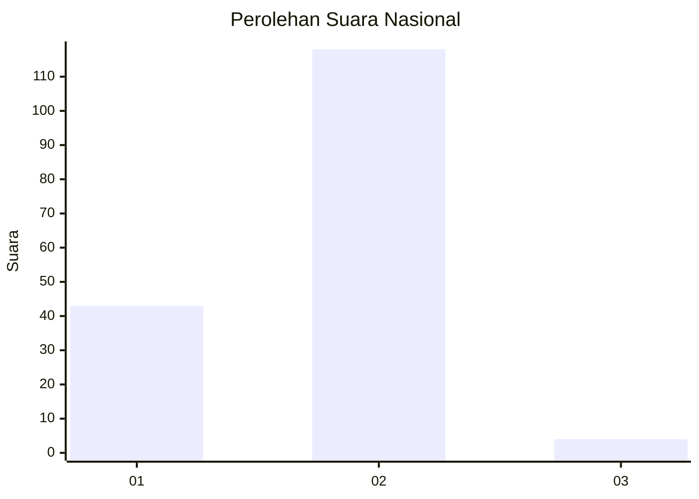
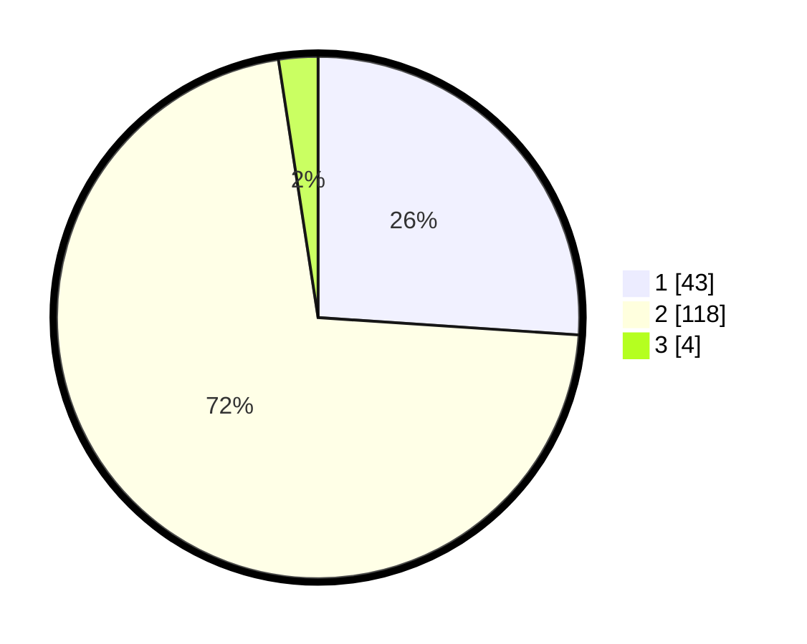

# Hasil

## Grafik

## Tabel

| No. | Nama Paslon    | Suara | Suara (raw) | Persentase |
|:--- |:-------------- | -----:| -----------:| ----------:|
| 1   | ANIES MUHAIMIN | 43    | [43][p-1]   | 26,06      |
| 2   | PRABOWO GIBRAN | 118   | [118][p-2]  | 71,52      |
| 3   | GANJAR MAHFUD  | 4     | [4][p-3]    | 2,42       |

[p-1]: https://github.com/gigit-pemilu/pemilu-2024/blob/main/pilpres/hitung-suara/sub/73-sulawesi-selatan/sub/10-pangkajene-dan-kepulauan/sub/13-liukang-tupabbiring-utara/sub/2002-mattiro-baji/sub/001-tps/sub/paslon-1.txt
[p-2]: https://github.com/gigit-pemilu/pemilu-2024/blob/main/pilpres/hitung-suara/sub/73-sulawesi-selatan/sub/10-pangkajene-dan-kepulauan/sub/13-liukang-tupabbiring-utara/sub/2002-mattiro-baji/sub/001-tps/sub/paslon-2.txt
[p-3]: https://github.com/gigit-pemilu/pemilu-2024/blob/main/pilpres/hitung-suara/sub/73-sulawesi-selatan/sub/10-pangkajene-dan-kepulauan/sub/13-liukang-tupabbiring-utara/sub/2002-mattiro-baji/sub/001-tps/sub/paslon-3.txt

## Foto C Plano

https://sirekap-obj-formc.kpu.go.id/97fb/pemilu/ppwp/73/10/13/20/02/7310132002001-20240219-140159--b5d219db-d9f1-421c-bf8f-2914d18b90ba.jpg

https://sirekap-obj-formc.kpu.go.id/97fb/pemilu/ppwp/73/10/13/20/02/7310132002001-20240219-140244--95055d67-e078-4646-bc78-58c995b30bc0.jpg

https://sirekap-obj-formc.kpu.go.id/97fb/pemilu/ppwp/73/10/13/20/02/7310132002001-20240219-140342--d23250e7-fac9-437a-9667-6e496f93a128.jpg

## Metadata

| Key        | Value               |
| ---------- | ------------------- |
| Time Stamp | 2024-02-19 15:00:00 |

