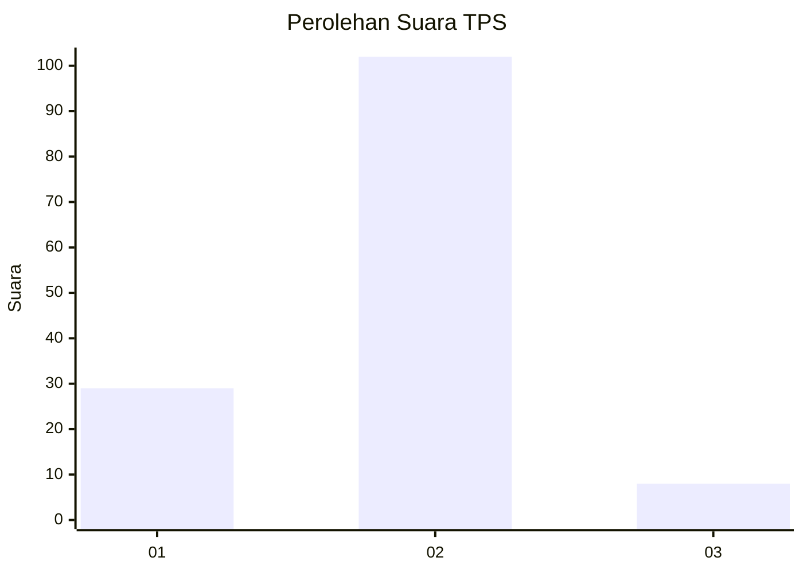

# Hasil

## Grafik

## Tabel

| No. | Nama Paslon    | Suara | Suara (raw) | Persentase |
|:--- |:-------------- | -----:| -----------:| ----------:|
| 1   | ANIES MUHAIMIN | 29    | [29][p-1]   | 20,86      |
| 2   | PRABOWO GIBRAN | 102   | [102][p-2]  | 73,38      |
| 3   | GANJAR MAHFUD  | 8     | [8][p-3]    | 5,76       |

[p-1]: https://github.com/gigit-pemilu/pemilu-2024-73-sulawesi-selatan/blob/main/pilpres/hitung-suara/sub/73-sulawesi-selatan/sub/10-pangkajene-dan-kepulauan/sub/13-liukang-tupabbiring-utara/sub/2002-mattiro-baji/sub/002-tps/sub/paslon-1.txt
[p-2]: https://github.com/gigit-pemilu/pemilu-2024-73-sulawesi-selatan/blob/main/pilpres/hitung-suara/sub/73-sulawesi-selatan/sub/10-pangkajene-dan-kepulauan/sub/13-liukang-tupabbiring-utara/sub/2002-mattiro-baji/sub/002-tps/sub/paslon-2.txt
[p-3]: https://github.com/gigit-pemilu/pemilu-2024-73-sulawesi-selatan/blob/main/pilpres/hitung-suara/sub/73-sulawesi-selatan/sub/10-pangkajene-dan-kepulauan/sub/13-liukang-tupabbiring-utara/sub/2002-mattiro-baji/sub/002-tps/sub/paslon-3.txt

## Foto C Plano

https://sirekap-obj-formc.kpu.go.id/12e9/pemilu/ppwp/73/10/13/20/02/7310132002002-20240219-152536--50c6e4ed-ff42-4d04-8dc3-45e1e90e8662.jpg

https://sirekap-obj-formc.kpu.go.id/12e9/pemilu/ppwp/73/10/13/20/02/7310132002002-20240219-152609--c40019e5-ba75-4aaf-a1fa-1ef63d4b7f4e.jpg

https://sirekap-obj-formc.kpu.go.id/12e9/pemilu/ppwp/73/10/13/20/02/7310132002002-20240219-152655--c217453e-8349-4005-b667-b31cb836531f.jpg

## Metadata

| Key        | Value               |
| ---------- | ------------------- |
| Time Stamp | 2024-02-19 19:00:00 |

