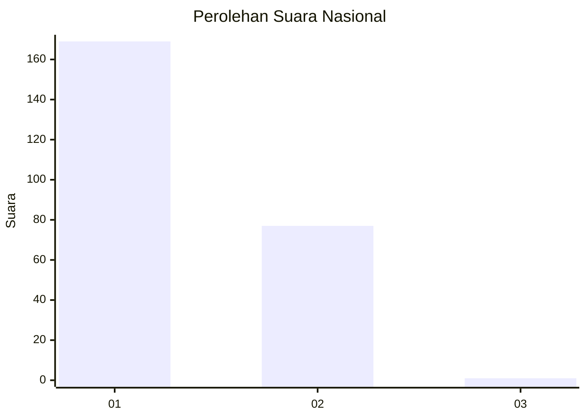
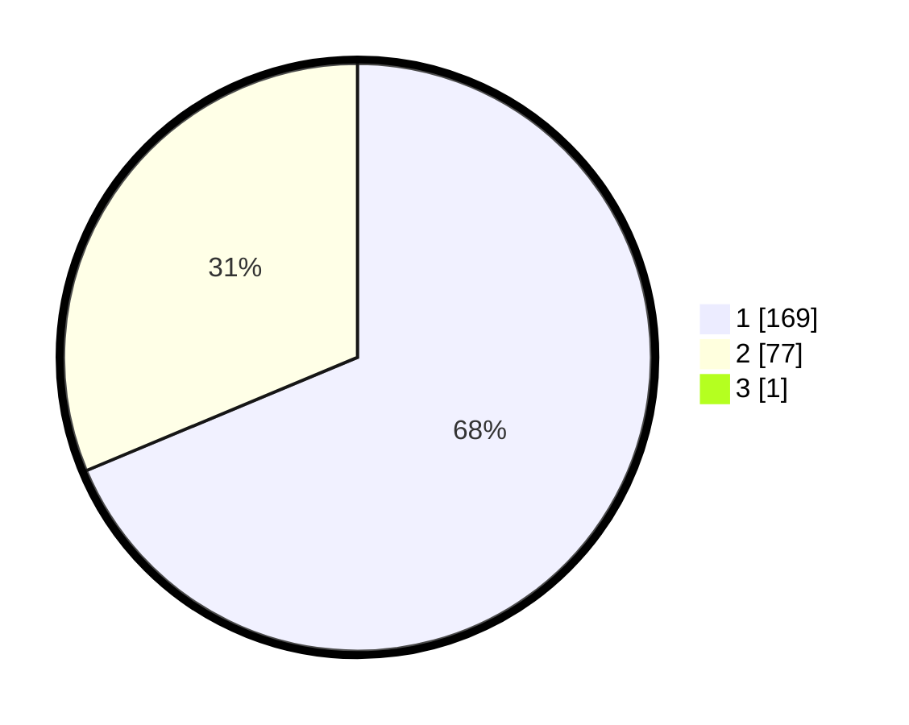

# Hasil

## Grafik

## Tabel

| No. | Nama Paslon    | Suara | Suara (raw) | Persentase |
|:--- |:-------------- | -----:| -----------:| ----------:|
| 1   | ANIES MUHAIMIN | 169   | [169][p-1]  | 68,42      |
| 2   | PRABOWO GIBRAN | 77    | [77][p-2]   | 31,17      |
| 3   | GANJAR MAHFUD  | 1     | [1][p-3]    | 0,40       |

[p-1]: https://github.com/gigit-pemilu/pemilu-2024/blob/main/pilpres/hitung-suara/sub/73-sulawesi-selatan/sub/11-barru/sub/01-tanete-riaja/sub/2004-kading/sub/007-tps/sub/paslon-1.txt
[p-2]: https://github.com/gigit-pemilu/pemilu-2024/blob/main/pilpres/hitung-suara/sub/73-sulawesi-selatan/sub/11-barru/sub/01-tanete-riaja/sub/2004-kading/sub/007-tps/sub/paslon-2.txt
[p-3]: https://github.com/gigit-pemilu/pemilu-2024/blob/main/pilpres/hitung-suara/sub/73-sulawesi-selatan/sub/11-barru/sub/01-tanete-riaja/sub/2004-kading/sub/007-tps/sub/paslon-3.txt

## Foto C Plano

https://sirekap-obj-formc.kpu.go.id/4487/pemilu/ppwp/73/11/01/20/04/7311012004007-20240215-011230--c53d7d97-9e99-49ba-b9e0-5a5e204b2ec3.jpg

https://sirekap-obj-formc.kpu.go.id/4487/pemilu/ppwp/73/11/01/20/04/7311012004007-20240215-011208--ca42d078-af28-4cba-8333-f62d2033844f.jpg

https://sirekap-obj-formc.kpu.go.id/4487/pemilu/ppwp/73/11/01/20/04/7311012004007-20240215-011023--5145ba99-6489-4927-9534-a1ef234f363c.jpg

## Metadata

| Key        | Value               |
| ---------- | ------------------- |
| Time Stamp | 2024-02-15 12:00:28 |

