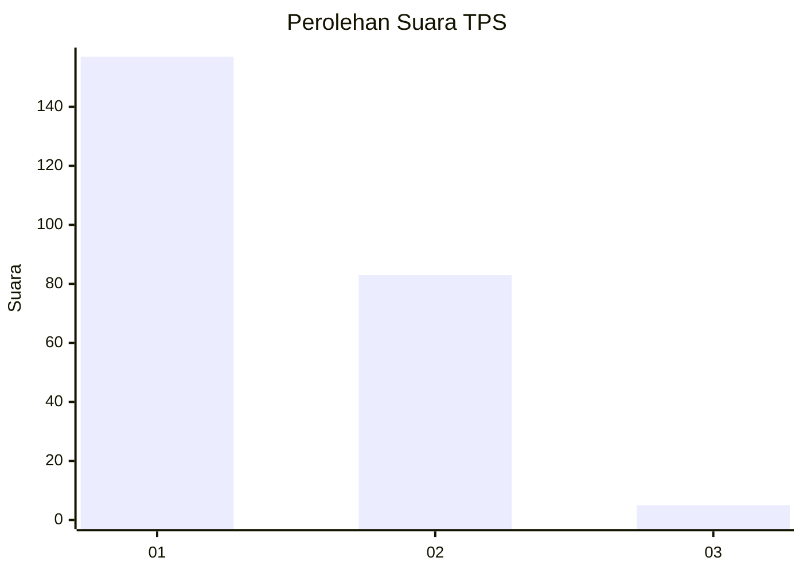
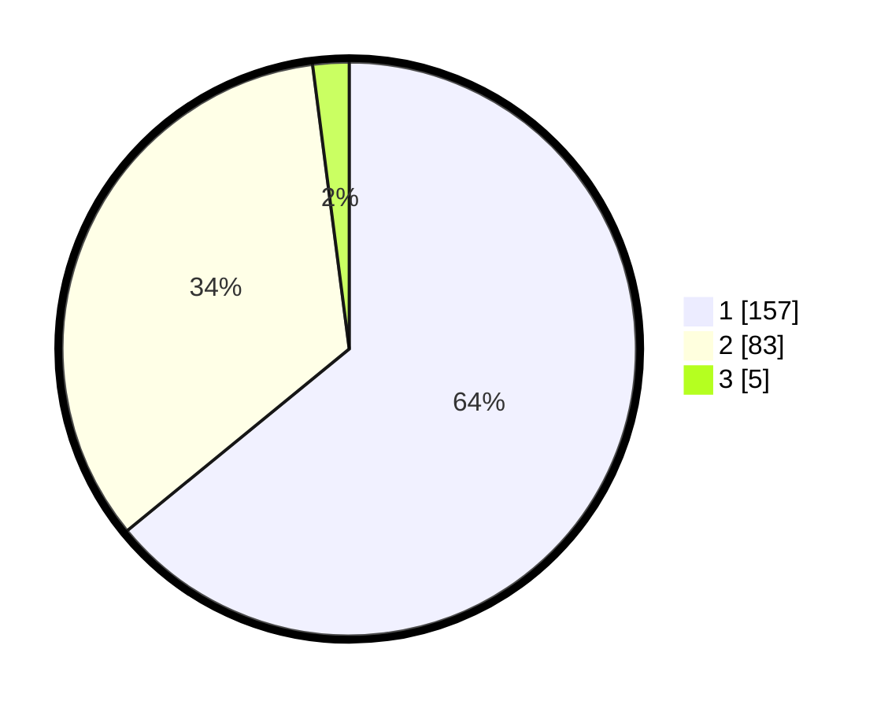

# Hasil

## Grafik

## Tabel

| No. | Nama Paslon    | Suara | Suara (raw) | Persentase |
|:--- |:-------------- | -----:| -----------:| ----------:|
| 1   | ANIES MUHAIMIN | 157   | [157][p-1]  | 64,08      |
| 2   | PRABOWO GIBRAN | 83    | [83][p-2]   | 33,88      |
| 3   | GANJAR MAHFUD  | 5     | [5][p-3]    | 2,04       |

[p-1]: https://github.com/gigit-pemilu/pemilu-2024-73-sulawesi-selatan/blob/main/pilpres/hitung-suara/sub/73-sulawesi-selatan/sub/11-barru/sub/02-tanete-rilau/sub/1001-lalolang/sub/004-tps/sub/paslon-1.txt
[p-2]: https://github.com/gigit-pemilu/pemilu-2024-73-sulawesi-selatan/blob/main/pilpres/hitung-suara/sub/73-sulawesi-selatan/sub/11-barru/sub/02-tanete-rilau/sub/1001-lalolang/sub/004-tps/sub/paslon-2.txt
[p-3]: https://github.com/gigit-pemilu/pemilu-2024-73-sulawesi-selatan/blob/main/pilpres/hitung-suara/sub/73-sulawesi-selatan/sub/11-barru/sub/02-tanete-rilau/sub/1001-lalolang/sub/004-tps/sub/paslon-3.txt

## Foto C Plano

https://sirekap-obj-formc.kpu.go.id/a2a4/pemilu/ppwp/73/11/02/10/01/7311021001004-20240215-020122--effeafa5-cfcc-479c-bbb5-2045487b2f66.jpg

https://sirekap-obj-formc.kpu.go.id/a2a4/pemilu/ppwp/73/11/02/10/01/7311021001004-20240215-020255--ce652dc3-7c08-4f97-82f6-28adc37e8b4b.jpg

https://sirekap-obj-formc.kpu.go.id/a2a4/pemilu/ppwp/73/11/02/10/01/7311021001004-20240215-020452--2e2752f4-683b-4c23-8543-40a5619952e2.jpg

## Metadata

| Key        | Value               |
| ---------- | ------------------- |
| Time Stamp | 2024-02-15 12:00:28 |

