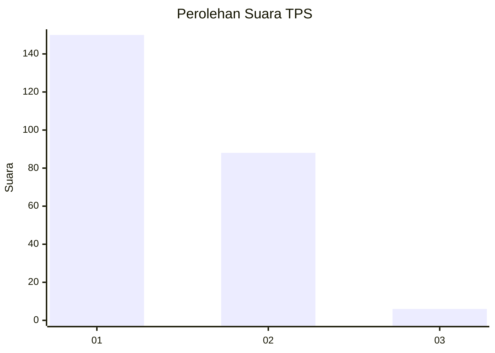
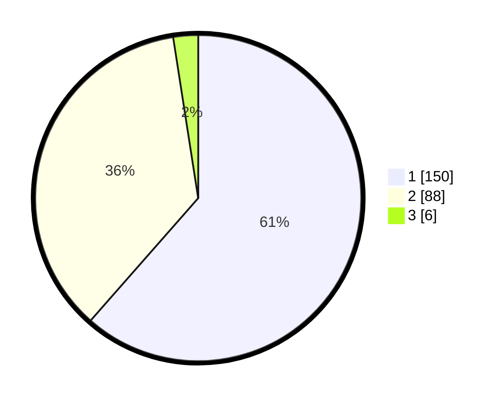

# Hasil

## Grafik

## Tabel

| No. | Nama Paslon    | Suara | Suara (raw) | Persentase |
|:--- |:-------------- | -----:| -----------:| ----------:|
| 1   | ANIES MUHAIMIN | 150   | [150][p-1]  | 61,48      |
| 2   | PRABOWO GIBRAN | 88    | [88][p-2]   | 36,07      |
| 3   | GANJAR MAHFUD  | 6     | [6][p-3]    | 2,46       |

[p-1]: https://github.com/gigit-pemilu/pemilu-2024-73-sulawesi-selatan/blob/main/pilpres/hitung-suara/sub/73-sulawesi-selatan/sub/11-barru/sub/02-tanete-rilau/sub/1001-lalolang/sub/006-tps/sub/paslon-1.txt
[p-2]: https://github.com/gigit-pemilu/pemilu-2024-73-sulawesi-selatan/blob/main/pilpres/hitung-suara/sub/73-sulawesi-selatan/sub/11-barru/sub/02-tanete-rilau/sub/1001-lalolang/sub/006-tps/sub/paslon-2.txt
[p-3]: https://github.com/gigit-pemilu/pemilu-2024-73-sulawesi-selatan/blob/main/pilpres/hitung-suara/sub/73-sulawesi-selatan/sub/11-barru/sub/02-tanete-rilau/sub/1001-lalolang/sub/006-tps/sub/paslon-3.txt

## Foto C Plano

https://sirekap-obj-formc.kpu.go.id/103a/pemilu/ppwp/73/11/02/10/01/7311021001006-20240215-040729--ba7a7527-44db-435e-bae7-23acf30de218.jpg

https://sirekap-obj-formc.kpu.go.id/103a/pemilu/ppwp/73/11/02/10/01/7311021001006-20240215-040850--d4899532-5602-461a-acdf-feaf066bd3ee.jpg

https://sirekap-obj-formc.kpu.go.id/103a/pemilu/ppwp/73/11/02/10/01/7311021001006-20240215-041009--8d5bb94f-7c75-482f-82c7-7ac90da5b607.jpg

## Metadata

| Key        | Value               |
| ---------- | ------------------- |
| Time Stamp | 2024-02-15 18:30:25 |

