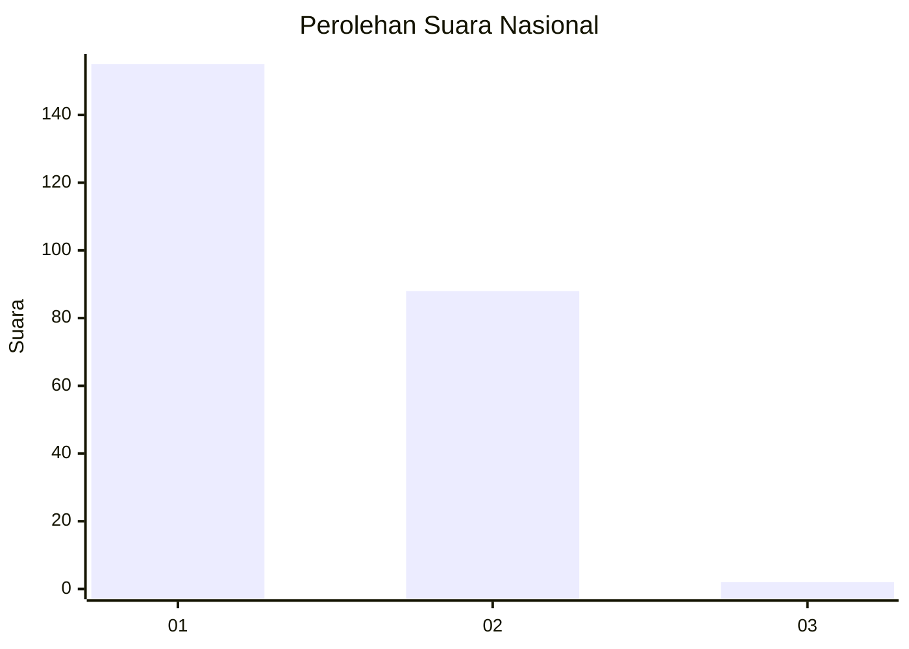
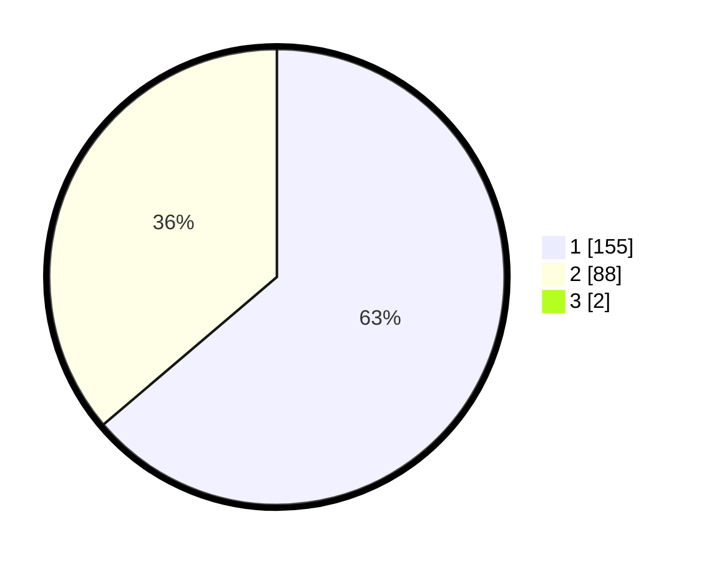

# Hasil

## Grafik

## Tabel

| No. | Nama Paslon    | Suara | Suara (raw) | Persentase |
|:--- |:-------------- | -----:| -----------:| ----------:|
| 1   | ANIES MUHAIMIN | 155   | [155][p-1]  | 63,27      |
| 2   | PRABOWO GIBRAN | 88    | [88][p-2]   | 35,92      |
| 3   | GANJAR MAHFUD  | 2     | [2][p-3]    | 0,82       |

[p-1]: https://github.com/gigit-pemilu/pemilu-2024/blob/main/pilpres/hitung-suara/sub/73-sulawesi-selatan/sub/11-barru/sub/02-tanete-rilau/sub/1001-lalolang/sub/009-tps/sub/paslon-1.txt
[p-2]: https://github.com/gigit-pemilu/pemilu-2024/blob/main/pilpres/hitung-suara/sub/73-sulawesi-selatan/sub/11-barru/sub/02-tanete-rilau/sub/1001-lalolang/sub/009-tps/sub/paslon-2.txt
[p-3]: https://github.com/gigit-pemilu/pemilu-2024/blob/main/pilpres/hitung-suara/sub/73-sulawesi-selatan/sub/11-barru/sub/02-tanete-rilau/sub/1001-lalolang/sub/009-tps/sub/paslon-3.txt

## Foto C Plano

https://sirekap-obj-formc.kpu.go.id/7944/pemilu/ppwp/73/11/02/10/01/7311021001009-20240215-080848--9a2ce8e1-381c-4966-ac66-7078e93da23f.jpg

https://sirekap-obj-formc.kpu.go.id/7944/pemilu/ppwp/73/11/02/10/01/7311021001009-20240214-211841--0dc95a1c-7dd7-4ab1-b20f-b0b48ba125e9.jpg

https://sirekap-obj-formc.kpu.go.id/7944/pemilu/ppwp/73/11/02/10/01/7311021001009-20240215-081032--daa354f4-5975-499c-8a91-28938b305eef.jpg

## Metadata

| Key        | Value               |
| ---------- | ------------------- |
| Time Stamp | 2024-02-15 15:00:29 |

