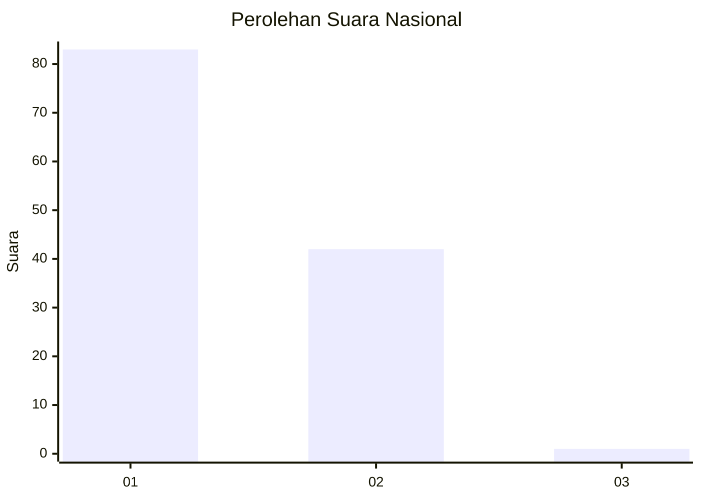
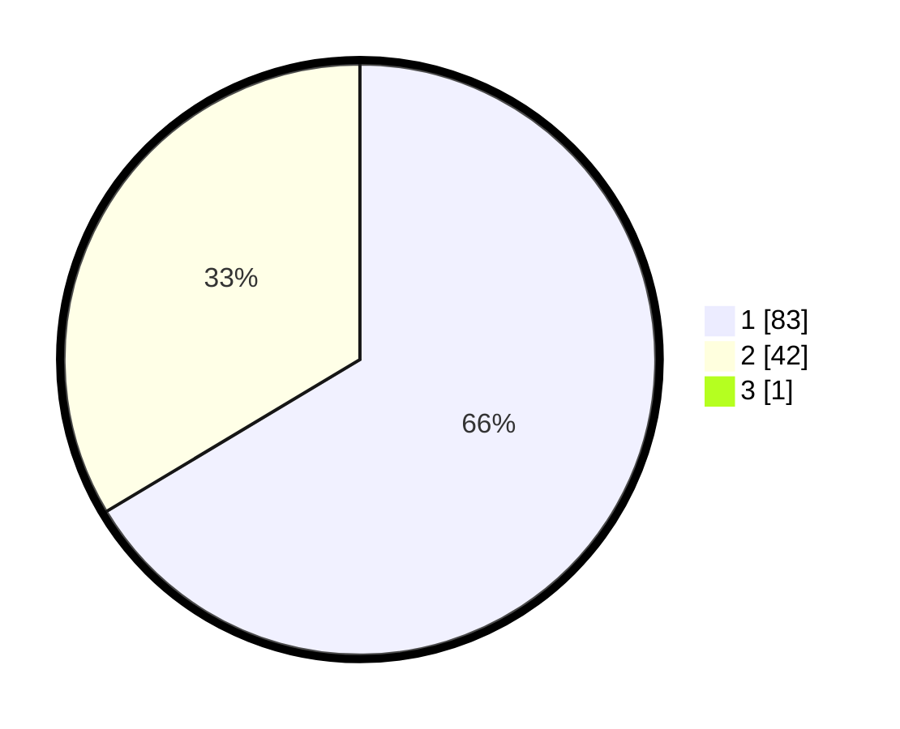

# Hasil

## Grafik

## Tabel

| No. | Nama Paslon    | Suara | Suara (raw) | Persentase |
|:--- |:-------------- | -----:| -----------:| ----------:|
| 1   | ANIES MUHAIMIN | 83    | [83][p-1]   | 65,87      |
| 2   | PRABOWO GIBRAN | 42    | [42][p-2]   | 33,33      |
| 3   | GANJAR MAHFUD  | 1     | [1][p-3]    | 0,79       |

[p-1]: https://github.com/gigit-pemilu/pemilu-2024/blob/main/pilpres/hitung-suara/sub/73-sulawesi-selatan/sub/11-barru/sub/02-tanete-rilau/sub/1002-tanete/sub/010-tps/sub/paslon-1.txt
[p-2]: https://github.com/gigit-pemilu/pemilu-2024/blob/main/pilpres/hitung-suara/sub/73-sulawesi-selatan/sub/11-barru/sub/02-tanete-rilau/sub/1002-tanete/sub/010-tps/sub/paslon-2.txt
[p-3]: https://github.com/gigit-pemilu/pemilu-2024/blob/main/pilpres/hitung-suara/sub/73-sulawesi-selatan/sub/11-barru/sub/02-tanete-rilau/sub/1002-tanete/sub/010-tps/sub/paslon-3.txt

## Foto C Plano

https://sirekap-obj-formc.kpu.go.id/8b8c/pemilu/ppwp/73/11/02/10/02/7311021002010-20240214-200937--dca83afe-728e-45f5-9c07-ddcddc341136.jpg

https://sirekap-obj-formc.kpu.go.id/8b8c/pemilu/ppwp/73/11/02/10/02/7311021002010-20240214-200948--b11fc020-ec5f-4ff9-ba1a-86b667431ea2.jpg

https://sirekap-obj-formc.kpu.go.id/8b8c/pemilu/ppwp/73/11/02/10/02/7311021002010-20240214-200958--fd5904e9-8234-4abe-af3f-33be6ca9ea4a.jpg

## Metadata

| Key        | Value               |
| ---------- | ------------------- |
| Time Stamp | 2024-02-14 21:46:01 |

