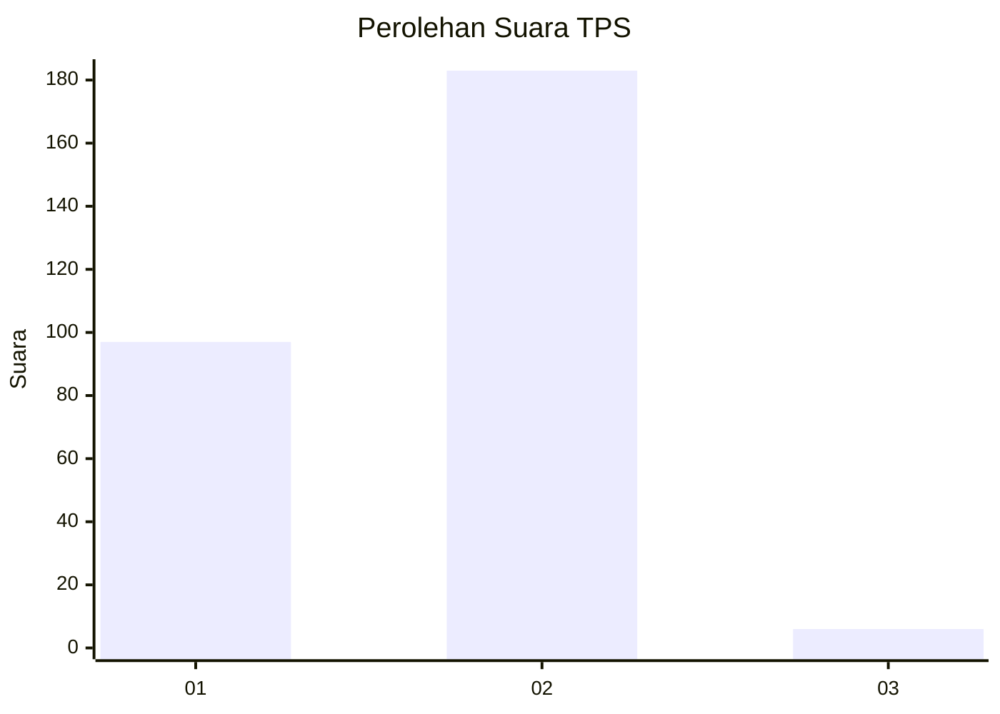
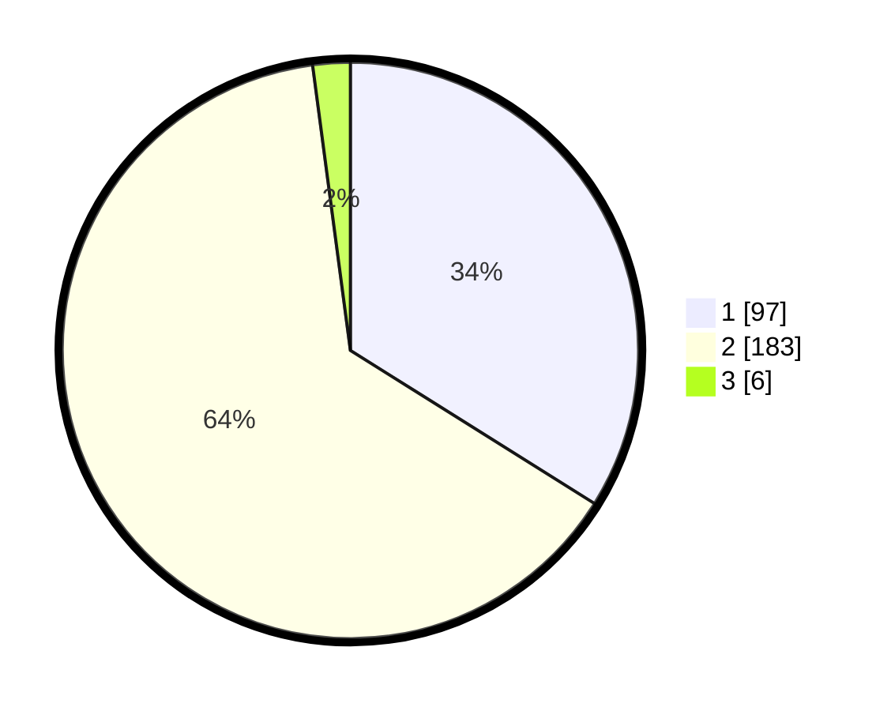

# Hasil

## Grafik

## Tabel

| No. | Nama Paslon    | Suara | Suara (raw) | Persentase |
|:--- |:-------------- | -----:| -----------:| ----------:|
| 1   | ANIES MUHAIMIN | 97    | [97][p-1]   | 33,92      |
| 2   | PRABOWO GIBRAN | 183   | [183][p-2]  | 63,99      |
| 3   | GANJAR MAHFUD  | 6     | [6][p-3]    | 2,10       |

[p-1]: https://github.com/gigit-pemilu/pemilu-2024-73-sulawesi-selatan/blob/main/pilpres/hitung-suara/sub/73-sulawesi-selatan/sub/11-barru/sub/02-tanete-rilau/sub/2003-pancana/sub/003-tps/sub/paslon-1.txt
[p-2]: https://github.com/gigit-pemilu/pemilu-2024-73-sulawesi-selatan/blob/main/pilpres/hitung-suara/sub/73-sulawesi-selatan/sub/11-barru/sub/02-tanete-rilau/sub/2003-pancana/sub/003-tps/sub/paslon-2.txt
[p-3]: https://github.com/gigit-pemilu/pemilu-2024-73-sulawesi-selatan/blob/main/pilpres/hitung-suara/sub/73-sulawesi-selatan/sub/11-barru/sub/02-tanete-rilau/sub/2003-pancana/sub/003-tps/sub/paslon-3.txt

## Foto C Plano

https://sirekap-obj-formc.kpu.go.id/069e/pemilu/ppwp/73/11/02/20/03/7311022003003-20240215-080925--be396cd5-d133-4bd2-9e1d-570a307aba29.jpg

https://sirekap-obj-formc.kpu.go.id/069e/pemilu/ppwp/73/11/02/20/03/7311022003003-20240215-002612--4ad38139-d389-4b25-822d-3f348f7b57ed.jpg

https://sirekap-obj-formc.kpu.go.id/069e/pemilu/ppwp/73/11/02/20/03/7311022003003-20240215-081146--9f2b5085-9d87-4b58-b077-6ca26185ae6b.jpg

## Metadata

| Key        | Value               |
| ---------- | ------------------- |
| Time Stamp | 2024-02-15 19:00:26 |

