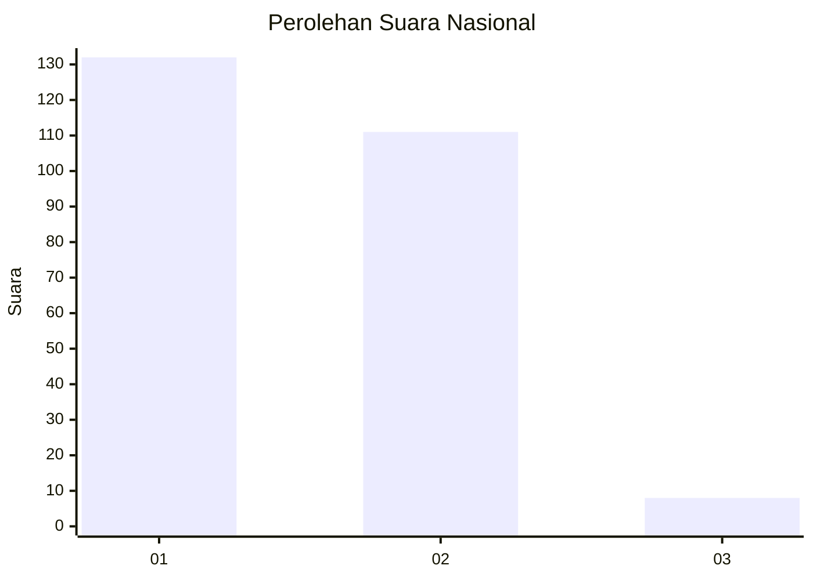
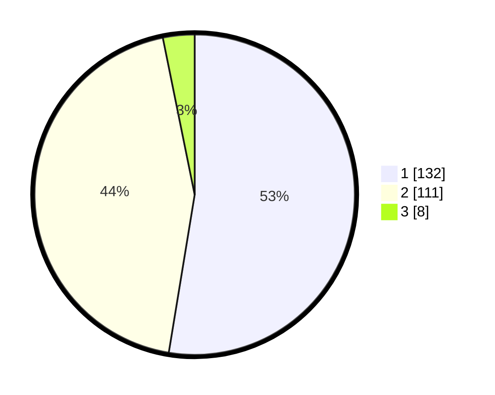

# Hasil

## Grafik

## Tabel

| No. | Nama Paslon    | Suara | Suara (raw) | Persentase |
|:--- |:-------------- | -----:| -----------:| ----------:|
| 1   | ANIES MUHAIMIN | 132   | [132][p-1]  | 52,59      |
| 2   | PRABOWO GIBRAN | 111   | [111][p-2]  | 44,22      |
| 3   | GANJAR MAHFUD  | 8     | [8][p-3]    | 3,19       |

[p-1]: https://github.com/gigit-pemilu/pemilu-2024/blob/main/pilpres/hitung-suara/sub/73-sulawesi-selatan/sub/11-barru/sub/02-tanete-rilau/sub/2008-lipukasi/sub/011-tps/sub/paslon-1.txt
[p-2]: https://github.com/gigit-pemilu/pemilu-2024/blob/main/pilpres/hitung-suara/sub/73-sulawesi-selatan/sub/11-barru/sub/02-tanete-rilau/sub/2008-lipukasi/sub/011-tps/sub/paslon-2.txt
[p-3]: https://github.com/gigit-pemilu/pemilu-2024/blob/main/pilpres/hitung-suara/sub/73-sulawesi-selatan/sub/11-barru/sub/02-tanete-rilau/sub/2008-lipukasi/sub/011-tps/sub/paslon-3.txt

## Foto C Plano

https://sirekap-obj-formc.kpu.go.id/29fe/pemilu/ppwp/73/11/02/20/08/7311022008011-20240215-031534--5315cfbd-b8d2-4636-b0d3-204d13bc5fa1.jpg

https://sirekap-obj-formc.kpu.go.id/29fe/pemilu/ppwp/73/11/02/20/08/7311022008011-20240215-031729--f4d5ae74-58b3-4957-8c4d-2e98bb291d78.jpg

https://sirekap-obj-formc.kpu.go.id/29fe/pemilu/ppwp/73/11/02/20/08/7311022008011-20240215-031914--4c4ec6bb-2f1a-41ea-bd81-2afccd142521.jpg

## Metadata

| Key        | Value               |
| ---------- | ------------------- |
| Time Stamp | 2024-02-15 20:30:46 |

