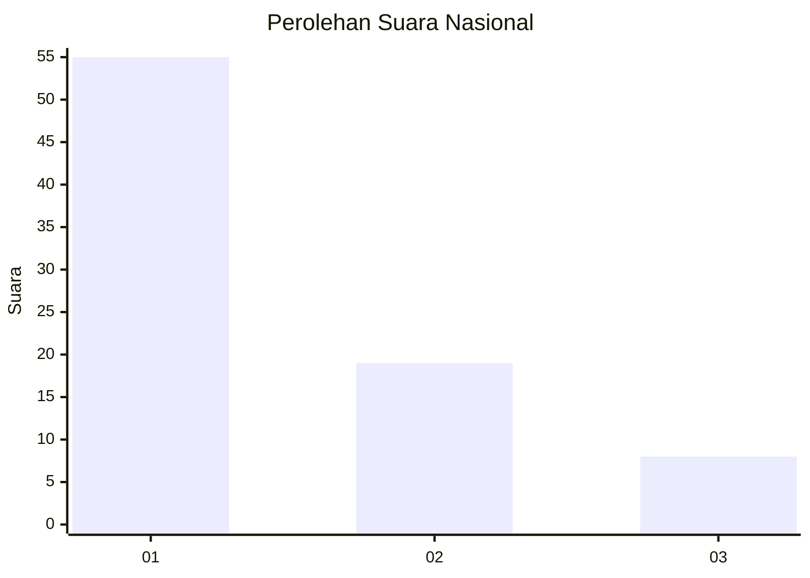
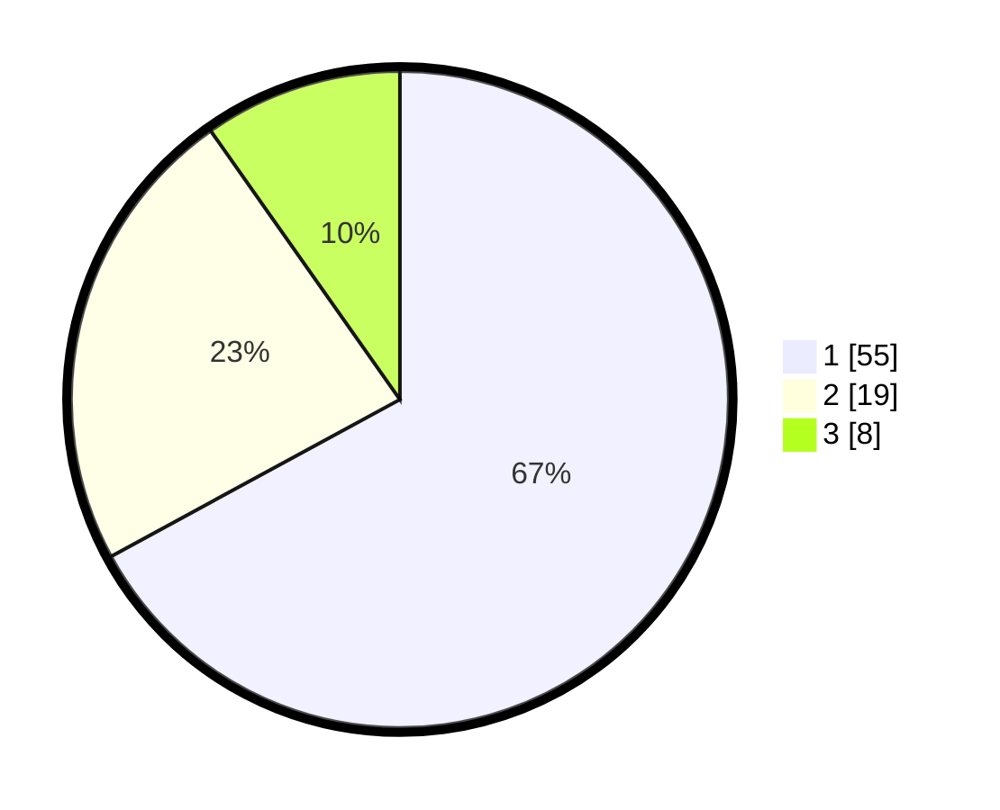

# Hasil

## Grafik

## Tabel

| No. | Nama Paslon    | Suara | Suara (raw) | Persentase |
|:--- |:-------------- | -----:| -----------:| ----------:|
| 1   | ANIES MUHAIMIN | 55    | [55][p-1]   | 67,07      |
| 2   | PRABOWO GIBRAN | 19    | [19][p-2]   | 23,17      |
| 3   | GANJAR MAHFUD  | 8     | [8][p-3]    | 9,76       |

[p-1]: https://github.com/gigit-pemilu/pemilu-2024/blob/main/pilpres/hitung-suara/sub/73-sulawesi-selatan/sub/11-barru/sub/02-tanete-rilau/sub/2010-lasitae/sub/007-tps/sub/paslon-1.txt
[p-2]: https://github.com/gigit-pemilu/pemilu-2024/blob/main/pilpres/hitung-suara/sub/73-sulawesi-selatan/sub/11-barru/sub/02-tanete-rilau/sub/2010-lasitae/sub/007-tps/sub/paslon-2.txt
[p-3]: https://github.com/gigit-pemilu/pemilu-2024/blob/main/pilpres/hitung-suara/sub/73-sulawesi-selatan/sub/11-barru/sub/02-tanete-rilau/sub/2010-lasitae/sub/007-tps/sub/paslon-3.txt

## Foto C Plano

https://sirekap-obj-formc.kpu.go.id/7d91/pemilu/ppwp/73/11/02/20/10/7311022010007-20240214-225646--57050319-e050-45f4-9239-05085f456116.jpg

https://sirekap-obj-formc.kpu.go.id/7d91/pemilu/ppwp/73/11/02/20/10/7311022010007-20240214-225739--f3740498-9726-469c-80e6-1fdef6083081.jpg

https://sirekap-obj-formc.kpu.go.id/7d91/pemilu/ppwp/73/11/02/20/10/7311022010007-20240214-225829--939d0ce1-6124-4d8a-bc41-d24b082453ae.jpg

## Metadata

| Key        | Value               |
| ---------- | ------------------- |
| Time Stamp | 2024-02-15 12:00:28 |

