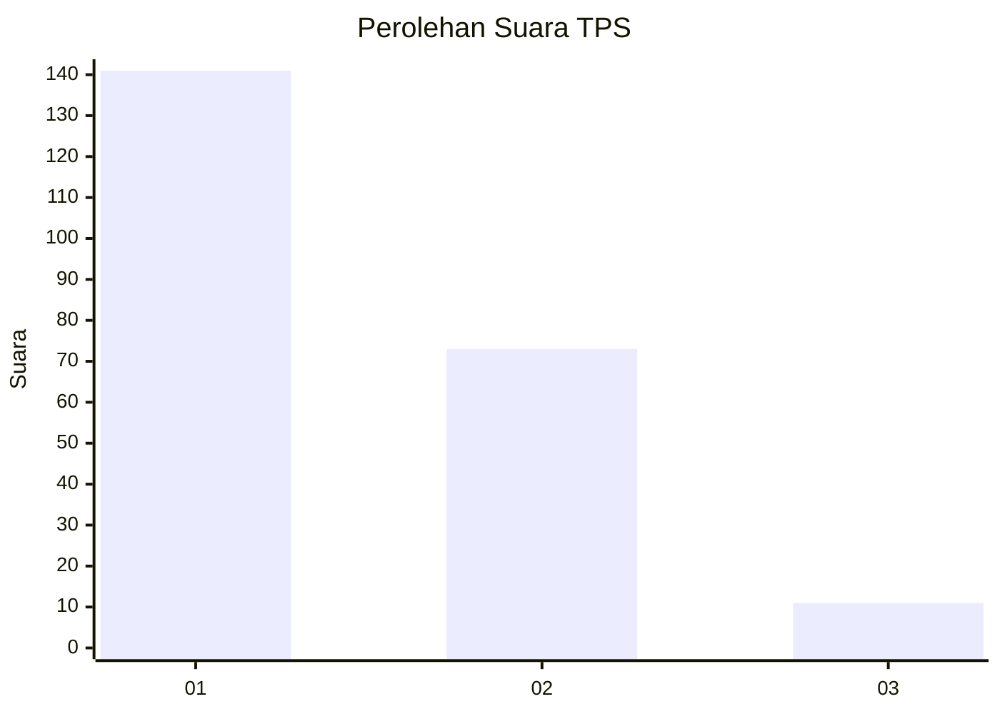
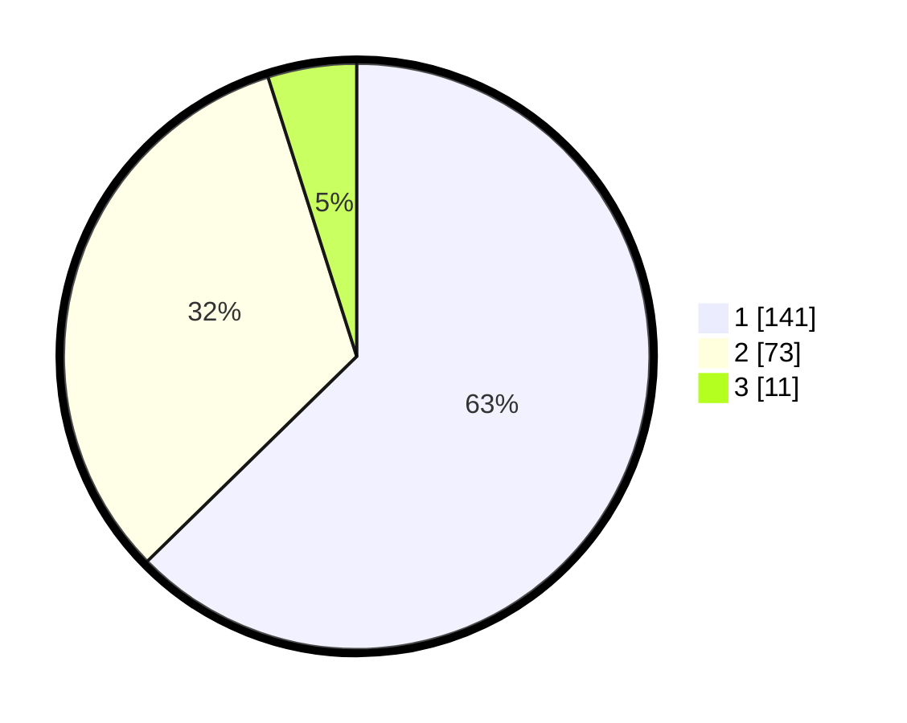

# Hasil

## Grafik

## Tabel

| No. | Nama Paslon    | Suara | Suara (raw) | Persentase |
|:--- |:-------------- | -----:| -----------:| ----------:|
| 1   | ANIES MUHAIMIN | 141   | [141][p-1]  | 62,67      |
| 2   | PRABOWO GIBRAN | 73    | [73][p-2]   | 32,44      |
| 3   | GANJAR MAHFUD  | 11    | [11][p-3]   | 4,89       |

[p-1]: https://github.com/gigit-pemilu/pemilu-2024-73-sulawesi-selatan/blob/main/pilpres/hitung-suara/sub/73-sulawesi-selatan/sub/11-barru/sub/05-mallusetasi/sub/1001-palanro/sub/004-tps/sub/paslon-1.txt
[p-2]: https://github.com/gigit-pemilu/pemilu-2024-73-sulawesi-selatan/blob/main/pilpres/hitung-suara/sub/73-sulawesi-selatan/sub/11-barru/sub/05-mallusetasi/sub/1001-palanro/sub/004-tps/sub/paslon-2.txt
[p-3]: https://github.com/gigit-pemilu/pemilu-2024-73-sulawesi-selatan/blob/main/pilpres/hitung-suara/sub/73-sulawesi-selatan/sub/11-barru/sub/05-mallusetasi/sub/1001-palanro/sub/004-tps/sub/paslon-3.txt

## Foto C Plano

https://sirekap-obj-formc.kpu.go.id/4d04/pemilu/ppwp/73/11/05/10/01/7311051001004-20240215-065640--d63f262a-7ca3-48be-996c-0ac1a655d558.jpg

https://sirekap-obj-formc.kpu.go.id/4d04/pemilu/ppwp/73/11/05/10/01/7311051001004-20240215-065807--e8ee4664-f440-43d8-bef9-91de11322c9d.jpg

https://sirekap-obj-formc.kpu.go.id/4d04/pemilu/ppwp/73/11/05/10/01/7311051001004-20240215-065853--53d28481-f30c-43d1-a0f7-49adbbb70701.jpg

## Metadata

| Key        | Value               |
| ---------- | ------------------- |
| Time Stamp | 2024-02-16 16:25:10 |

