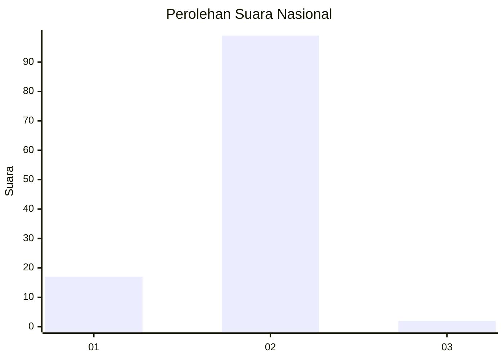
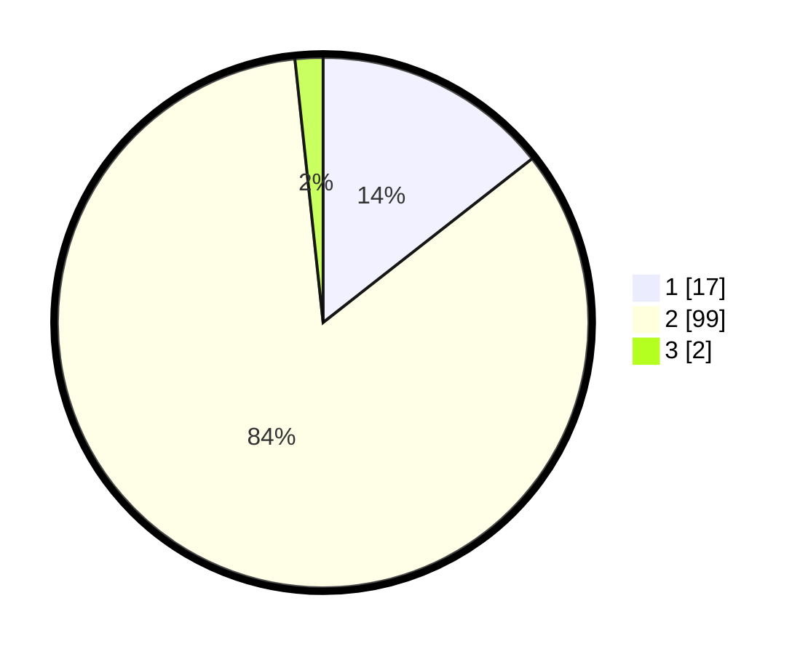

# Hasil

## Grafik

## Tabel

| No. | Nama Paslon    | Suara | Suara (raw) | Persentase |
|:--- |:-------------- | -----:| -----------:| ----------:|
| 1   | ANIES MUHAIMIN | 17    | [17][p-1]   | 14,41      |
| 2   | PRABOWO GIBRAN | 99    | [99][p-2]   | 83,90      |
| 3   | GANJAR MAHFUD  | 2     | [2][p-3]    | 1,69       |

[p-1]: https://github.com/gigit-pemilu/pemilu-2024/blob/main/pilpres/hitung-suara/sub/73-sulawesi-selatan/sub/11-barru/sub/06-pujananting/sub/2001-pujananting/sub/008-tps/sub/paslon-1.txt
[p-2]: https://github.com/gigit-pemilu/pemilu-2024/blob/main/pilpres/hitung-suara/sub/73-sulawesi-selatan/sub/11-barru/sub/06-pujananting/sub/2001-pujananting/sub/008-tps/sub/paslon-2.txt
[p-3]: https://github.com/gigit-pemilu/pemilu-2024/blob/main/pilpres/hitung-suara/sub/73-sulawesi-selatan/sub/11-barru/sub/06-pujananting/sub/2001-pujananting/sub/008-tps/sub/paslon-3.txt

## Foto C Plano

https://sirekap-obj-formc.kpu.go.id/c5a4/pemilu/ppwp/73/11/06/20/01/7311062001008-20240216-082119--f9d994a9-47e1-41b2-9e09-9f6cd21b9d79.jpg

https://sirekap-obj-formc.kpu.go.id/c5a4/pemilu/ppwp/73/11/06/20/01/7311062001008-20240215-033324--34b79c33-c5c6-4658-a985-df3858ab4798.jpg

https://sirekap-obj-formc.kpu.go.id/c5a4/pemilu/ppwp/73/11/06/20/01/7311062001008-20240215-033500--33a50b64-c7df-49de-8a30-2cc8d8a0a829.jpg

## Metadata

| Key        | Value               |
| ---------- | ------------------- |
| Time Stamp | 2024-02-16 16:25:10 |

