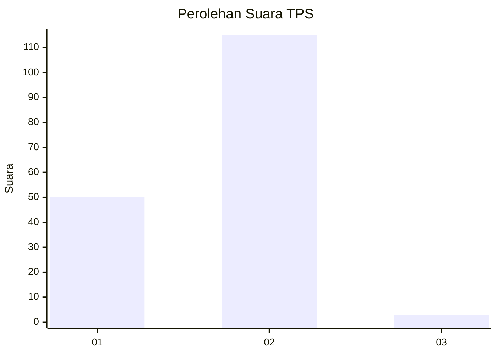
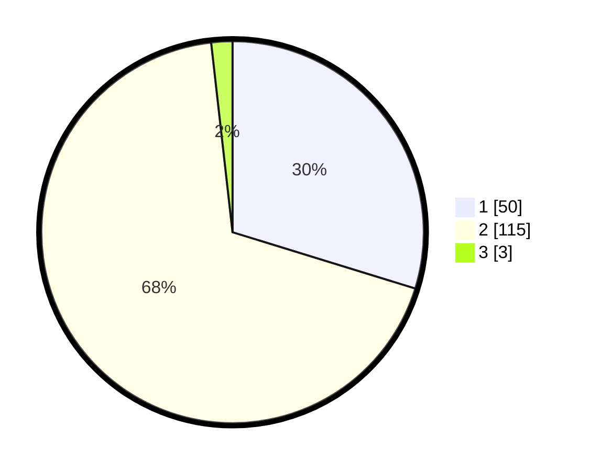

# Hasil

## Grafik

## Tabel

| No. | Nama Paslon    | Suara | Suara (raw) | Persentase |
|:--- |:-------------- | -----:| -----------:| ----------:|
| 1   | ANIES MUHAIMIN | 50    | [50][p-1]   | 29,76      |
| 2   | PRABOWO GIBRAN | 115   | [115][p-2]  | 68,45      |
| 3   | GANJAR MAHFUD  | 3     | [3][p-3]    | 1,79       |

[p-1]: https://github.com/gigit-pemilu/pemilu-2024-73-sulawesi-selatan/blob/main/pilpres/hitung-suara/sub/73-sulawesi-selatan/sub/11-barru/sub/07-balusu/sub/1001-takkalasi/sub/001-tps/sub/paslon-1.txt
[p-2]: https://github.com/gigit-pemilu/pemilu-2024-73-sulawesi-selatan/blob/main/pilpres/hitung-suara/sub/73-sulawesi-selatan/sub/11-barru/sub/07-balusu/sub/1001-takkalasi/sub/001-tps/sub/paslon-2.txt
[p-3]: https://github.com/gigit-pemilu/pemilu-2024-73-sulawesi-selatan/blob/main/pilpres/hitung-suara/sub/73-sulawesi-selatan/sub/11-barru/sub/07-balusu/sub/1001-takkalasi/sub/001-tps/sub/paslon-3.txt

## Foto C Plano

https://sirekap-obj-formc.kpu.go.id/1d82/pemilu/ppwp/73/11/07/10/01/7311071001001-20240224-154704--9f19c216-eebd-4870-a5ed-030bf1cfd162.jpg

https://sirekap-obj-formc.kpu.go.id/1d82/pemilu/ppwp/73/11/07/10/01/7311071001001-20240224-154807--5ab5c5c7-0c5e-461e-81ff-17567db81ecc.jpg

https://sirekap-obj-formc.kpu.go.id/1d82/pemilu/ppwp/73/11/07/10/01/7311071001001-20240224-154919--5f1d14f2-eb2d-4867-87fc-a05873ec5be2.jpg

## Metadata

| Key        | Value               |
| ---------- | ------------------- |
| Time Stamp | 2024-02-28 20:00:00 |

