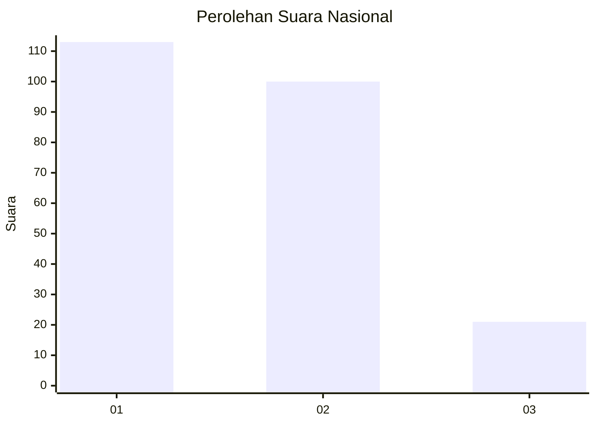
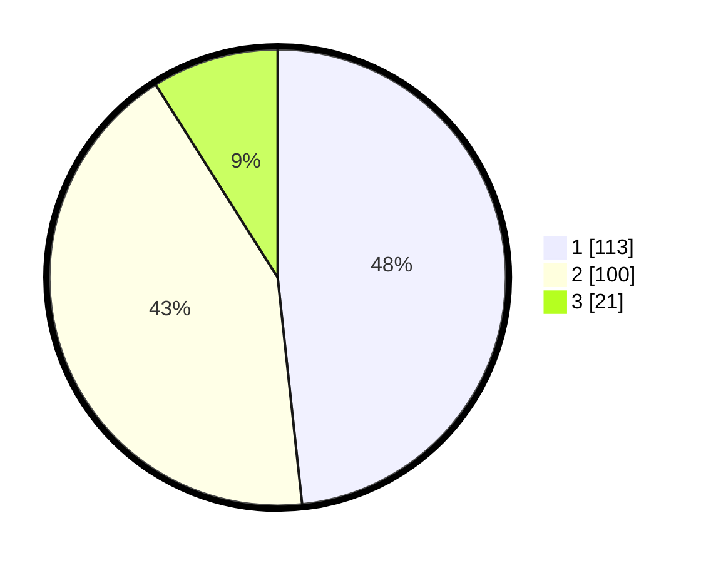

# Hasil

## Grafik

## Tabel

| No. | Nama Paslon    | Suara | Suara (raw) | Persentase |
|:--- |:-------------- | -----:| -----------:| ----------:|
| 1   | ANIES MUHAIMIN | 113   | [113][p-1]  | 48,29      |
| 2   | PRABOWO GIBRAN | 100   | [100][p-2]  | 42,74      |
| 3   | GANJAR MAHFUD  | 21    | [21][p-3]   | 8,97       |

[p-1]: https://github.com/gigit-pemilu/pemilu-2024/blob/main/pilpres/hitung-suara/sub/73-sulawesi-selatan/sub/11-barru/sub/07-balusu/sub/1001-takkalasi/sub/005-tps/sub/paslon-1.txt
[p-2]: https://github.com/gigit-pemilu/pemilu-2024/blob/main/pilpres/hitung-suara/sub/73-sulawesi-selatan/sub/11-barru/sub/07-balusu/sub/1001-takkalasi/sub/005-tps/sub/paslon-2.txt
[p-3]: https://github.com/gigit-pemilu/pemilu-2024/blob/main/pilpres/hitung-suara/sub/73-sulawesi-selatan/sub/11-barru/sub/07-balusu/sub/1001-takkalasi/sub/005-tps/sub/paslon-3.txt

## Foto C Plano

https://sirekap-obj-formc.kpu.go.id/90a2/pemilu/ppwp/73/11/07/10/01/7311071001005-20240215-023429--9d443191-8bfe-4911-abda-ff051eea0e1b.jpg

https://sirekap-obj-formc.kpu.go.id/90a2/pemilu/ppwp/73/11/07/10/01/7311071001005-20240215-025523--55f06c9e-7e5d-4984-8025-f72b1374b945.jpg

https://sirekap-obj-formc.kpu.go.id/90a2/pemilu/ppwp/73/11/07/10/01/7311071001005-20240215-025245--99012437-40c4-48e4-994b-47947202cc8a.jpg

## Metadata

| Key        | Value               |
| ---------- | ------------------- |
| Time Stamp | 2024-02-15 22:30:27 |

