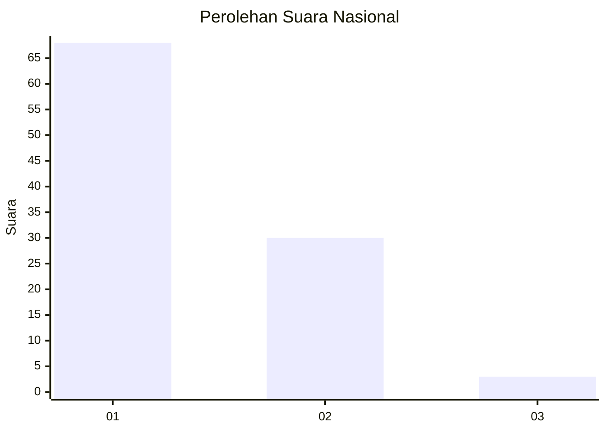
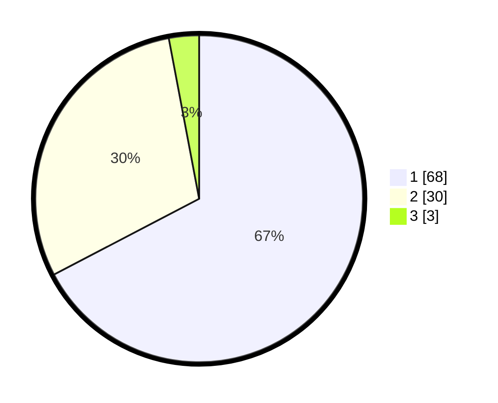

# Hasil

## Grafik

## Tabel

| No. | Nama Paslon    | Suara | Suara (raw) | Persentase |
|:--- |:-------------- | -----:| -----------:| ----------:|
| 1   | ANIES MUHAIMIN | 68    | [68][p-1]   | 67,33      |
| 2   | PRABOWO GIBRAN | 30    | [30][p-2]   | 29,70      |
| 3   | GANJAR MAHFUD  | 3     | [3][p-3]    | 2,97       |

[p-1]: https://github.com/gigit-pemilu/pemilu-2024/blob/main/pilpres/hitung-suara/sub/73-sulawesi-selatan/sub/11-barru/sub/07-balusu/sub/2002-balusu/sub/009-tps/sub/paslon-1.txt
[p-2]: https://github.com/gigit-pemilu/pemilu-2024/blob/main/pilpres/hitung-suara/sub/73-sulawesi-selatan/sub/11-barru/sub/07-balusu/sub/2002-balusu/sub/009-tps/sub/paslon-2.txt
[p-3]: https://github.com/gigit-pemilu/pemilu-2024/blob/main/pilpres/hitung-suara/sub/73-sulawesi-selatan/sub/11-barru/sub/07-balusu/sub/2002-balusu/sub/009-tps/sub/paslon-3.txt

## Foto C Plano

https://sirekap-obj-formc.kpu.go.id/7fa2/pemilu/ppwp/73/11/07/20/02/7311072002009-20240220-220120--72c79b5f-e52c-461c-9a92-a45896a25e3d.jpg

https://sirekap-obj-formc.kpu.go.id/7fa2/pemilu/ppwp/73/11/07/20/02/7311072002009-20240220-220234--d84842bc-f16f-4465-81b4-29388b904d21.jpg

https://sirekap-obj-formc.kpu.go.id/7fa2/pemilu/ppwp/73/11/07/20/02/7311072002009-20240220-220613--d07329a7-aba3-41f4-be36-ae49cc240996.jpg

## Metadata

| Key        | Value               |
| ---------- | ------------------- |
| Time Stamp | 2024-02-24 22:31:28 |

