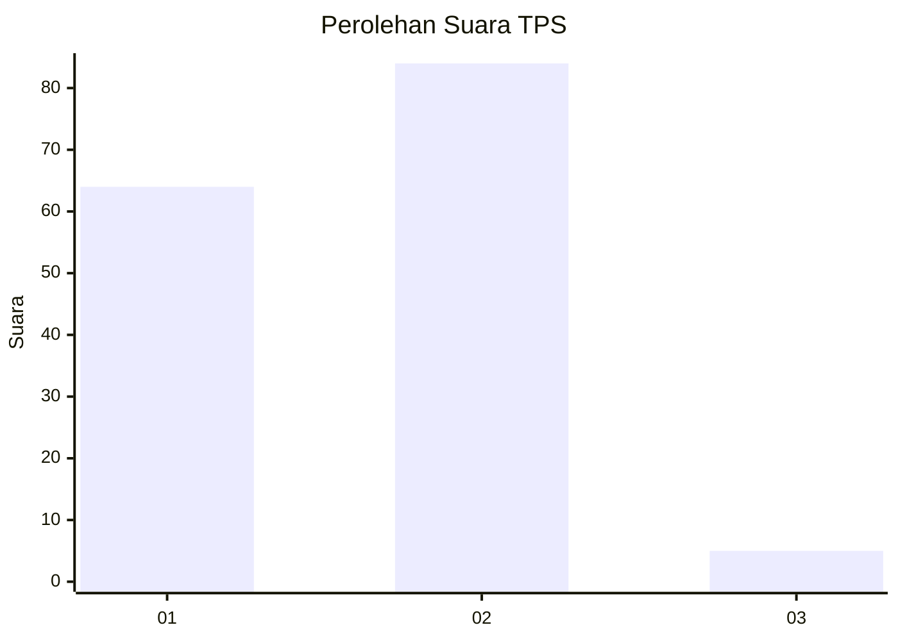
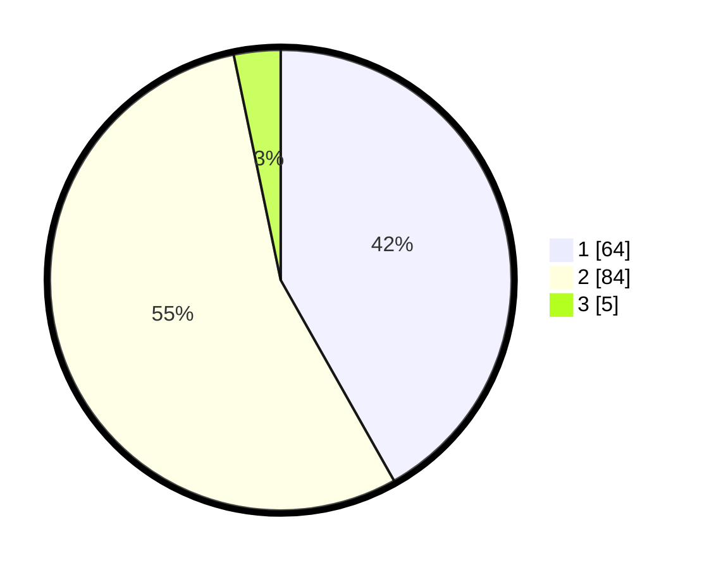

# Hasil

## Grafik

## Tabel

| No. | Nama Paslon    | Suara | Suara (raw) | Persentase |
|:--- |:-------------- | -----:| -----------:| ----------:|
| 1   | ANIES MUHAIMIN | 64    | [64][p-1]   | 41,83      |
| 2   | PRABOWO GIBRAN | 84    | [84][p-2]   | 54,90      |
| 3   | GANJAR MAHFUD  | 5     | [5][p-3]    | 3,27       |

[p-1]: https://github.com/gigit-pemilu/pemilu-2024-73-sulawesi-selatan/blob/main/pilpres/hitung-suara/sub/73-sulawesi-selatan/sub/12-soppeng/sub/04-lalabata/sub/1001-lalabata-rilau/sub/001-tps/sub/paslon-1.txt
[p-2]: https://github.com/gigit-pemilu/pemilu-2024-73-sulawesi-selatan/blob/main/pilpres/hitung-suara/sub/73-sulawesi-selatan/sub/12-soppeng/sub/04-lalabata/sub/1001-lalabata-rilau/sub/001-tps/sub/paslon-2.txt
[p-3]: https://github.com/gigit-pemilu/pemilu-2024-73-sulawesi-selatan/blob/main/pilpres/hitung-suara/sub/73-sulawesi-selatan/sub/12-soppeng/sub/04-lalabata/sub/1001-lalabata-rilau/sub/001-tps/sub/paslon-3.txt

## Foto C Plano

https://sirekap-obj-formc.kpu.go.id/30eb/pemilu/ppwp/73/12/04/10/01/7312041001001-20240215-132633--900ca841-77c9-4847-b69c-944f0d9ee7f4.jpg

https://sirekap-obj-formc.kpu.go.id/30eb/pemilu/ppwp/73/12/04/10/01/7312041001001-20240214-231047--be4558cd-85bc-4d56-822a-c65384f110ef.jpg

https://sirekap-obj-formc.kpu.go.id/30eb/pemilu/ppwp/73/12/04/10/01/7312041001001-20240214-231221--ccee4163-025e-436c-ae85-e226dbfc03a3.jpg

## Metadata

| Key        | Value               |
| ---------- | ------------------- |
| Time Stamp | 2024-02-16 09:00:28 |

