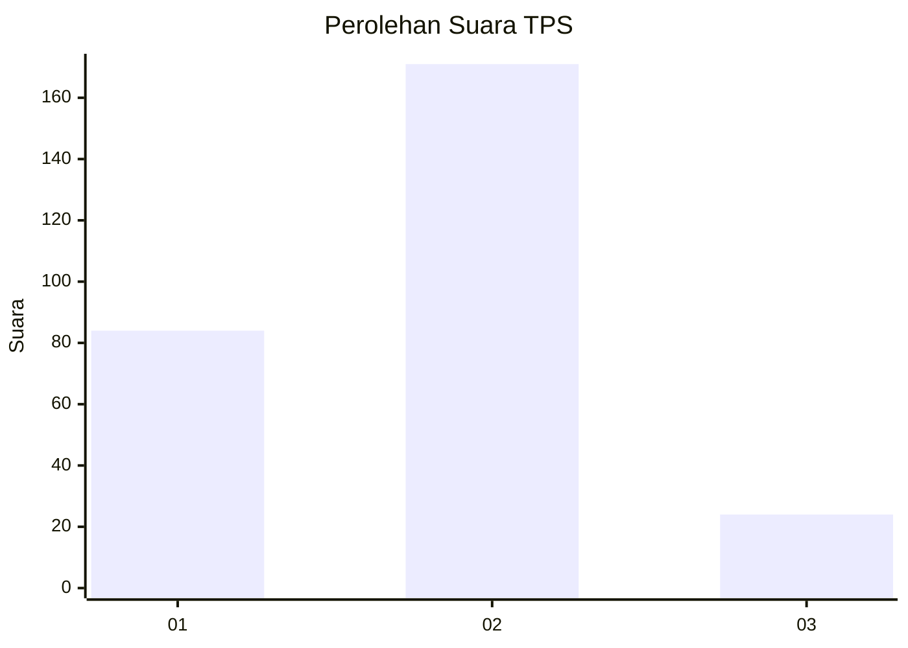
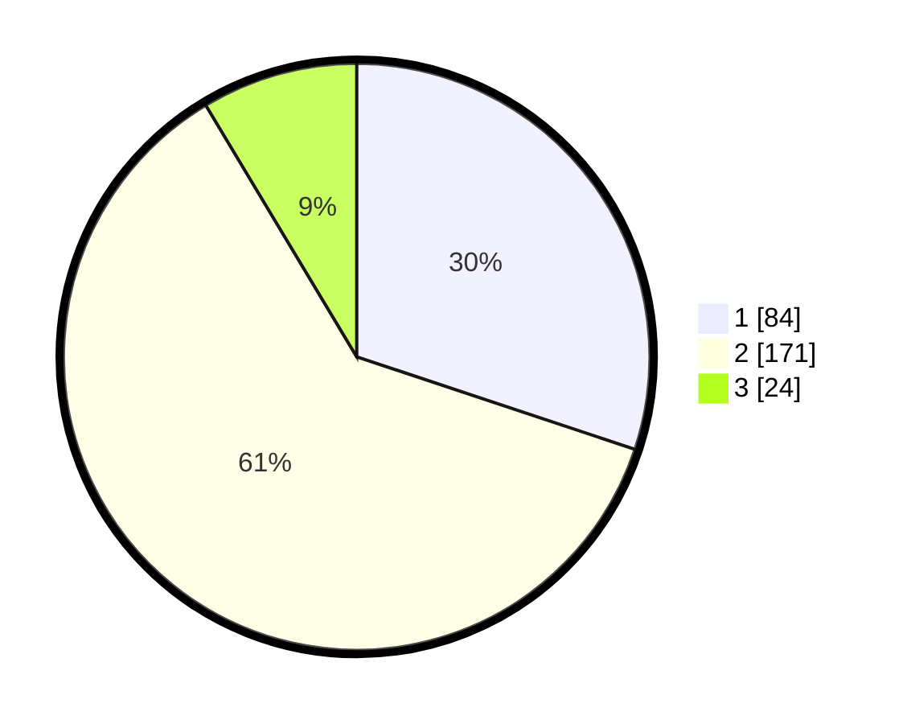

# Hasil

## Grafik

## Tabel

| No. | Nama Paslon    | Suara | Suara (raw) | Persentase |
|:--- |:-------------- | -----:| -----------:| ----------:|
| 1   | ANIES MUHAIMIN | 84    | [84][p-1]   | 30,11      |
| 2   | PRABOWO GIBRAN | 171   | [171][p-2]  | 61,29      |
| 3   | GANJAR MAHFUD  | 24    | [24][p-3]   | 8,60       |

[p-1]: https://github.com/gigit-pemilu/pemilu-2024-73-sulawesi-selatan/blob/main/pilpres/hitung-suara/sub/73-sulawesi-selatan/sub/12-soppeng/sub/04-lalabata/sub/1001-lalabata-rilau/sub/006-tps/sub/paslon-1.txt
[p-2]: https://github.com/gigit-pemilu/pemilu-2024-73-sulawesi-selatan/blob/main/pilpres/hitung-suara/sub/73-sulawesi-selatan/sub/12-soppeng/sub/04-lalabata/sub/1001-lalabata-rilau/sub/006-tps/sub/paslon-2.txt
[p-3]: https://github.com/gigit-pemilu/pemilu-2024-73-sulawesi-selatan/blob/main/pilpres/hitung-suara/sub/73-sulawesi-selatan/sub/12-soppeng/sub/04-lalabata/sub/1001-lalabata-rilau/sub/006-tps/sub/paslon-3.txt

## Foto C Plano

https://sirekap-obj-formc.kpu.go.id/9a4b/pemilu/ppwp/73/12/04/10/01/7312041001006-20240215-062443--2121046a-ec21-4cde-addb-2b84d7fbea95.jpg

https://sirekap-obj-formc.kpu.go.id/9a4b/pemilu/ppwp/73/12/04/10/01/7312041001006-20240215-175901--dcaa4fc6-d675-486a-8892-30b59b6559f1.jpg

https://sirekap-obj-formc.kpu.go.id/9a4b/pemilu/ppwp/73/12/04/10/01/7312041001006-20240215-062601--e9554045-94fd-4be9-8726-e1b87b3f090d.jpg

## Metadata

| Key        | Value               |
| ---------- | ------------------- |
| Time Stamp | 2024-02-15 22:30:27 |

