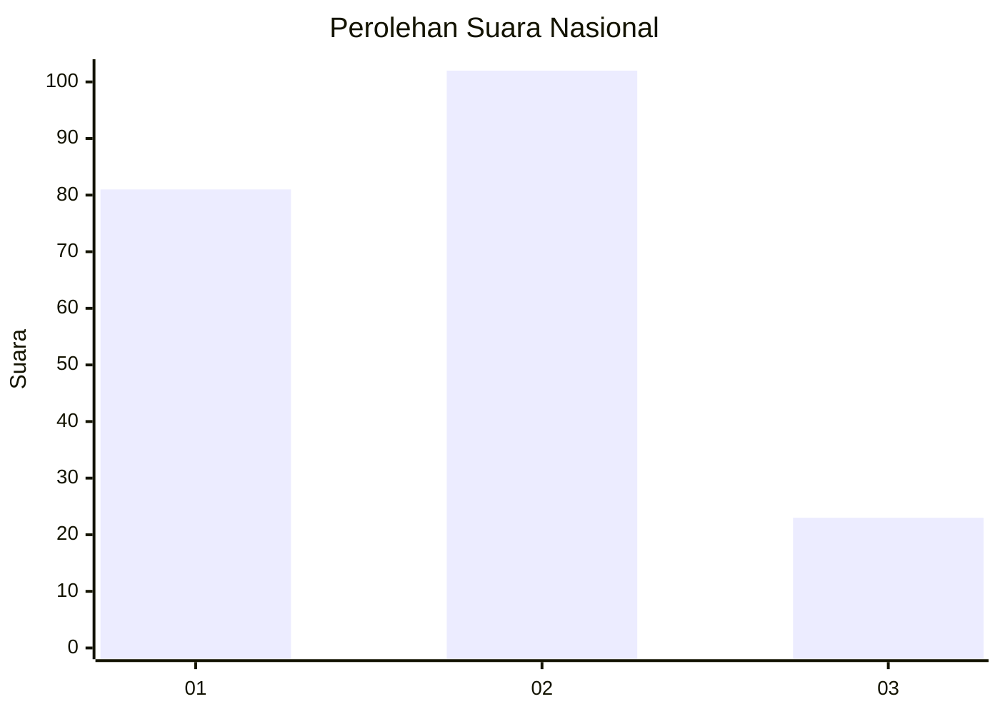
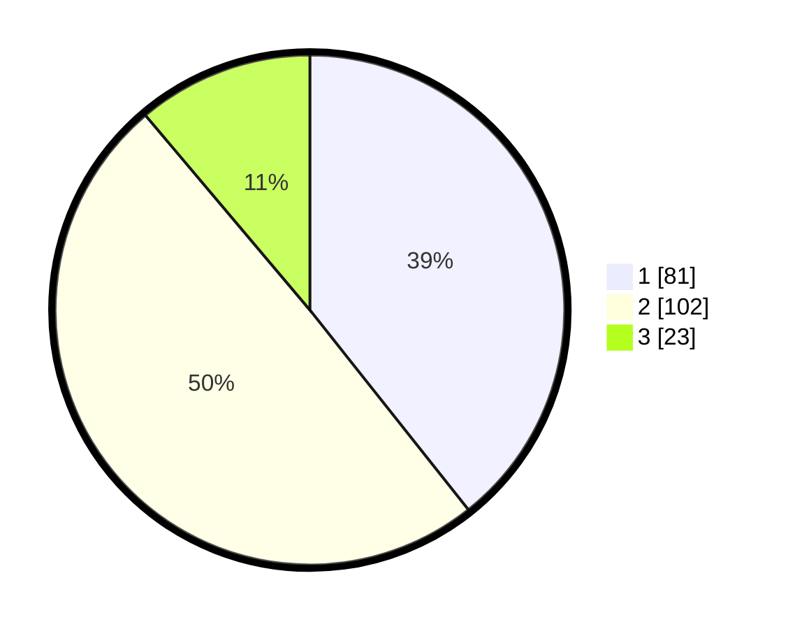

# Hasil

## Grafik

## Tabel

| No. | Nama Paslon    | Suara | Suara (raw) | Persentase |
|:--- |:-------------- | -----:| -----------:| ----------:|
| 1   | ANIES MUHAIMIN | 81    | [81][p-1]   | 39,32      |
| 2   | PRABOWO GIBRAN | 102   | [102][p-2]  | 49,51      |
| 3   | GANJAR MAHFUD  | 23    | [23][p-3]   | 11,17      |

[p-1]: https://github.com/gigit-pemilu/pemilu-2024/blob/main/pilpres/hitung-suara/sub/73-sulawesi-selatan/sub/12-soppeng/sub/06-donri-donri/sub/2003-lalabatariaja/sub/003-tps/sub/paslon-1.txt
[p-2]: https://github.com/gigit-pemilu/pemilu-2024/blob/main/pilpres/hitung-suara/sub/73-sulawesi-selatan/sub/12-soppeng/sub/06-donri-donri/sub/2003-lalabatariaja/sub/003-tps/sub/paslon-2.txt
[p-3]: https://github.com/gigit-pemilu/pemilu-2024/blob/main/pilpres/hitung-suara/sub/73-sulawesi-selatan/sub/12-soppeng/sub/06-donri-donri/sub/2003-lalabatariaja/sub/003-tps/sub/paslon-3.txt

## Foto C Plano

https://sirekap-obj-formc.kpu.go.id/cf4d/pemilu/ppwp/73/12/06/20/03/7312062003003-20240215-073723--0eaf4d1d-e462-4414-972a-9addfae7af09.jpg

https://sirekap-obj-formc.kpu.go.id/cf4d/pemilu/ppwp/73/12/06/20/03/7312062003003-20240214-192917--327964c5-6088-4abf-a2f2-2735853dc3b5.jpg

https://sirekap-obj-formc.kpu.go.id/cf4d/pemilu/ppwp/73/12/06/20/03/7312062003003-20240215-050126--f91fa08b-8ee9-4e4a-9900-e6cfcc0dd2a1.jpg

## Metadata

| Key        | Value               |
| ---------- | ------------------- |
| Time Stamp | 2024-02-15 23:29:50 |

