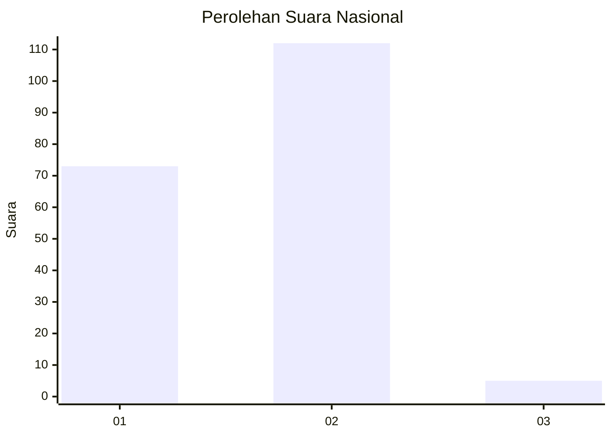
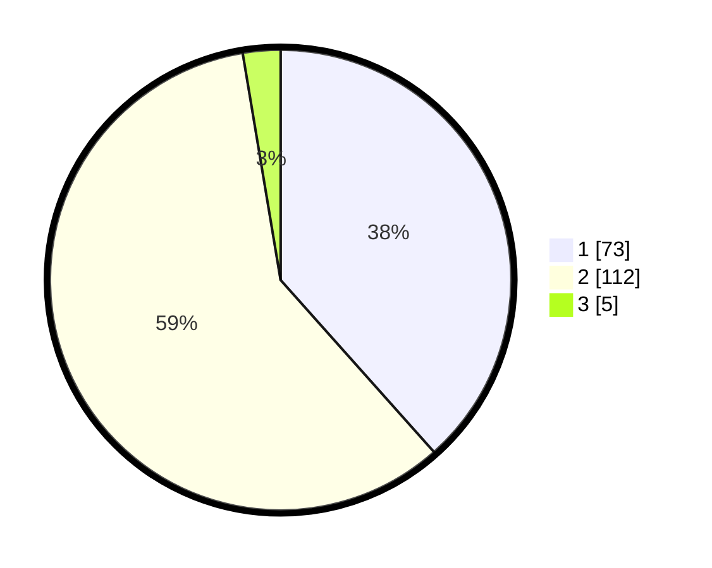

# Hasil

## Grafik

## Tabel

| No. | Nama Paslon    | Suara | Suara (raw) | Persentase |
|:--- |:-------------- | -----:| -----------:| ----------:|
| 1   | ANIES MUHAIMIN | 73    | [73][p-1]   | 38,42      |
| 2   | PRABOWO GIBRAN | 112   | [112][p-2]  | 58,95      |
| 3   | GANJAR MAHFUD  | 5     | [5][p-3]    | 2,63       |

[p-1]: https://github.com/gigit-pemilu/pemilu-2024/blob/main/pilpres/hitung-suara/sub/73-sulawesi-selatan/sub/13-wajo/sub/03-takkalalla/sub/1001-peneki/sub/003-tps/sub/paslon-1.txt
[p-2]: https://github.com/gigit-pemilu/pemilu-2024/blob/main/pilpres/hitung-suara/sub/73-sulawesi-selatan/sub/13-wajo/sub/03-takkalalla/sub/1001-peneki/sub/003-tps/sub/paslon-2.txt
[p-3]: https://github.com/gigit-pemilu/pemilu-2024/blob/main/pilpres/hitung-suara/sub/73-sulawesi-selatan/sub/13-wajo/sub/03-takkalalla/sub/1001-peneki/sub/003-tps/sub/paslon-3.txt

## Foto C Plano

https://sirekap-obj-formc.kpu.go.id/a973/pemilu/ppwp/73/13/03/10/01/7313031001003-20240215-091652--3bff7487-55f1-422f-973d-5be2083ee008.jpg

https://sirekap-obj-formc.kpu.go.id/a973/pemilu/ppwp/73/13/03/10/01/7313031001003-20240215-091705--87b2276c-a4c7-4dc5-a4fc-dbc7d57ad47f.jpg

https://sirekap-obj-formc.kpu.go.id/a973/pemilu/ppwp/73/13/03/10/01/7313031001003-20240215-091718--a9cd4e69-cc6a-49e0-9108-7c345bbc8e02.jpg

## Metadata

| Key        | Value               |
| ---------- | ------------------- |
| Time Stamp | 2024-02-17 10:30:03 |

