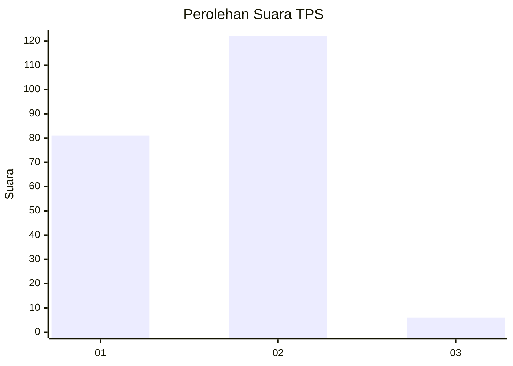
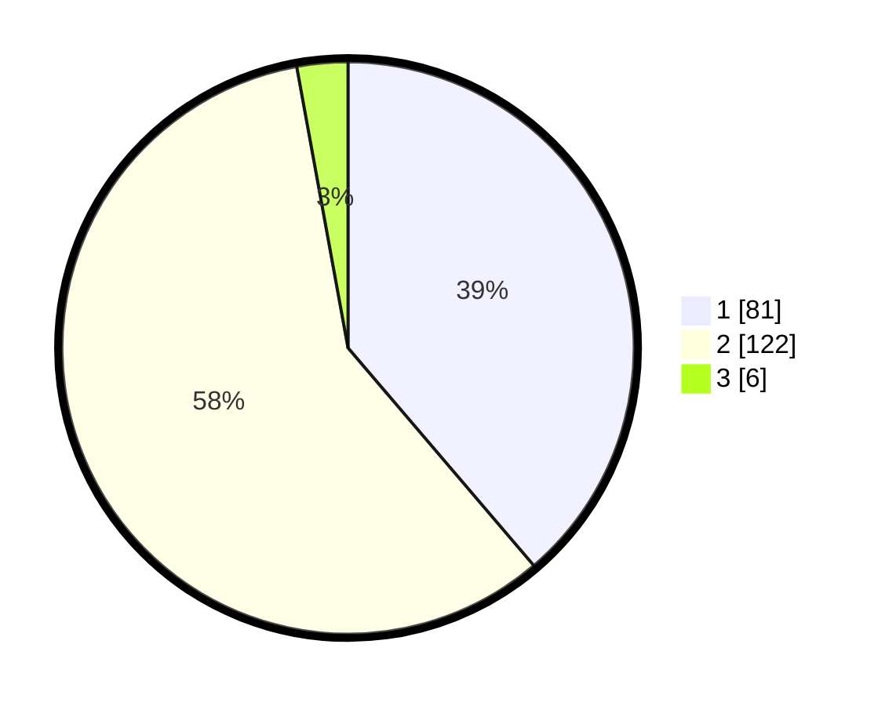

# Hasil

## Grafik

## Tabel

| No. | Nama Paslon    | Suara | Suara (raw) | Persentase |
|:--- |:-------------- | -----:| -----------:| ----------:|
| 1   | ANIES MUHAIMIN | 81    | [81][p-1]   | 38,76      |
| 2   | PRABOWO GIBRAN | 122   | [122][p-2]  | 58,37      |
| 3   | GANJAR MAHFUD  | 6     | [6][p-3]    | 2,87       |

[p-1]: https://github.com/gigit-pemilu/pemilu-2024-73-sulawesi-selatan/blob/main/pilpres/hitung-suara/sub/73-sulawesi-selatan/sub/13-wajo/sub/04-sajoanging/sub/1001-akkajeng/sub/002-tps/sub/paslon-1.txt
[p-2]: https://github.com/gigit-pemilu/pemilu-2024-73-sulawesi-selatan/blob/main/pilpres/hitung-suara/sub/73-sulawesi-selatan/sub/13-wajo/sub/04-sajoanging/sub/1001-akkajeng/sub/002-tps/sub/paslon-2.txt
[p-3]: https://github.com/gigit-pemilu/pemilu-2024-73-sulawesi-selatan/blob/main/pilpres/hitung-suara/sub/73-sulawesi-selatan/sub/13-wajo/sub/04-sajoanging/sub/1001-akkajeng/sub/002-tps/sub/paslon-3.txt

## Foto C Plano

https://sirekap-obj-formc.kpu.go.id/a332/pemilu/ppwp/73/13/04/10/01/7313041001002-20240215-045105--7b98f57f-eaf9-4571-a43a-63b530e00c8e.jpg

https://sirekap-obj-formc.kpu.go.id/a332/pemilu/ppwp/73/13/04/10/01/7313041001002-20240215-045258--42c31766-1ac6-4ae2-813d-c5090ca1fb28.jpg

https://sirekap-obj-formc.kpu.go.id/a332/pemilu/ppwp/73/13/04/10/01/7313041001002-20240215-045451--5a9c0a06-c603-404b-9e97-20e8a9435239.jpg

## Metadata

| Key        | Value               |
| ---------- | ------------------- |
| Time Stamp | 2024-02-16 05:00:26 |

