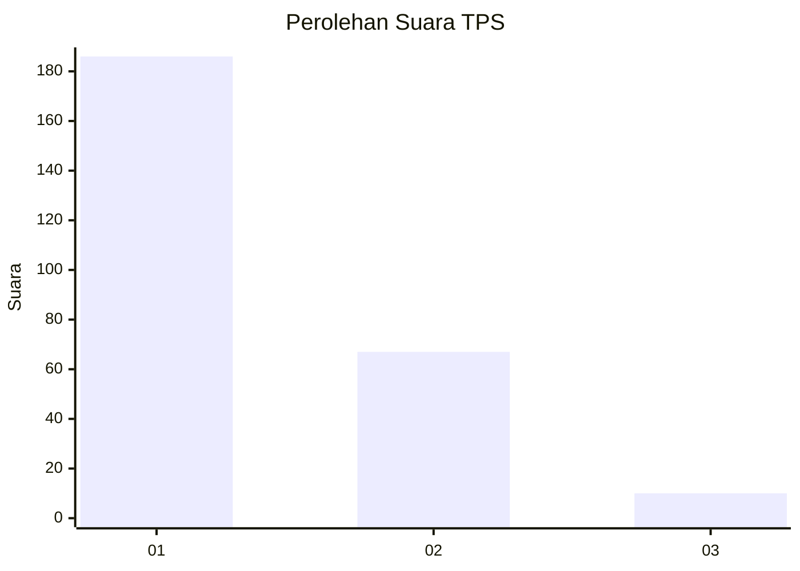
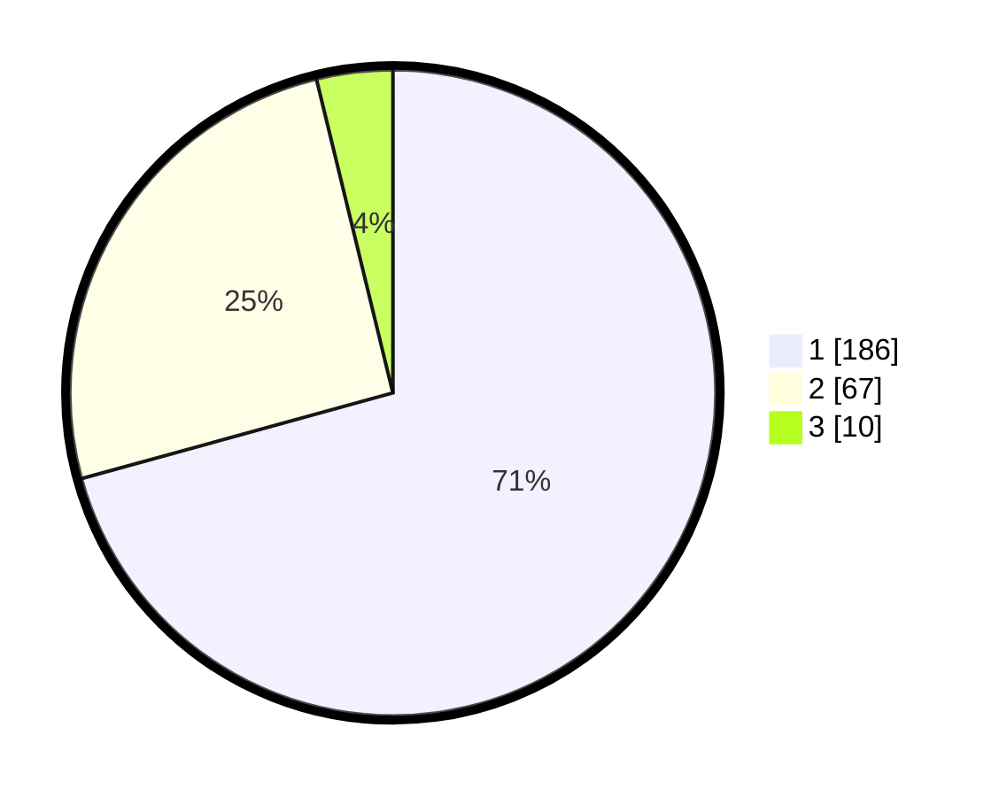

# Hasil

## Grafik

## Tabel

| No. | Nama Paslon    | Suara | Suara (raw) | Persentase |
|:--- |:-------------- | -----:| -----------:| ----------:|
| 1   | ANIES MUHAIMIN | 186   | [186][p-1]  | 70,72      |
| 2   | PRABOWO GIBRAN | 67    | [67][p-2]   | 25,48      |
| 3   | GANJAR MAHFUD  | 10    | [10][p-3]   | 3,80       |

[p-1]: https://github.com/gigit-pemilu/pemilu-2024-73-sulawesi-selatan/blob/main/pilpres/hitung-suara/sub/73-sulawesi-selatan/sub/13-wajo/sub/07-belawa/sub/1003-belawa/sub/002-tps/sub/paslon-1.txt
[p-2]: https://github.com/gigit-pemilu/pemilu-2024-73-sulawesi-selatan/blob/main/pilpres/hitung-suara/sub/73-sulawesi-selatan/sub/13-wajo/sub/07-belawa/sub/1003-belawa/sub/002-tps/sub/paslon-2.txt
[p-3]: https://github.com/gigit-pemilu/pemilu-2024-73-sulawesi-selatan/blob/main/pilpres/hitung-suara/sub/73-sulawesi-selatan/sub/13-wajo/sub/07-belawa/sub/1003-belawa/sub/002-tps/sub/paslon-3.txt

## Foto C Plano

https://sirekap-obj-formc.kpu.go.id/a76e/pemilu/ppwp/73/13/07/10/03/7313071003002-20240214-223044--443e5ca8-6c05-41d5-a771-0d63c617b0f8.jpg

https://sirekap-obj-formc.kpu.go.id/a76e/pemilu/ppwp/73/13/07/10/03/7313071003002-20240214-223432--8d64c63d-3439-487e-b9e3-60e2474ab1d8.jpg

https://sirekap-obj-formc.kpu.go.id/a76e/pemilu/ppwp/73/13/07/10/03/7313071003002-20240214-223956--f7885060-a7a6-4ed4-8101-af23d3179679.jpg

## Metadata

| Key        | Value               |
| ---------- | ------------------- |
| Time Stamp | 2024-02-16 21:01:00 |

