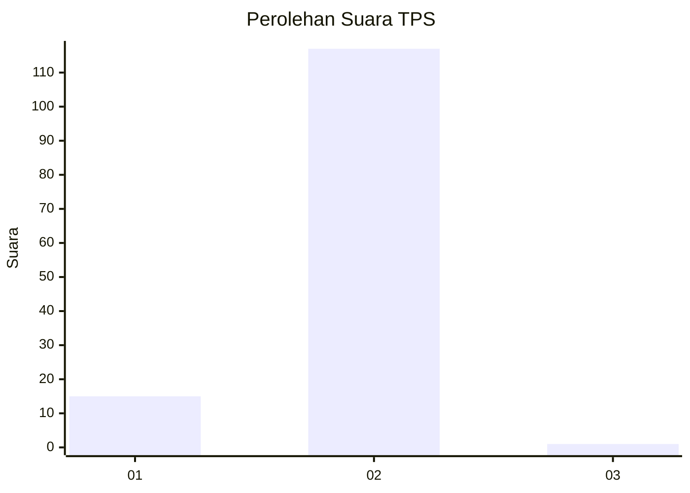
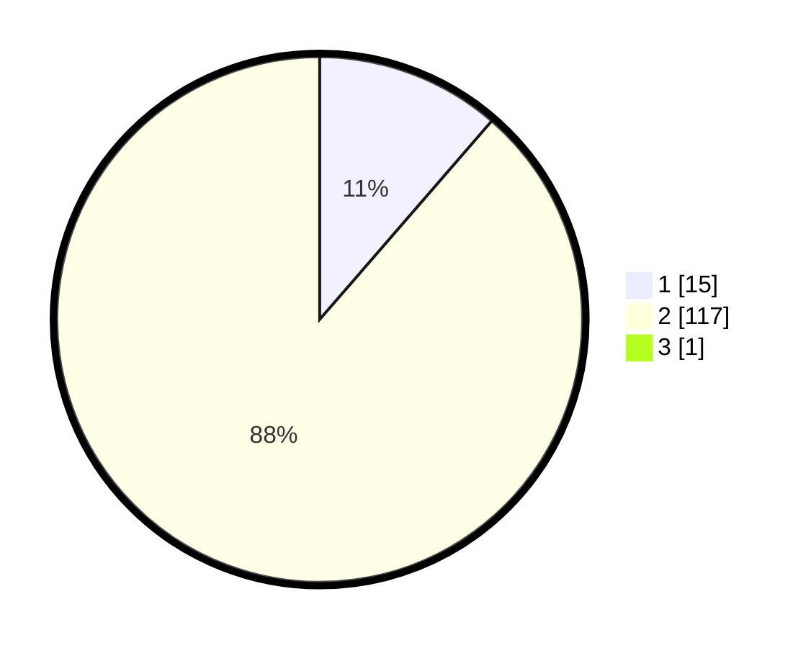

# Hasil

## Grafik

## Tabel

| No. | Nama Paslon    | Suara | Suara (raw) | Persentase |
|:--- |:-------------- | -----:| -----------:| ----------:|
| 1   | ANIES MUHAIMIN | 15    | [15][p-1]   | 11,28      |
| 2   | PRABOWO GIBRAN | 117   | [117][p-2]  | 87,97      |
| 3   | GANJAR MAHFUD  | 1     | [1][p-3]    | 0,75       |

[p-1]: https://github.com/gigit-pemilu/pemilu-2024-73-sulawesi-selatan/blob/main/pilpres/hitung-suara/sub/73-sulawesi-selatan/sub/13-wajo/sub/10-pitumpanua/sub/2024-maccolli-loloe/sub/002-tps/sub/paslon-1.txt
[p-2]: https://github.com/gigit-pemilu/pemilu-2024-73-sulawesi-selatan/blob/main/pilpres/hitung-suara/sub/73-sulawesi-selatan/sub/13-wajo/sub/10-pitumpanua/sub/2024-maccolli-loloe/sub/002-tps/sub/paslon-2.txt
[p-3]: https://github.com/gigit-pemilu/pemilu-2024-73-sulawesi-selatan/blob/main/pilpres/hitung-suara/sub/73-sulawesi-selatan/sub/13-wajo/sub/10-pitumpanua/sub/2024-maccolli-loloe/sub/002-tps/sub/paslon-3.txt

## Foto C Plano

https://sirekap-obj-formc.kpu.go.id/b0b8/pemilu/ppwp/73/13/10/20/24/7313102024002-20240226-163138--b6894d78-8c4d-4505-8e06-1968b912a0e4.jpg

https://sirekap-obj-formc.kpu.go.id/b0b8/pemilu/ppwp/73/13/10/20/24/7313102024002-20240226-163151--df6f4a62-a3f7-4195-bafa-3ca1517f75d5.jpg

https://sirekap-obj-formc.kpu.go.id/b0b8/pemilu/ppwp/73/13/10/20/24/7313102024002-20240226-163201--31ecf5bc-bc70-4802-95e4-b3f073bffc4c.jpg

## Metadata

| Key        | Value               |
| ---------- | ------------------- |
| Time Stamp | 2024-02-26 22:00:00 |

