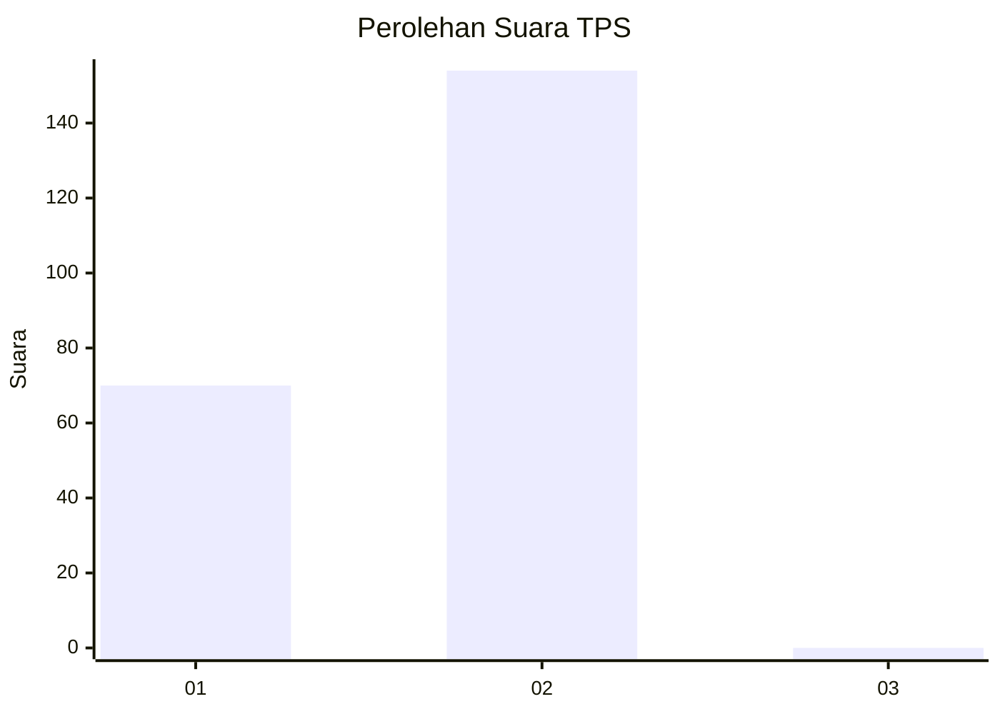
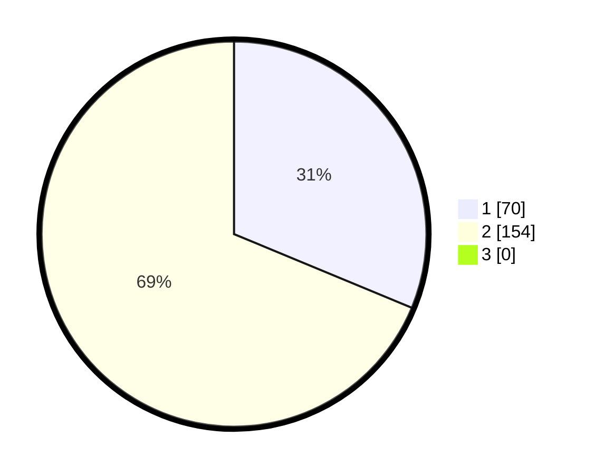

# Hasil

## Grafik

## Tabel

| No. | Nama Paslon    | Suara | Suara (raw) | Persentase |
|:--- |:-------------- | -----:| -----------:| ----------:|
| 1   | ANIES MUHAIMIN | 70    | [70][p-1]   | 31,25      |
| 2   | PRABOWO GIBRAN | 154   | [154][p-2]  | 68,75      |
| 3   | GANJAR MAHFUD  | 0     | [0][p-3]    | 0,00       |

[p-1]: https://github.com/gigit-pemilu/pemilu-2024-73-sulawesi-selatan/blob/main/pilpres/hitung-suara/sub/73-sulawesi-selatan/sub/14-sidenreng-rappang/sub/01-panca-lautang/sub/1001-bilokka/sub/005-tps/sub/paslon-1.txt
[p-2]: https://github.com/gigit-pemilu/pemilu-2024-73-sulawesi-selatan/blob/main/pilpres/hitung-suara/sub/73-sulawesi-selatan/sub/14-sidenreng-rappang/sub/01-panca-lautang/sub/1001-bilokka/sub/005-tps/sub/paslon-2.txt
[p-3]: https://github.com/gigit-pemilu/pemilu-2024-73-sulawesi-selatan/blob/main/pilpres/hitung-suara/sub/73-sulawesi-selatan/sub/14-sidenreng-rappang/sub/01-panca-lautang/sub/1001-bilokka/sub/005-tps/sub/paslon-3.txt

## Foto C Plano

https://sirekap-obj-formc.kpu.go.id/8eb5/pemilu/ppwp/73/14/01/10/01/7314011001005-20240216-151653--b6a68b28-bf7a-4c96-8d1b-36c00b75a23d.jpg

https://sirekap-obj-formc.kpu.go.id/8eb5/pemilu/ppwp/73/14/01/10/01/7314011001005-20240215-070411--ee544189-72c2-4b1b-9f7b-56817e2bc44a.jpg

https://sirekap-obj-formc.kpu.go.id/8eb5/pemilu/ppwp/73/14/01/10/01/7314011001005-20240215-070152--c40dee55-2eb7-4e2e-bb09-2d3ee6728da0.jpg

## Metadata

| Key        | Value               |
| ---------- | ------------------- |
| Time Stamp | 2024-02-16 23:30:00 |

