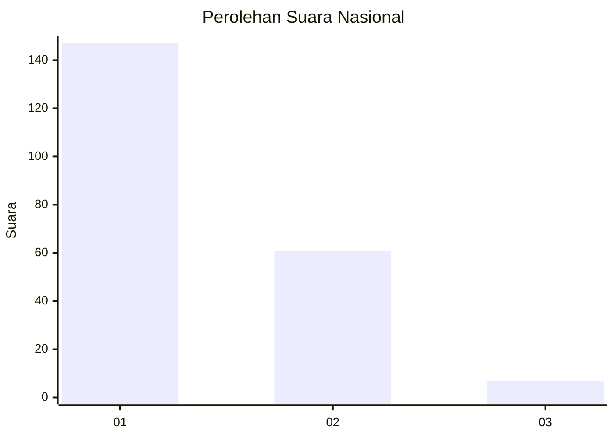
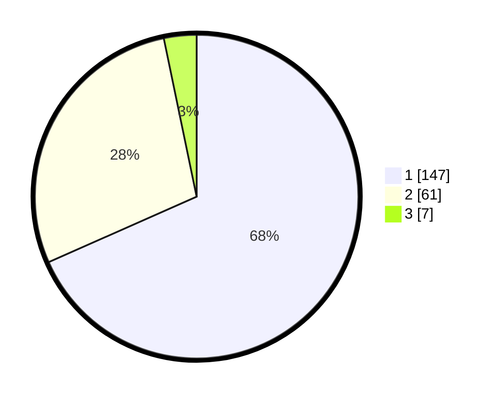

# Hasil

## Grafik

## Tabel

| No. | Nama Paslon    | Suara | Suara (raw) | Persentase |
|:--- |:-------------- | -----:| -----------:| ----------:|
| 1   | ANIES MUHAIMIN | 147   | [147][p-1]  | 68,37      |
| 2   | PRABOWO GIBRAN | 61    | [61][p-2]   | 28,37      |
| 3   | GANJAR MAHFUD  | 7     | [7][p-3]    | 3,26       |

[p-1]: https://github.com/gigit-pemilu/pemilu-2024/blob/main/pilpres/hitung-suara/sub/73-sulawesi-selatan/sub/14-sidenreng-rappang/sub/01-panca-lautang/sub/2007-lise/sub/007-tps/sub/paslon-1.txt
[p-2]: https://github.com/gigit-pemilu/pemilu-2024/blob/main/pilpres/hitung-suara/sub/73-sulawesi-selatan/sub/14-sidenreng-rappang/sub/01-panca-lautang/sub/2007-lise/sub/007-tps/sub/paslon-2.txt
[p-3]: https://github.com/gigit-pemilu/pemilu-2024/blob/main/pilpres/hitung-suara/sub/73-sulawesi-selatan/sub/14-sidenreng-rappang/sub/01-panca-lautang/sub/2007-lise/sub/007-tps/sub/paslon-3.txt

## Foto C Plano

https://sirekap-obj-formc.kpu.go.id/b7c5/pemilu/ppwp/73/14/01/20/07/7314012007007-20240216-130159--761157b5-b291-4b08-9ba0-537d4fdba205.jpg

https://sirekap-obj-formc.kpu.go.id/b7c5/pemilu/ppwp/73/14/01/20/07/7314012007007-20240216-125049--513ecb9b-496d-4a7f-ac11-6aebbad1fcee.jpg

https://sirekap-obj-formc.kpu.go.id/b7c5/pemilu/ppwp/73/14/01/20/07/7314012007007-20240216-125223--e8698049-1cc6-44d7-a7c2-94fd9e009766.jpg

## Metadata

| Key        | Value               |
| ---------- | ------------------- |
| Time Stamp | 2024-02-17 19:30:00 |

## DATA PEMILIH TETAP

Jumlah pemilih dalam DPT: **253**.
 * L: **428**.
 * P: **233**.

## DATA PENGGUNA HAK PILIH

Jumlah pengguna hak pilih dalam DPT: **218**.
 * L: **895**.
 * P: **463**.

Jumlah pengguna hak pilih dalam DPTb: **993**.
 * L: **992**.
 * P: **993**.

Jumlah pengguna hak pilih dalam DPK: **903**.
 * L: **93**.
 * P: **99**.

Jumlah pengguna hak pilih: **224**.
 * L: **199**.
 * P: **185**.

## JUMLAH SUARA SAH DAN TIDAK SAH

JUMLAH SELURUH SUARA SAH: **215**.

JUMLAH SUARA TIDAK SAH: **9**.

JUMLAH SELURUH SUARA SAH DAN SUARA TIDAK SAH: **224**.

