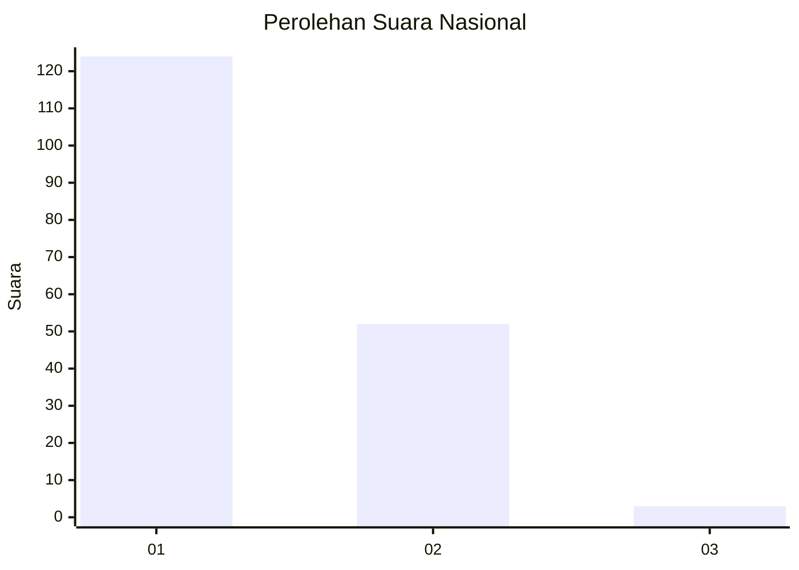
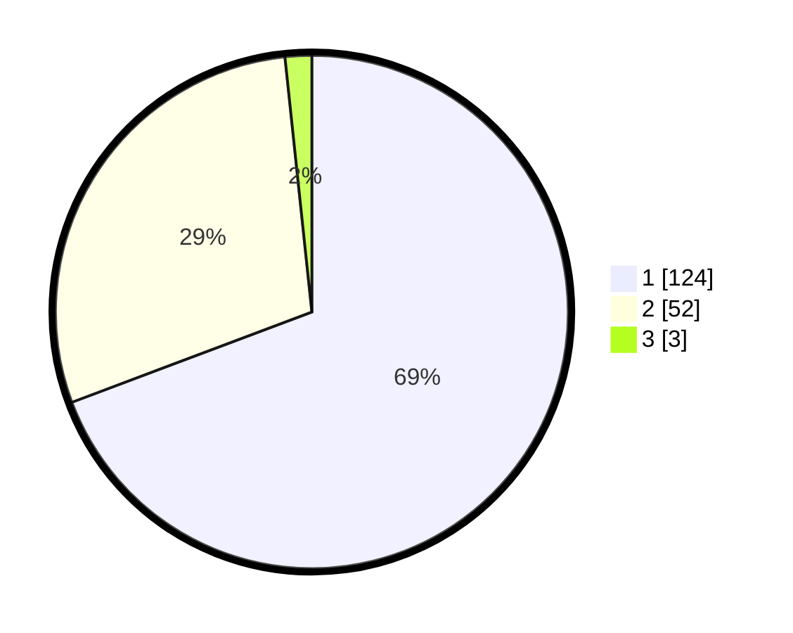

# Hasil

## Grafik

## Tabel

| No. | Nama Paslon    | Suara | Suara (raw) | Persentase |
|:--- |:-------------- | -----:| -----------:| ----------:|
| 1   | ANIES MUHAIMIN | 124   | [124][p-1]  | 69,27      |
| 2   | PRABOWO GIBRAN | 52    | [52][p-2]   | 29,05      |
| 3   | GANJAR MAHFUD  | 3     | [3][p-3]    | 1,68       |

[p-1]: https://github.com/gigit-pemilu/pemilu-2024/blob/main/pilpres/hitung-suara/sub/73-sulawesi-selatan/sub/14-sidenreng-rappang/sub/04-baranti/sub/2007-sipodeceng/sub/002-tps/sub/paslon-1.txt
[p-2]: https://github.com/gigit-pemilu/pemilu-2024/blob/main/pilpres/hitung-suara/sub/73-sulawesi-selatan/sub/14-sidenreng-rappang/sub/04-baranti/sub/2007-sipodeceng/sub/002-tps/sub/paslon-2.txt
[p-3]: https://github.com/gigit-pemilu/pemilu-2024/blob/main/pilpres/hitung-suara/sub/73-sulawesi-selatan/sub/14-sidenreng-rappang/sub/04-baranti/sub/2007-sipodeceng/sub/002-tps/sub/paslon-3.txt

## Foto C Plano

https://sirekap-obj-formc.kpu.go.id/6e45/pemilu/ppwp/73/14/04/20/07/7314042007002-20240214-141056--676f4225-1e87-430d-aa2c-a31f1f711a1e.jpg

https://sirekap-obj-formc.kpu.go.id/6e45/pemilu/ppwp/73/14/04/20/07/7314042007002-20240214-132640--dbe601f3-05f9-4fdd-99fb-c0c010485000.jpg

https://sirekap-obj-formc.kpu.go.id/6e45/pemilu/ppwp/73/14/04/20/07/7314042007002-20240214-132813--37b1c484-9ba4-484f-b541-b842f8b18c6d.jpg

## Metadata

| Key        | Value               |
| ---------- | ------------------- |
| Time Stamp | 2024-02-14 21:46:01 |

