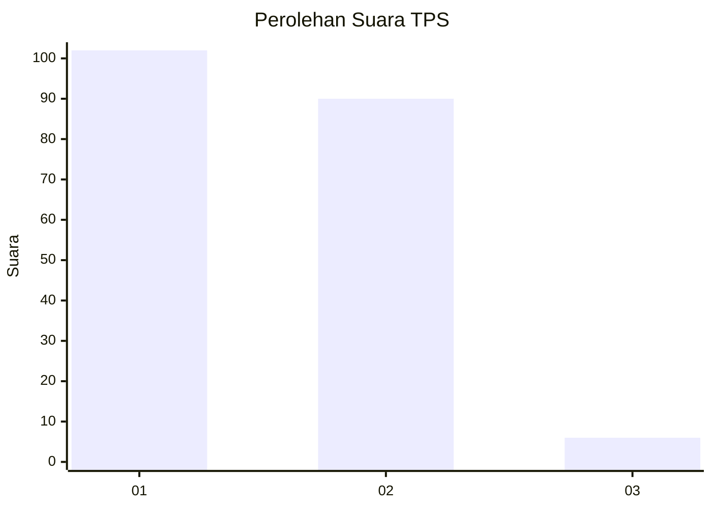
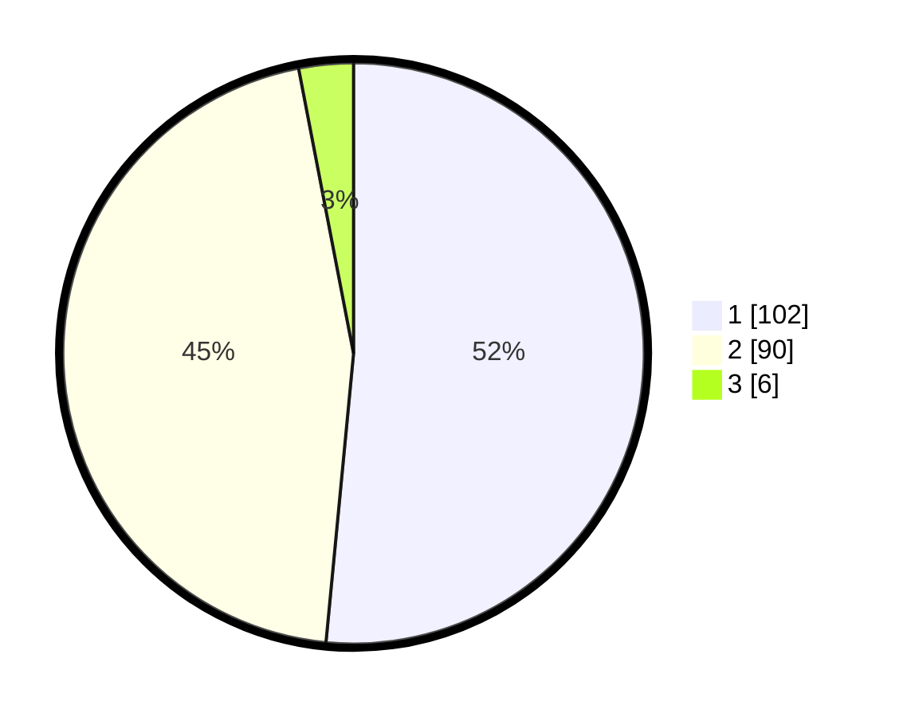

# Hasil

## Grafik

## Tabel

| No. | Nama Paslon    | Suara | Suara (raw) | Persentase |
|:--- |:-------------- | -----:| -----------:| ----------:|
| 1   | ANIES MUHAIMIN | 102   | [102][p-1]  | 51,52      |
| 2   | PRABOWO GIBRAN | 90    | [90][p-2]   | 45,45      |
| 3   | GANJAR MAHFUD  | 6     | [6][p-3]    | 3,03       |

[p-1]: https://github.com/gigit-pemilu/pemilu-2024-73-sulawesi-selatan/blob/main/pilpres/hitung-suara/sub/73-sulawesi-selatan/sub/15-pinrang/sub/01-mattiro-sompe/sub/1001-langnga/sub/010-tps/sub/paslon-1.txt
[p-2]: https://github.com/gigit-pemilu/pemilu-2024-73-sulawesi-selatan/blob/main/pilpres/hitung-suara/sub/73-sulawesi-selatan/sub/15-pinrang/sub/01-mattiro-sompe/sub/1001-langnga/sub/010-tps/sub/paslon-2.txt
[p-3]: https://github.com/gigit-pemilu/pemilu-2024-73-sulawesi-selatan/blob/main/pilpres/hitung-suara/sub/73-sulawesi-selatan/sub/15-pinrang/sub/01-mattiro-sompe/sub/1001-langnga/sub/010-tps/sub/paslon-3.txt

## Foto C Plano

https://sirekap-obj-formc.kpu.go.id/765c/pemilu/ppwp/73/15/01/10/01/7315011001010-20240214-200306--c6df078b-d9b2-476a-8c4c-58fa09e36b33.jpg

https://sirekap-obj-formc.kpu.go.id/765c/pemilu/ppwp/73/15/01/10/01/7315011001010-20240214-200527--b743c7d1-2113-4437-b216-4c1f3b945f9b.jpg

https://sirekap-obj-formc.kpu.go.id/765c/pemilu/ppwp/73/15/01/10/01/7315011001010-20240214-200711--dcb00080-beae-4323-9044-2912cd7e6a51.jpg

## Metadata

| Key        | Value               |
| ---------- | ------------------- |
| Time Stamp | 2024-02-15 00:41:44 |

