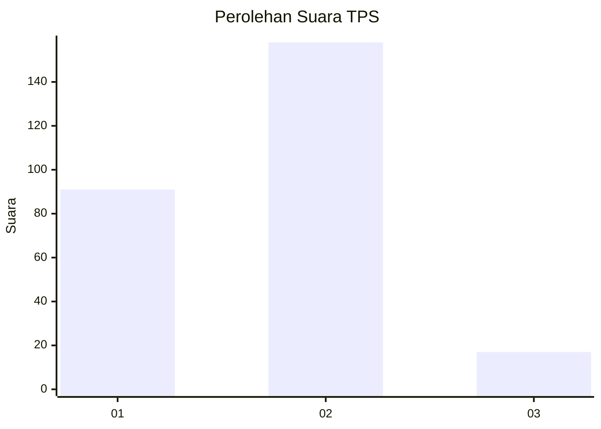
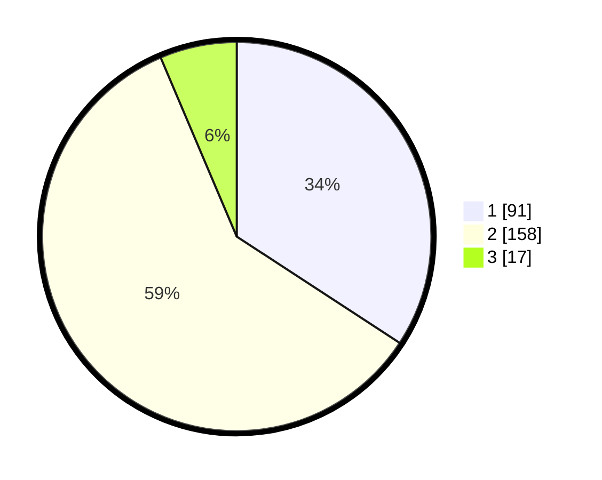

# Hasil

## Grafik

## Tabel

| No. | Nama Paslon    | Suara | Suara (raw) | Persentase |
|:--- |:-------------- | -----:| -----------:| ----------:|
| 1   | ANIES MUHAIMIN | 91    | [91][p-1]   | 34,21      |
| 2   | PRABOWO GIBRAN | 158   | [158][p-2]  | 59,40      |
| 3   | GANJAR MAHFUD  | 17    | [17][p-3]   | 6,39       |

[p-1]: https://github.com/gigit-pemilu/pemilu-2024-73-sulawesi-selatan/blob/main/pilpres/hitung-suara/sub/73-sulawesi-selatan/sub/15-pinrang/sub/02-suppa/sub/1001-watang-suppa/sub/010-tps/sub/paslon-1.txt
[p-2]: https://github.com/gigit-pemilu/pemilu-2024-73-sulawesi-selatan/blob/main/pilpres/hitung-suara/sub/73-sulawesi-selatan/sub/15-pinrang/sub/02-suppa/sub/1001-watang-suppa/sub/010-tps/sub/paslon-2.txt
[p-3]: https://github.com/gigit-pemilu/pemilu-2024-73-sulawesi-selatan/blob/main/pilpres/hitung-suara/sub/73-sulawesi-selatan/sub/15-pinrang/sub/02-suppa/sub/1001-watang-suppa/sub/010-tps/sub/paslon-3.txt

## Foto C Plano

https://sirekap-obj-formc.kpu.go.id/032a/pemilu/ppwp/73/15/02/10/01/7315021001010-20240222-081520--d377ac51-e1e8-46a7-88f0-a48ab16cdc1f.jpg

https://sirekap-obj-formc.kpu.go.id/032a/pemilu/ppwp/73/15/02/10/01/7315021001010-20240222-081617--0d928857-b163-44d8-a27a-a5040360525f.jpg

https://sirekap-obj-formc.kpu.go.id/032a/pemilu/ppwp/73/15/02/10/01/7315021001010-20240222-081705--4a84f28a-08a3-4d4a-b75a-f79e1f70776c.jpg

## Metadata

| Key        | Value               |
| ---------- | ------------------- |
| Time Stamp | 2024-02-25 21:00:00 |

