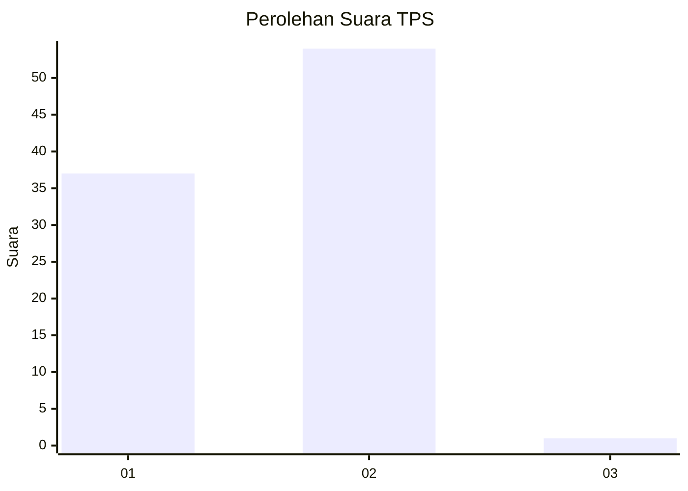
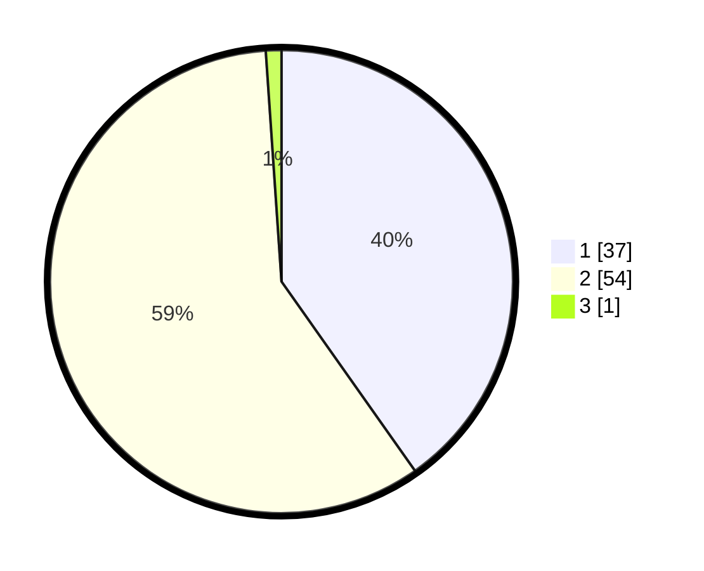

# Hasil

## Grafik

## Tabel

| No. | Nama Paslon    | Suara | Suara (raw) | Persentase |
|:--- |:-------------- | -----:| -----------:| ----------:|
| 1   | ANIES MUHAIMIN | 37    | [37][p-1]   | 40,22      |
| 2   | PRABOWO GIBRAN | 54    | [54][p-2]   | 58,70      |
| 3   | GANJAR MAHFUD  | 1     | [1][p-3]    | 1,09       |

[p-1]: https://github.com/gigit-pemilu/pemilu-2024-73-sulawesi-selatan/blob/main/pilpres/hitung-suara/sub/73-sulawesi-selatan/sub/15-pinrang/sub/07-lembang/sub/2008-basseang/sub/005-tps/sub/paslon-1.txt
[p-2]: https://github.com/gigit-pemilu/pemilu-2024-73-sulawesi-selatan/blob/main/pilpres/hitung-suara/sub/73-sulawesi-selatan/sub/15-pinrang/sub/07-lembang/sub/2008-basseang/sub/005-tps/sub/paslon-2.txt
[p-3]: https://github.com/gigit-pemilu/pemilu-2024-73-sulawesi-selatan/blob/main/pilpres/hitung-suara/sub/73-sulawesi-selatan/sub/15-pinrang/sub/07-lembang/sub/2008-basseang/sub/005-tps/sub/paslon-3.txt

## Foto C Plano

https://sirekap-obj-formc.kpu.go.id/14da/pemilu/ppwp/73/15/07/20/08/7315072008005-20240215-082609--7a37ce20-a86c-41b9-a5c5-2a7f6dd96a29.jpg

https://sirekap-obj-formc.kpu.go.id/14da/pemilu/ppwp/73/15/07/20/08/7315072008005-20240215-093125--679e6626-8e22-46fa-ab3d-6737bd730a97.jpg

https://sirekap-obj-formc.kpu.go.id/14da/pemilu/ppwp/73/15/07/20/08/7315072008005-20240215-084159--0f6589ba-d6ee-482d-84d2-52dbdffc1fa6.jpg

## Metadata

| Key        | Value               |
| ---------- | ------------------- |
| Time Stamp | 2024-02-16 16:25:10 |

