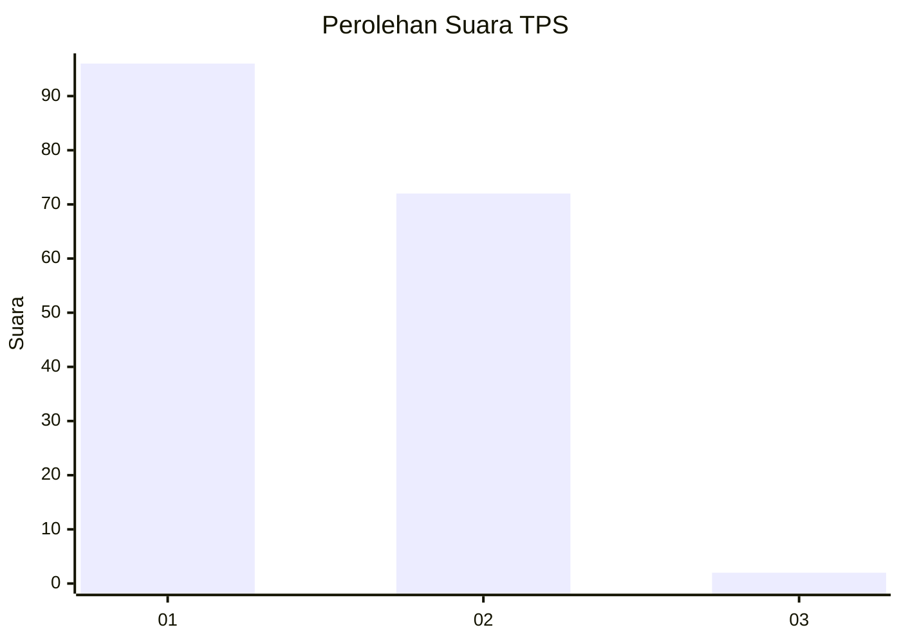
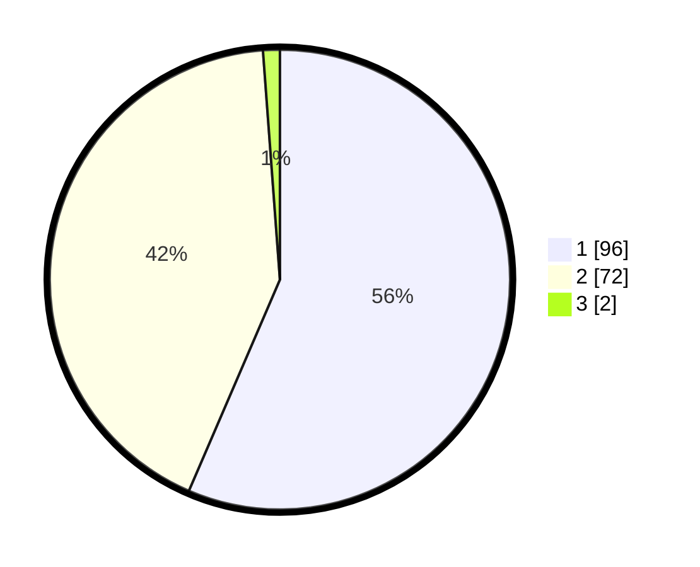

# Hasil

## Grafik

## Tabel

| No. | Nama Paslon    | Suara | Suara (raw) | Persentase |
|:--- |:-------------- | -----:| -----------:| ----------:|
| 1   | ANIES MUHAIMIN | 96    | [96][p-1]   | 56,47      |
| 2   | PRABOWO GIBRAN | 72    | [72][p-2]   | 42,35      |
| 3   | GANJAR MAHFUD  | 2     | [2][p-3]    | 1,18       |

[p-1]: https://github.com/gigit-pemilu/pemilu-2024-73-sulawesi-selatan/blob/main/pilpres/hitung-suara/sub/73-sulawesi-selatan/sub/16-enrekang/sub/02-enrekang/sub/1001-galonta/sub/004-tps/sub/paslon-1.txt
[p-2]: https://github.com/gigit-pemilu/pemilu-2024-73-sulawesi-selatan/blob/main/pilpres/hitung-suara/sub/73-sulawesi-selatan/sub/16-enrekang/sub/02-enrekang/sub/1001-galonta/sub/004-tps/sub/paslon-2.txt
[p-3]: https://github.com/gigit-pemilu/pemilu-2024-73-sulawesi-selatan/blob/main/pilpres/hitung-suara/sub/73-sulawesi-selatan/sub/16-enrekang/sub/02-enrekang/sub/1001-galonta/sub/004-tps/sub/paslon-3.txt

## Foto C Plano

https://sirekap-obj-formc.kpu.go.id/b661/pemilu/ppwp/73/16/02/10/01/7316021001004-20240214-132638--1f943d6f-4fb0-45ad-8c71-4b2bf656feb4.jpg

https://sirekap-obj-formc.kpu.go.id/b661/pemilu/ppwp/73/16/02/10/01/7316021001004-20240214-133407--2c0cca47-fdcd-4922-83df-1eb74e3ab151.jpg

https://sirekap-obj-formc.kpu.go.id/b661/pemilu/ppwp/73/16/02/10/01/7316021001004-20240214-131526--4bd14d2e-3cb2-43f1-80f7-7c10194dbd66.jpg

## Metadata

| Key        | Value               |
| ---------- | ------------------- |
| Time Stamp | 2024-02-15 00:41:44 |

