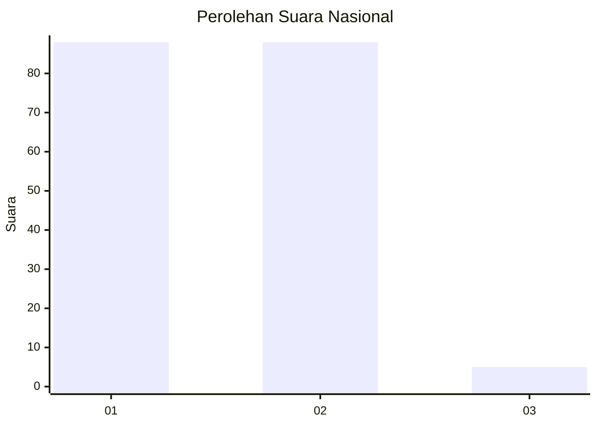
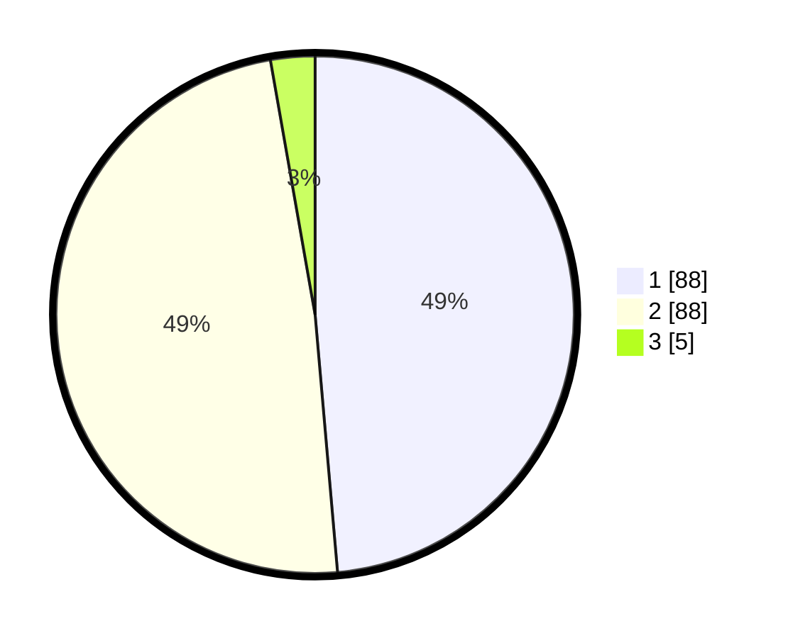

# Hasil

## Grafik

## Tabel

| No. | Nama Paslon    | Suara | Suara (raw) | Persentase |
|:--- |:-------------- | -----:| -----------:| ----------:|
| 1   | ANIES MUHAIMIN | 88    | [88][p-1]   | 48,62      |
| 2   | PRABOWO GIBRAN | 88    | [88][p-2]   | 48,62      |
| 3   | GANJAR MAHFUD  | 5     | [5][p-3]    | 2,76       |

[p-1]: https://github.com/gigit-pemilu/pemilu-2024/blob/main/pilpres/hitung-suara/sub/73-sulawesi-selatan/sub/16-enrekang/sub/02-enrekang/sub/1001-galonta/sub/005-tps/sub/paslon-1.txt
[p-2]: https://github.com/gigit-pemilu/pemilu-2024/blob/main/pilpres/hitung-suara/sub/73-sulawesi-selatan/sub/16-enrekang/sub/02-enrekang/sub/1001-galonta/sub/005-tps/sub/paslon-2.txt
[p-3]: https://github.com/gigit-pemilu/pemilu-2024/blob/main/pilpres/hitung-suara/sub/73-sulawesi-selatan/sub/16-enrekang/sub/02-enrekang/sub/1001-galonta/sub/005-tps/sub/paslon-3.txt

## Foto C Plano

https://sirekap-obj-formc.kpu.go.id/db8c/pemilu/ppwp/73/16/02/10/01/7316021001005-20240215-021950--2fe32bfd-1fe9-4640-9ac3-9e6e7cd91724.jpg

https://sirekap-obj-formc.kpu.go.id/db8c/pemilu/ppwp/73/16/02/10/01/7316021001005-20240215-001329--30642331-8d8a-49da-891a-5a828dcce9a6.jpg

https://sirekap-obj-formc.kpu.go.id/db8c/pemilu/ppwp/73/16/02/10/01/7316021001005-20240215-001537--fbb6a282-1a86-47cd-bf57-ec7b1c0df342.jpg

## Metadata

| Key        | Value               |
| ---------- | ------------------- |
| Time Stamp | 2024-02-17 00:00:00 |

