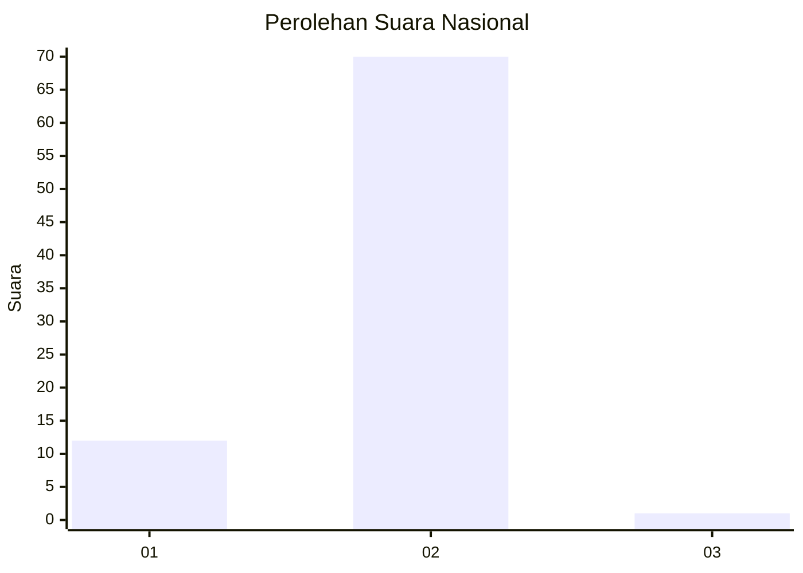
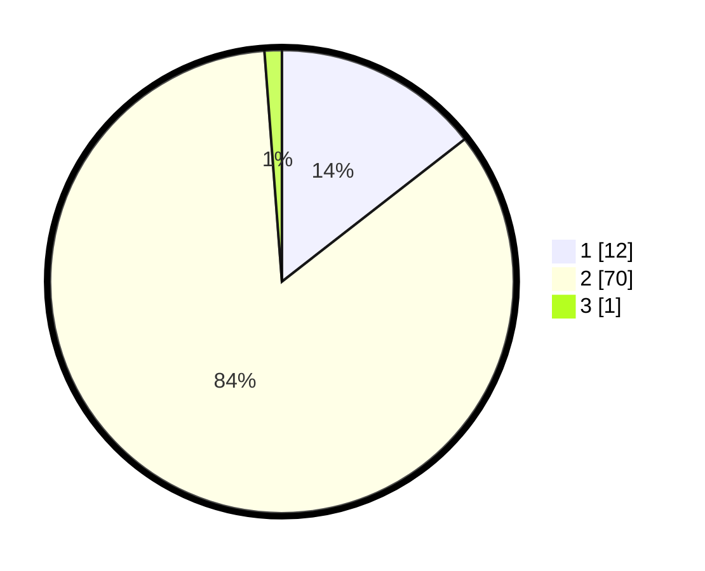

# Hasil

## Grafik

## Tabel

| No. | Nama Paslon    | Suara | Suara (raw) | Persentase |
|:--- |:-------------- | -----:| -----------:| ----------:|
| 1   | ANIES MUHAIMIN | 12    | [12][p-1]   | 14,46      |
| 2   | PRABOWO GIBRAN | 70    | [70][p-2]   | 84,34      |
| 3   | GANJAR MAHFUD  | 1     | [1][p-3]    | 1,20       |

[p-1]: https://github.com/gigit-pemilu/pemilu-2024/blob/main/pilpres/hitung-suara/sub/73-sulawesi-selatan/sub/16-enrekang/sub/02-enrekang/sub/2015-cemba/sub/006-tps/sub/paslon-1.txt
[p-2]: https://github.com/gigit-pemilu/pemilu-2024/blob/main/pilpres/hitung-suara/sub/73-sulawesi-selatan/sub/16-enrekang/sub/02-enrekang/sub/2015-cemba/sub/006-tps/sub/paslon-2.txt
[p-3]: https://github.com/gigit-pemilu/pemilu-2024/blob/main/pilpres/hitung-suara/sub/73-sulawesi-selatan/sub/16-enrekang/sub/02-enrekang/sub/2015-cemba/sub/006-tps/sub/paslon-3.txt

## Foto C Plano

https://sirekap-obj-formc.kpu.go.id/ece8/pemilu/ppwp/73/16/02/20/15/7316022015006-20240214-234739--2d350a07-a49f-4a17-856e-4eaacf83ee7e.jpg

https://sirekap-obj-formc.kpu.go.id/ece8/pemilu/ppwp/73/16/02/20/15/7316022015006-20240214-235031--e888de47-253a-475e-b160-65d8342645cc.jpg

https://sirekap-obj-formc.kpu.go.id/ece8/pemilu/ppwp/73/16/02/20/15/7316022015006-20240214-235308--1ace1b46-beab-4210-a289-9885aaa827ea.jpg

## Metadata

| Key        | Value               |
| ---------- | ------------------- |
| Time Stamp | 2024-02-15 15:00:29 |

