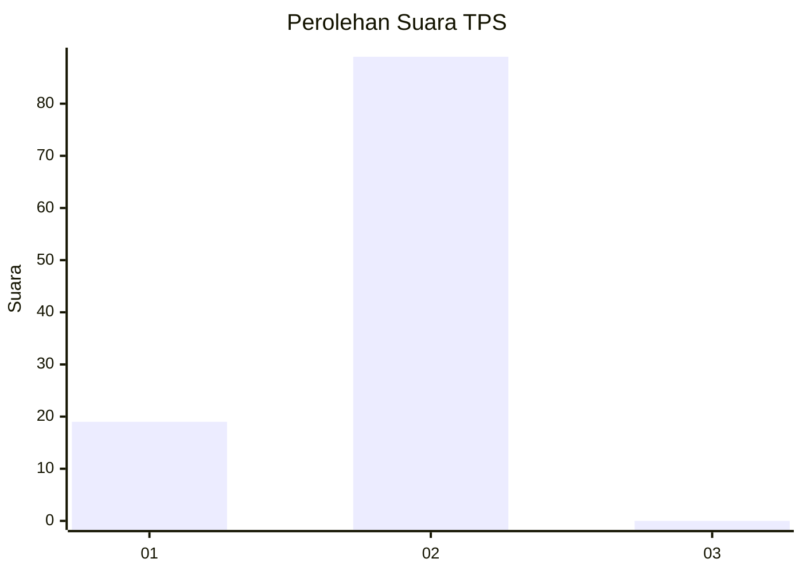
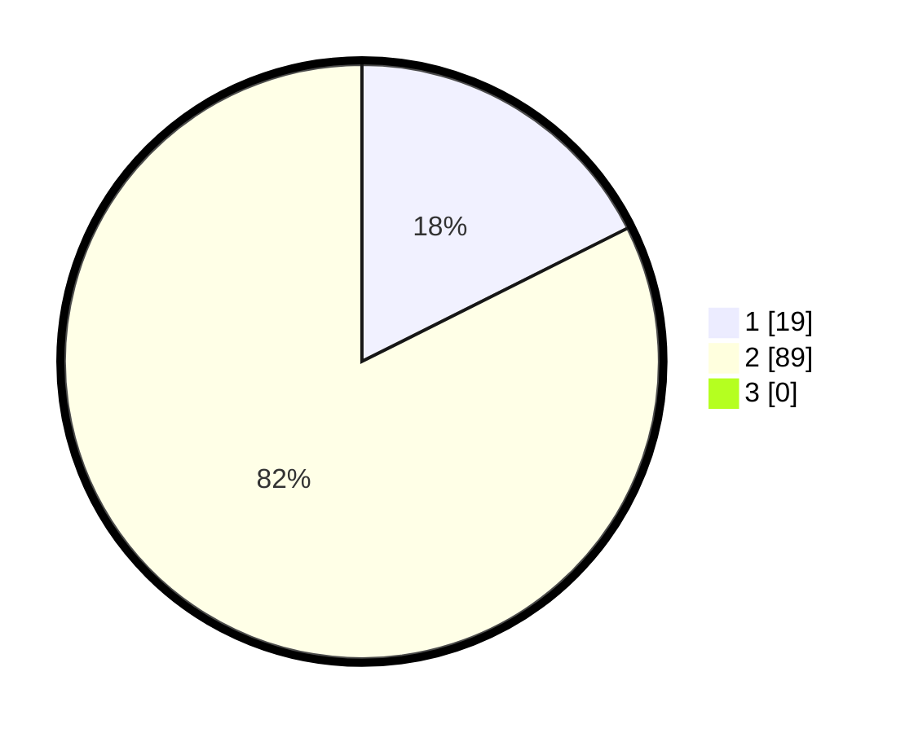

# Hasil

## Grafik

## Tabel

| No. | Nama Paslon    | Suara | Suara (raw) | Persentase |
|:--- |:-------------- | -----:| -----------:| ----------:|
| 1   | ANIES MUHAIMIN | 19    | [19][p-1]   | 17,59      |
| 2   | PRABOWO GIBRAN | 89    | [89][p-2]   | 82,41      |
| 3   | GANJAR MAHFUD  | 0     | [0][p-3]    | 0,00       |

[p-1]: https://github.com/gigit-pemilu/pemilu-2024-73-sulawesi-selatan/blob/main/pilpres/hitung-suara/sub/73-sulawesi-selatan/sub/16-enrekang/sub/02-enrekang/sub/2017-temban/sub/004-tps/sub/paslon-1.txt
[p-2]: https://github.com/gigit-pemilu/pemilu-2024-73-sulawesi-selatan/blob/main/pilpres/hitung-suara/sub/73-sulawesi-selatan/sub/16-enrekang/sub/02-enrekang/sub/2017-temban/sub/004-tps/sub/paslon-2.txt
[p-3]: https://github.com/gigit-pemilu/pemilu-2024-73-sulawesi-selatan/blob/main/pilpres/hitung-suara/sub/73-sulawesi-selatan/sub/16-enrekang/sub/02-enrekang/sub/2017-temban/sub/004-tps/sub/paslon-3.txt

## Foto C Plano

https://sirekap-obj-formc.kpu.go.id/7015/pemilu/ppwp/73/16/02/20/17/7316022017004-20240214-214907--1daac67a-2f0a-4085-bfc6-6ea09ec1c45d.jpg

https://sirekap-obj-formc.kpu.go.id/7015/pemilu/ppwp/73/16/02/20/17/7316022017004-20240214-215347--f8158fbb-84f6-4f72-ab25-6696a14885a4.jpg

https://sirekap-obj-formc.kpu.go.id/7015/pemilu/ppwp/73/16/02/20/17/7316022017004-20240214-215617--3f7c86fe-c7de-49d0-850d-1ee8f549b57f.jpg

## Metadata

| Key        | Value               |
| ---------- | ------------------- |
| Time Stamp | 2024-02-15 15:00:29 |

