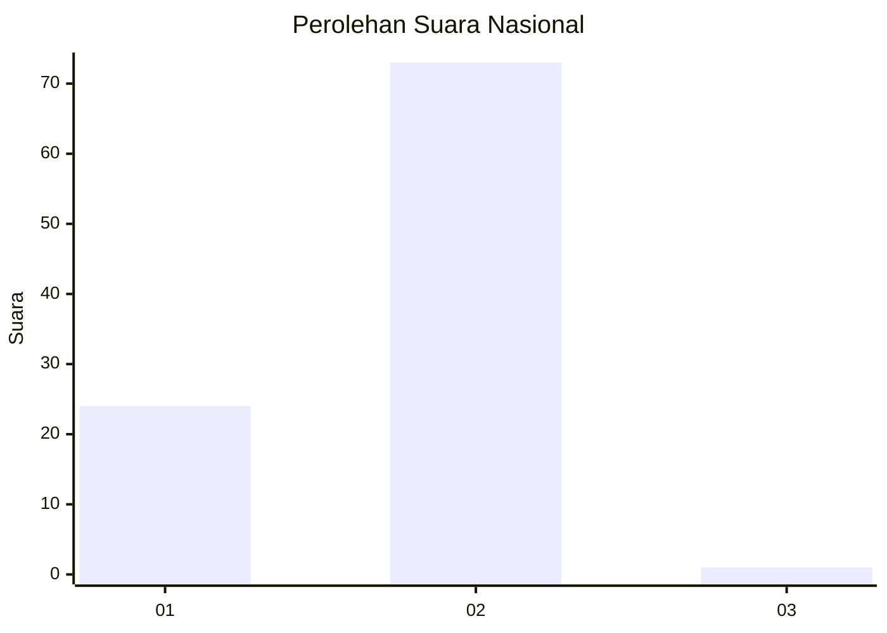
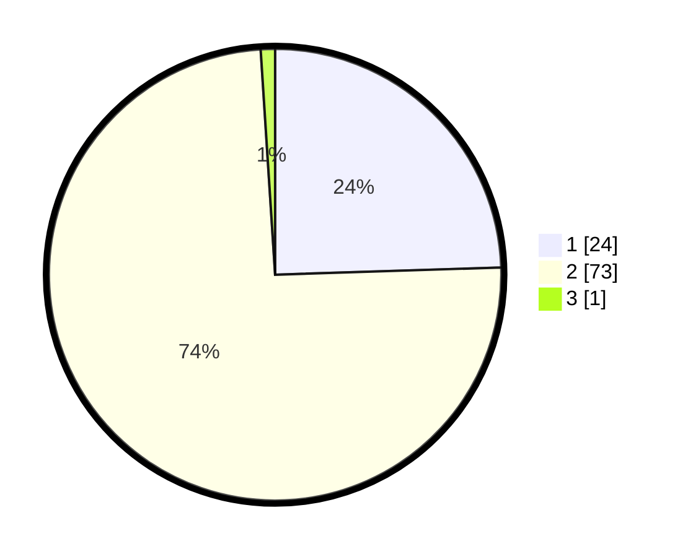

# Hasil

## Grafik

## Tabel

| No. | Nama Paslon    | Suara | Suara (raw) | Persentase |
|:--- |:-------------- | -----:| -----------:| ----------:|
| 1   | ANIES MUHAIMIN | 24    | [24][p-1]   | 24,49      |
| 2   | PRABOWO GIBRAN | 73    | [73][p-2]   | 74,49      |
| 3   | GANJAR MAHFUD  | 1     | [1][p-3]    | 1,02       |

[p-1]: https://github.com/gigit-pemilu/pemilu-2024/blob/main/pilpres/hitung-suara/sub/73-sulawesi-selatan/sub/16-enrekang/sub/02-enrekang/sub/2017-temban/sub/005-tps/sub/paslon-1.txt
[p-2]: https://github.com/gigit-pemilu/pemilu-2024/blob/main/pilpres/hitung-suara/sub/73-sulawesi-selatan/sub/16-enrekang/sub/02-enrekang/sub/2017-temban/sub/005-tps/sub/paslon-2.txt
[p-3]: https://github.com/gigit-pemilu/pemilu-2024/blob/main/pilpres/hitung-suara/sub/73-sulawesi-selatan/sub/16-enrekang/sub/02-enrekang/sub/2017-temban/sub/005-tps/sub/paslon-3.txt

## Foto C Plano

https://sirekap-obj-formc.kpu.go.id/fae9/pemilu/ppwp/73/16/02/20/17/7316022017005-20240215-082841--34c443a7-bc1f-4735-a1f5-08a0d65406af.jpg

https://sirekap-obj-formc.kpu.go.id/fae9/pemilu/ppwp/73/16/02/20/17/7316022017005-20240214-202704--dfb57358-b03d-40fa-9a2c-b318c645b1e3.jpg

https://sirekap-obj-formc.kpu.go.id/fae9/pemilu/ppwp/73/16/02/20/17/7316022017005-20240214-201927--f6c1133a-19b0-441d-aa25-7e4688e759c4.jpg

## Metadata

| Key        | Value               |
| ---------- | ------------------- |
| Time Stamp | 2024-02-15 15:00:29 |

