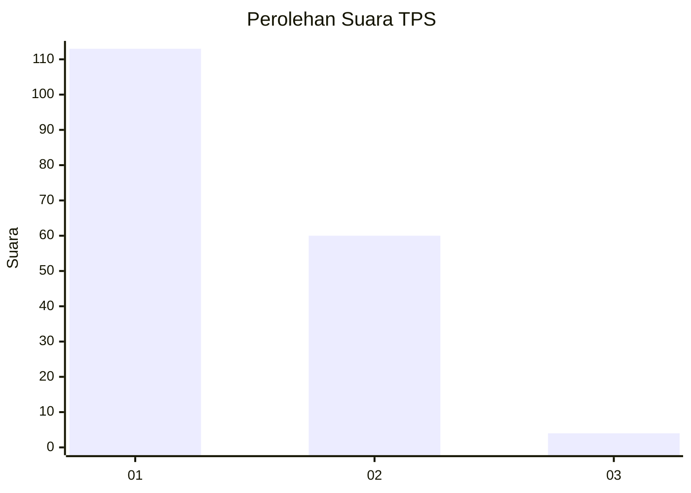
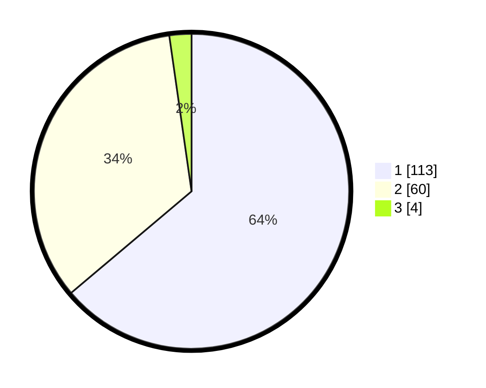

# Hasil

## Grafik

## Tabel

| No. | Nama Paslon    | Suara | Suara (raw) | Persentase |
|:--- |:-------------- | -----:| -----------:| ----------:|
| 1   | ANIES MUHAIMIN | 113   | [113][p-1]  | 63,84      |
| 2   | PRABOWO GIBRAN | 60    | [60][p-2]   | 33,90      |
| 3   | GANJAR MAHFUD  | 4     | [4][p-3]    | 2,26       |

[p-1]: https://github.com/gigit-pemilu/pemilu-2024-73-sulawesi-selatan/blob/main/pilpres/hitung-suara/sub/73-sulawesi-selatan/sub/16-enrekang/sub/03-baraka/sub/1001-baraka/sub/001-tps/sub/paslon-1.txt
[p-2]: https://github.com/gigit-pemilu/pemilu-2024-73-sulawesi-selatan/blob/main/pilpres/hitung-suara/sub/73-sulawesi-selatan/sub/16-enrekang/sub/03-baraka/sub/1001-baraka/sub/001-tps/sub/paslon-2.txt
[p-3]: https://github.com/gigit-pemilu/pemilu-2024-73-sulawesi-selatan/blob/main/pilpres/hitung-suara/sub/73-sulawesi-selatan/sub/16-enrekang/sub/03-baraka/sub/1001-baraka/sub/001-tps/sub/paslon-3.txt

## Foto C Plano

https://sirekap-obj-formc.kpu.go.id/3ce7/pemilu/ppwp/73/16/03/10/01/7316031001001-20240215-171454--770f05f8-be70-42f8-bea8-bb49bb9889e2.jpg

https://sirekap-obj-formc.kpu.go.id/3ce7/pemilu/ppwp/73/16/03/10/01/7316031001001-20240214-223337--c9b6ccce-0736-499b-9338-eaa1851a41a3.jpg

https://sirekap-obj-formc.kpu.go.id/3ce7/pemilu/ppwp/73/16/03/10/01/7316031001001-20240214-223515--68c67c16-0a7a-49fd-a49e-9221cf4e5d1b.jpg

## Metadata

| Key        | Value               |
| ---------- | ------------------- |
| Time Stamp | 2024-02-17 01:00:00 |

