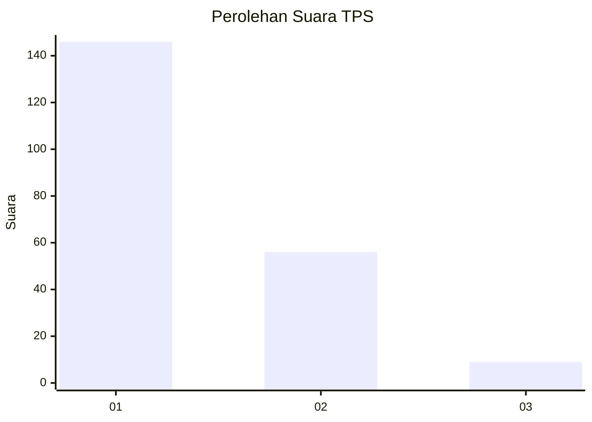
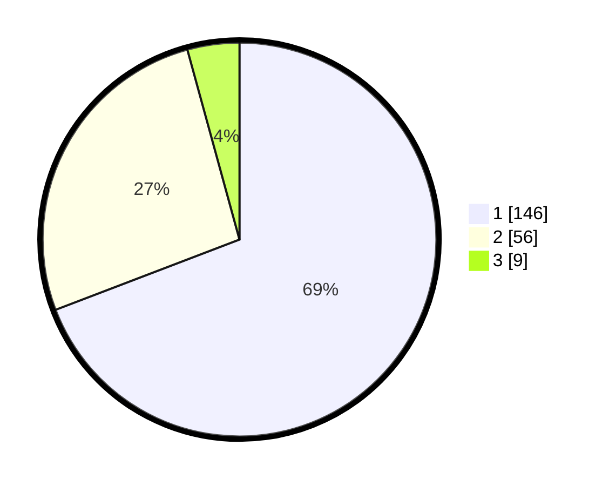

# Hasil

## Grafik

## Tabel

| No. | Nama Paslon    | Suara | Suara (raw) | Persentase |
|:--- |:-------------- | -----:| -----------:| ----------:|
| 1   | ANIES MUHAIMIN | 146   | [146][p-1]  | 69,19      |
| 2   | PRABOWO GIBRAN | 56    | [56][p-2]   | 26,54      |
| 3   | GANJAR MAHFUD  | 9     | [9][p-3]    | 4,27       |

[p-1]: https://github.com/gigit-pemilu/pemilu-2024-73-sulawesi-selatan/blob/main/pilpres/hitung-suara/sub/73-sulawesi-selatan/sub/16-enrekang/sub/03-baraka/sub/2010-tirowali/sub/004-tps/sub/paslon-1.txt
[p-2]: https://github.com/gigit-pemilu/pemilu-2024-73-sulawesi-selatan/blob/main/pilpres/hitung-suara/sub/73-sulawesi-selatan/sub/16-enrekang/sub/03-baraka/sub/2010-tirowali/sub/004-tps/sub/paslon-2.txt
[p-3]: https://github.com/gigit-pemilu/pemilu-2024-73-sulawesi-selatan/blob/main/pilpres/hitung-suara/sub/73-sulawesi-selatan/sub/16-enrekang/sub/03-baraka/sub/2010-tirowali/sub/004-tps/sub/paslon-3.txt

## Foto C Plano

https://sirekap-obj-formc.kpu.go.id/6d19/pemilu/ppwp/73/16/03/20/10/7316032010004-20240215-074812--03fcda6c-e07f-4a8e-bb2b-b945244e0ecc.jpg

https://sirekap-obj-formc.kpu.go.id/6d19/pemilu/ppwp/73/16/03/20/10/7316032010004-20240215-075104--ed69cdd2-1c5d-4ae7-8491-e6c2d21de47d.jpg

https://sirekap-obj-formc.kpu.go.id/6d19/pemilu/ppwp/73/16/03/20/10/7316032010004-20240215-075847--8cbfc9dd-19d1-4a31-9f1c-704f47393a9d.jpg

## Metadata

| Key        | Value               |
| ---------- | ------------------- |
| Time Stamp | 2024-02-17 17:30:00 |

