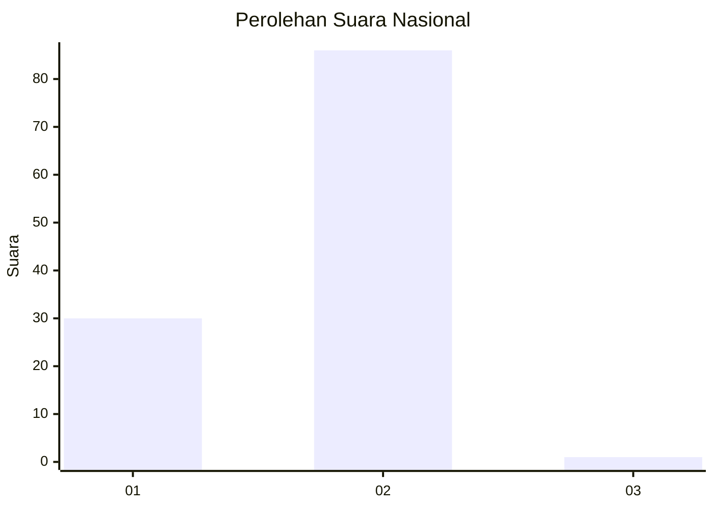
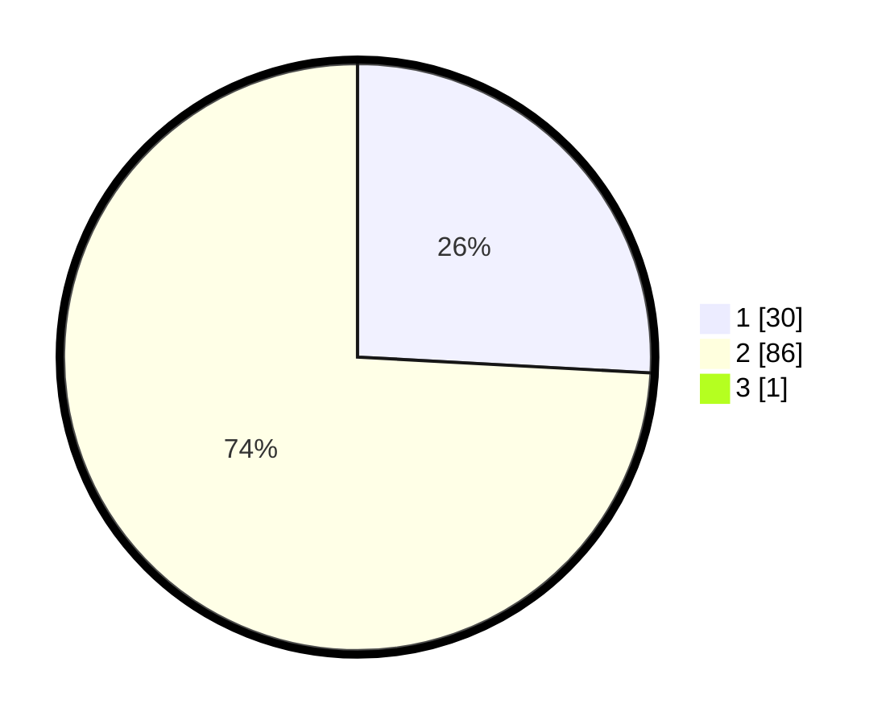

# Hasil

## Grafik

## Tabel

| No. | Nama Paslon    | Suara | Suara (raw) | Persentase |
|:--- |:-------------- | -----:| -----------:| ----------:|
| 1   | ANIES MUHAIMIN | 30    | [30][p-1]   | 25,64      |
| 2   | PRABOWO GIBRAN | 86    | [86][p-2]   | 73,50      |
| 3   | GANJAR MAHFUD  | 1     | [1][p-3]    | 0,85       |

[p-1]: https://github.com/gigit-pemilu/pemilu-2024/blob/main/pilpres/hitung-suara/sub/73-sulawesi-selatan/sub/16-enrekang/sub/03-baraka/sub/2011-pepandungan/sub/003-tps/sub/paslon-1.txt
[p-2]: https://github.com/gigit-pemilu/pemilu-2024/blob/main/pilpres/hitung-suara/sub/73-sulawesi-selatan/sub/16-enrekang/sub/03-baraka/sub/2011-pepandungan/sub/003-tps/sub/paslon-2.txt
[p-3]: https://github.com/gigit-pemilu/pemilu-2024/blob/main/pilpres/hitung-suara/sub/73-sulawesi-selatan/sub/16-enrekang/sub/03-baraka/sub/2011-pepandungan/sub/003-tps/sub/paslon-3.txt

## Foto C Plano

https://sirekap-obj-formc.kpu.go.id/e2b4/pemilu/ppwp/73/16/03/20/11/7316032011003-20240215-093558--eaac34d8-1f38-470d-8e9c-f6bb0922118f.jpg

https://sirekap-obj-formc.kpu.go.id/e2b4/pemilu/ppwp/73/16/03/20/11/7316032011003-20240215-093837--9fede0ba-3b05-4088-ab4c-814bee6c52a4.jpg

https://sirekap-obj-formc.kpu.go.id/e2b4/pemilu/ppwp/73/16/03/20/11/7316032011003-20240215-094058--cc4c84dc-cb9b-418f-850d-9a96a9b05c7f.jpg

## Metadata

| Key        | Value               |
| ---------- | ------------------- |
| Time Stamp | 2024-02-17 17:30:00 |

