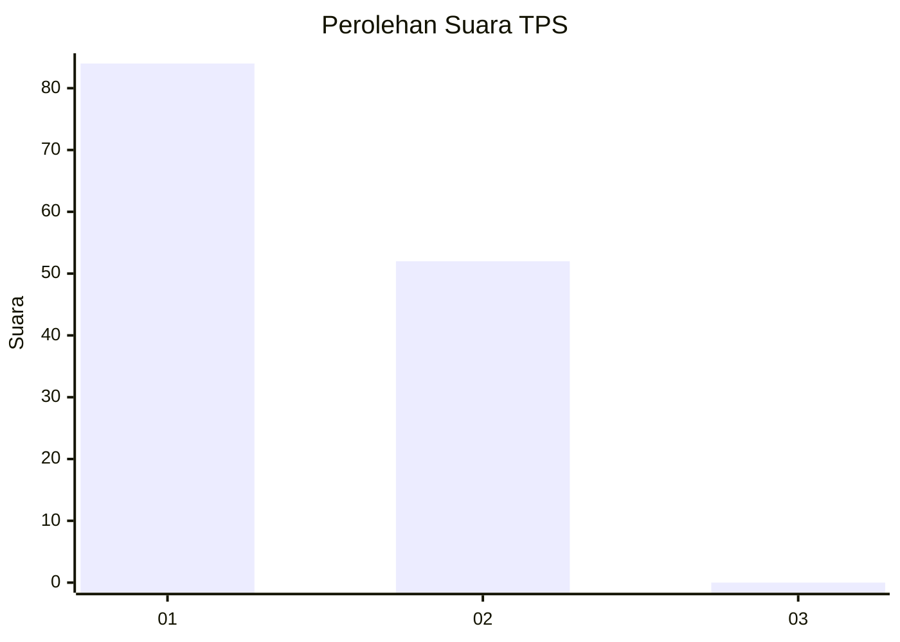
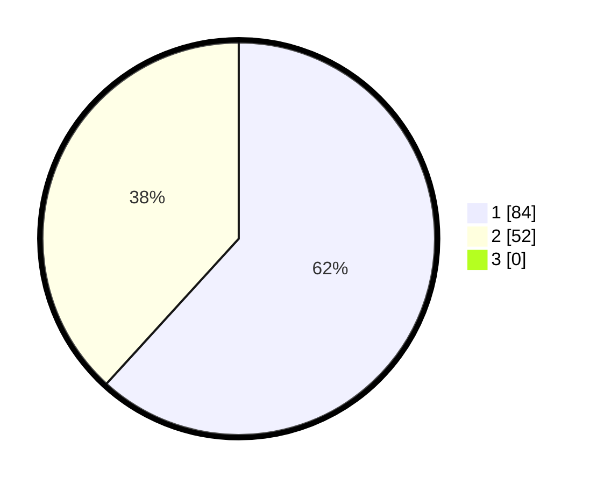

# Hasil

## Grafik

## Tabel

| No. | Nama Paslon    | Suara | Suara (raw) | Persentase |
|:--- |:-------------- | -----:| -----------:| ----------:|
| 1   | ANIES MUHAIMIN | 84    | [84][p-1]   | 61,76      |
| 2   | PRABOWO GIBRAN | 52    | [52][p-2]   | 38,24      |
| 3   | GANJAR MAHFUD  | 0     | [0][p-3]    | 0,00       |

[p-1]: https://github.com/gigit-pemilu/pemilu-2024-73-sulawesi-selatan/blob/main/pilpres/hitung-suara/sub/73-sulawesi-selatan/sub/16-enrekang/sub/03-baraka/sub/2012-kendenan/sub/005-tps/sub/paslon-1.txt
[p-2]: https://github.com/gigit-pemilu/pemilu-2024-73-sulawesi-selatan/blob/main/pilpres/hitung-suara/sub/73-sulawesi-selatan/sub/16-enrekang/sub/03-baraka/sub/2012-kendenan/sub/005-tps/sub/paslon-2.txt
[p-3]: https://github.com/gigit-pemilu/pemilu-2024-73-sulawesi-selatan/blob/main/pilpres/hitung-suara/sub/73-sulawesi-selatan/sub/16-enrekang/sub/03-baraka/sub/2012-kendenan/sub/005-tps/sub/paslon-3.txt

## Foto C Plano

https://sirekap-obj-formc.kpu.go.id/5d25/pemilu/ppwp/73/16/03/20/12/7316032012005-20240215-113024--eedb00e7-4ce7-46e4-a608-05ce892723d6.jpg

https://sirekap-obj-formc.kpu.go.id/5d25/pemilu/ppwp/73/16/03/20/12/7316032012005-20240215-115020--b5cf2970-75ff-4cf3-9e62-fa236511462d.jpg

https://sirekap-obj-formc.kpu.go.id/5d25/pemilu/ppwp/73/16/03/20/12/7316032012005-20240215-115256--e520e81d-42be-4c69-9b46-dee0089c61d8.jpg

## Metadata

| Key        | Value               |
| ---------- | ------------------- |
| Time Stamp | 2024-02-16 06:00:27 |

