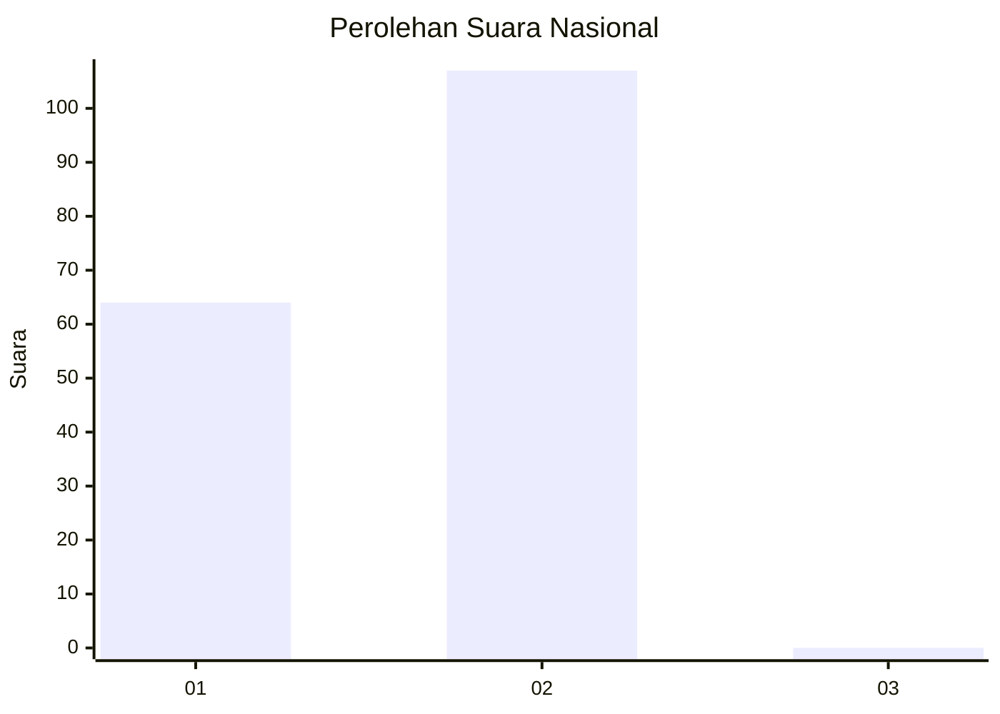
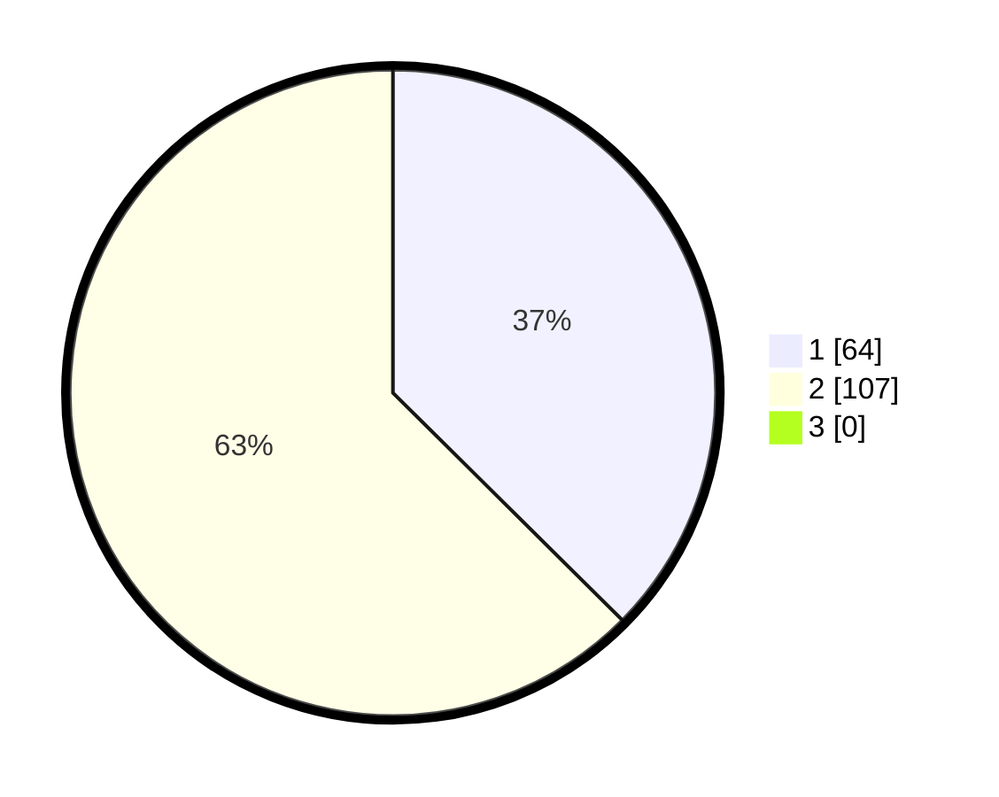

# Hasil

## Grafik

## Tabel

| No. | Nama Paslon    | Suara | Suara (raw) | Persentase |
|:--- |:-------------- | -----:| -----------:| ----------:|
| 1   | ANIES MUHAIMIN | 64    | [64][p-1]   | 37,43      |
| 2   | PRABOWO GIBRAN | 107   | [107][p-2]  | 62,57      |
| 3   | GANJAR MAHFUD  | 0     | [0][p-3]    | 0,00       |

[p-1]: https://github.com/gigit-pemilu/pemilu-2024/blob/main/pilpres/hitung-suara/sub/73-sulawesi-selatan/sub/16-enrekang/sub/05-alla/sub/2004-mata-allo/sub/002-tps/sub/paslon-1.txt
[p-2]: https://github.com/gigit-pemilu/pemilu-2024/blob/main/pilpres/hitung-suara/sub/73-sulawesi-selatan/sub/16-enrekang/sub/05-alla/sub/2004-mata-allo/sub/002-tps/sub/paslon-2.txt
[p-3]: https://github.com/gigit-pemilu/pemilu-2024/blob/main/pilpres/hitung-suara/sub/73-sulawesi-selatan/sub/16-enrekang/sub/05-alla/sub/2004-mata-allo/sub/002-tps/sub/paslon-3.txt

## Foto C Plano

https://sirekap-obj-formc.kpu.go.id/19a4/pemilu/ppwp/73/16/05/20/04/7316052004002-20240214-202701--264bfac3-f70d-43fd-a371-9c2eb6bb382d.jpg

https://sirekap-obj-formc.kpu.go.id/19a4/pemilu/ppwp/73/16/05/20/04/7316052004002-20240214-201711--ef515912-4a6d-43fc-8343-1a032c3712af.jpg

https://sirekap-obj-formc.kpu.go.id/19a4/pemilu/ppwp/73/16/05/20/04/7316052004002-20240214-202548--a455af24-8d33-4f5b-9209-607b25fc47e2.jpg

## Metadata

| Key        | Value               |
| ---------- | ------------------- |
| Time Stamp | 2024-02-16 23:30:00 |

