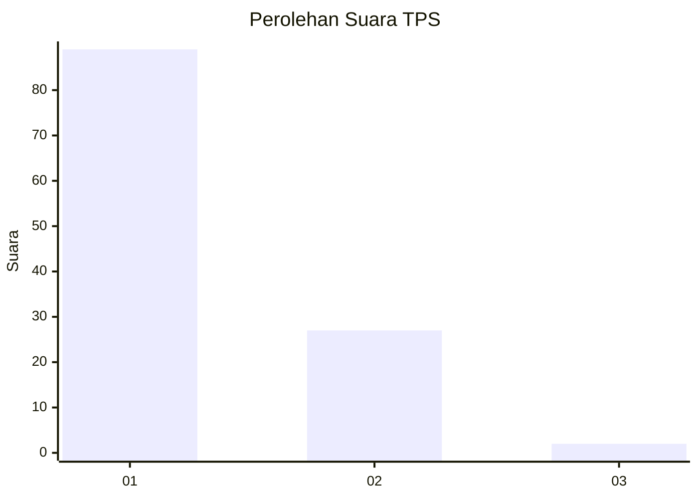
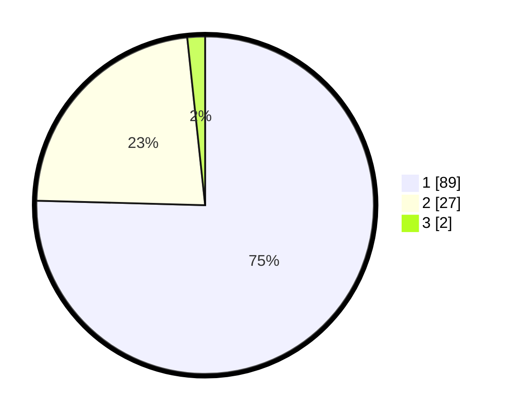

# Hasil

## Grafik

## Tabel

| No. | Nama Paslon    | Suara | Suara (raw) | Persentase |
|:--- |:-------------- | -----:| -----------:| ----------:|
| 1   | ANIES MUHAIMIN | 89    | [89][p-1]   | 75,42      |
| 2   | PRABOWO GIBRAN | 27    | [27][p-2]   | 22,88      |
| 3   | GANJAR MAHFUD  | 2     | [2][p-3]    | 1,69       |

[p-1]: https://github.com/gigit-pemilu/pemilu-2024-73-sulawesi-selatan/blob/main/pilpres/hitung-suara/sub/73-sulawesi-selatan/sub/16-enrekang/sub/05-alla/sub/2017-taulo/sub/005-tps/sub/paslon-1.txt
[p-2]: https://github.com/gigit-pemilu/pemilu-2024-73-sulawesi-selatan/blob/main/pilpres/hitung-suara/sub/73-sulawesi-selatan/sub/16-enrekang/sub/05-alla/sub/2017-taulo/sub/005-tps/sub/paslon-2.txt
[p-3]: https://github.com/gigit-pemilu/pemilu-2024-73-sulawesi-selatan/blob/main/pilpres/hitung-suara/sub/73-sulawesi-selatan/sub/16-enrekang/sub/05-alla/sub/2017-taulo/sub/005-tps/sub/paslon-3.txt

## Foto C Plano

https://sirekap-obj-formc.kpu.go.id/67a5/pemilu/ppwp/73/16/05/20/17/7316052017005-20240214-234340--c4d254bf-ea4a-4eac-9a8c-febf7a631792.jpg

https://sirekap-obj-formc.kpu.go.id/67a5/pemilu/ppwp/73/16/05/20/17/7316052017005-20240215-025724--1d82ed78-f842-41d2-9729-be97433abed3.jpg

https://sirekap-obj-formc.kpu.go.id/67a5/pemilu/ppwp/73/16/05/20/17/7316052017005-20240216-132040--4aec7182-3c71-456c-9e64-d7df016d20f6.jpg

## Metadata

| Key        | Value               |
| ---------- | ------------------- |
| Time Stamp | 2024-02-16 13:30:32 |

