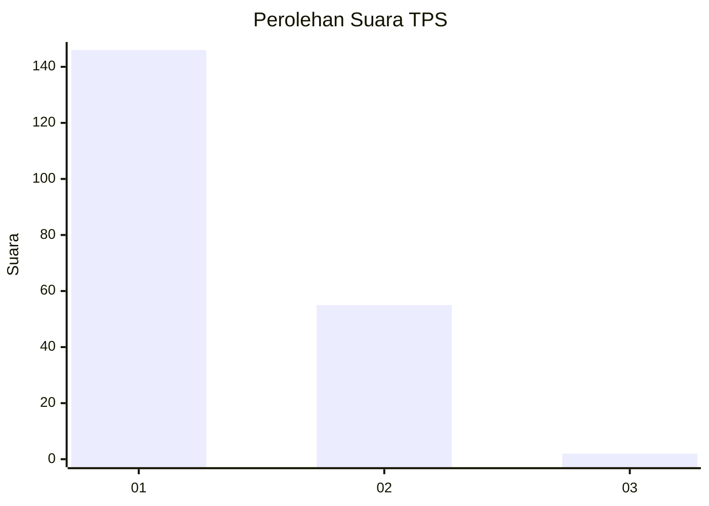
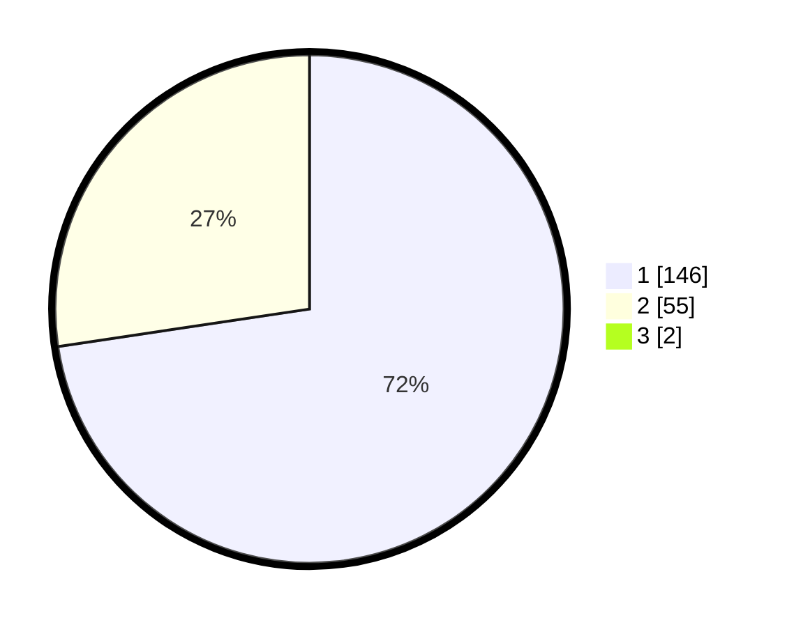

# Hasil

## Grafik

## Tabel

| No. | Nama Paslon    | Suara | Suara (raw) | Persentase |
|:--- |:-------------- | -----:| -----------:| ----------:|
| 1   | ANIES MUHAIMIN | 146   | [146][p-1]  | 71,92      |
| 2   | PRABOWO GIBRAN | 55    | [55][p-2]   | 27,09      |
| 3   | GANJAR MAHFUD  | 2     | [2][p-3]    | 0,99       |

[p-1]: https://github.com/gigit-pemilu/pemilu-2024-73-sulawesi-selatan/blob/main/pilpres/hitung-suara/sub/73-sulawesi-selatan/sub/16-enrekang/sub/10-buntu-batu/sub/2001-pasui/sub/001-tps/sub/paslon-1.txt
[p-2]: https://github.com/gigit-pemilu/pemilu-2024-73-sulawesi-selatan/blob/main/pilpres/hitung-suara/sub/73-sulawesi-selatan/sub/16-enrekang/sub/10-buntu-batu/sub/2001-pasui/sub/001-tps/sub/paslon-2.txt
[p-3]: https://github.com/gigit-pemilu/pemilu-2024-73-sulawesi-selatan/blob/main/pilpres/hitung-suara/sub/73-sulawesi-selatan/sub/16-enrekang/sub/10-buntu-batu/sub/2001-pasui/sub/001-tps/sub/paslon-3.txt

## Foto C Plano

https://sirekap-obj-formc.kpu.go.id/d35e/pemilu/ppwp/73/16/10/20/01/7316102001001-20240214-221202--dc3daf61-031f-45ca-be5d-4f3cb3e84bf6.jpg

https://sirekap-obj-formc.kpu.go.id/d35e/pemilu/ppwp/73/16/10/20/01/7316102001001-20240214-221212--8ca53077-dfc7-4cf7-9075-f6ff415a2035.jpg

https://sirekap-obj-formc.kpu.go.id/d35e/pemilu/ppwp/73/16/10/20/01/7316102001001-20240215-061248--94e29174-70db-4519-b434-024faa2bd074.jpg

## Metadata

| Key        | Value               |
| ---------- | ------------------- |
| Time Stamp | 2024-02-15 15:00:29 |

