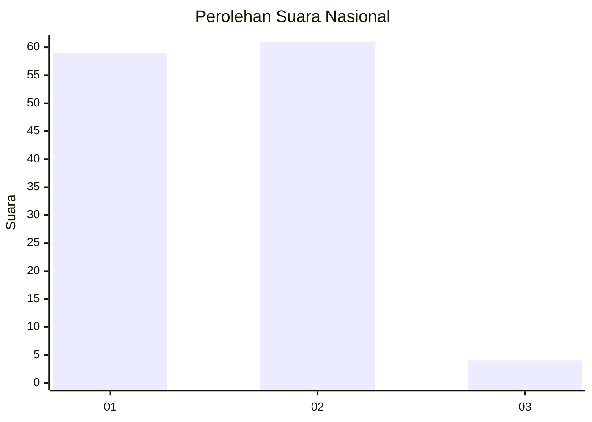
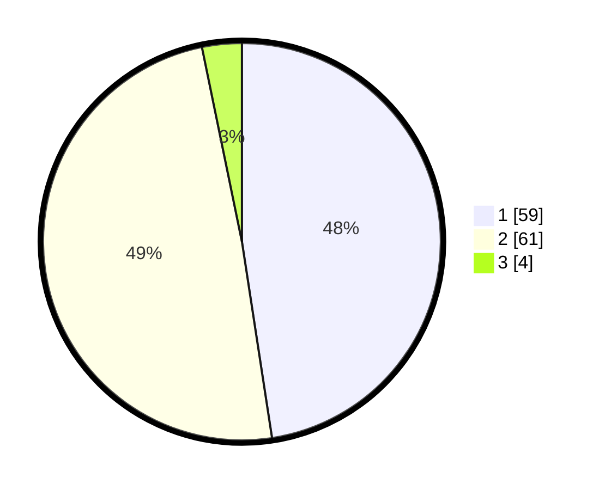

# Hasil

## Grafik

## Tabel

| No. | Nama Paslon    | Suara | Suara (raw) | Persentase |
|:--- |:-------------- | -----:| -----------:| ----------:|
| 1   | ANIES MUHAIMIN | 59    | [59][p-1]   | 47,58      |
| 2   | PRABOWO GIBRAN | 61    | [61][p-2]   | 49,19      |
| 3   | GANJAR MAHFUD  | 4     | [4][p-3]    | 3,23       |

[p-1]: https://github.com/gigit-pemilu/pemilu-2024/blob/main/pilpres/hitung-suara/sub/73-sulawesi-selatan/sub/16-enrekang/sub/10-buntu-batu/sub/2001-pasui/sub/003-tps/sub/paslon-1.txt
[p-2]: https://github.com/gigit-pemilu/pemilu-2024/blob/main/pilpres/hitung-suara/sub/73-sulawesi-selatan/sub/16-enrekang/sub/10-buntu-batu/sub/2001-pasui/sub/003-tps/sub/paslon-2.txt
[p-3]: https://github.com/gigit-pemilu/pemilu-2024/blob/main/pilpres/hitung-suara/sub/73-sulawesi-selatan/sub/16-enrekang/sub/10-buntu-batu/sub/2001-pasui/sub/003-tps/sub/paslon-3.txt

## Foto C Plano

https://sirekap-obj-formc.kpu.go.id/da33/pemilu/ppwp/73/16/10/20/01/7316102001003-20240214-230618--bb56eea3-7b64-4483-929f-403c00a4d562.jpg

https://sirekap-obj-formc.kpu.go.id/da33/pemilu/ppwp/73/16/10/20/01/7316102001003-20240215-084633--f7411064-c4a4-4655-9ab3-68b5a3729e50.jpg

https://sirekap-obj-formc.kpu.go.id/da33/pemilu/ppwp/73/16/10/20/01/7316102001003-20240215-072159--442ac593-de80-4073-be89-b009abef85b2.jpg

## Metadata

| Key        | Value               |
| ---------- | ------------------- |
| Time Stamp | 2024-02-17 16:36:25 |

