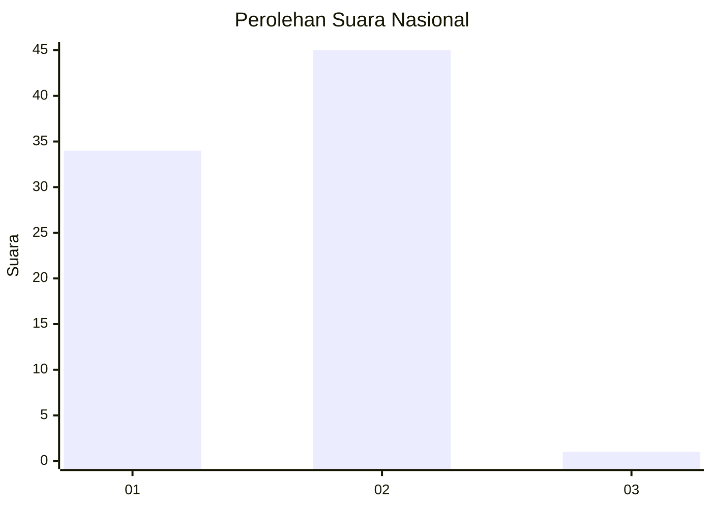
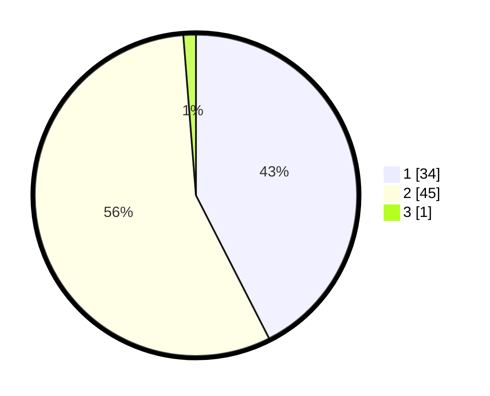

# Hasil

## Grafik

## Tabel

| No. | Nama Paslon    | Suara | Suara (raw) | Persentase |
|:--- |:-------------- | -----:| -----------:| ----------:|
| 1   | ANIES MUHAIMIN | 34    | [34][p-1]   | 42,50      |
| 2   | PRABOWO GIBRAN | 45    | [45][p-2]   | 56,25      |
| 3   | GANJAR MAHFUD  | 1     | [1][p-3]    | 1,25       |

[p-1]: https://github.com/gigit-pemilu/pemilu-2024/blob/main/pilpres/hitung-suara/sub/73-sulawesi-selatan/sub/16-enrekang/sub/10-buntu-batu/sub/2003-latimojong/sub/009-tps/sub/paslon-1.txt
[p-2]: https://github.com/gigit-pemilu/pemilu-2024/blob/main/pilpres/hitung-suara/sub/73-sulawesi-selatan/sub/16-enrekang/sub/10-buntu-batu/sub/2003-latimojong/sub/009-tps/sub/paslon-2.txt
[p-3]: https://github.com/gigit-pemilu/pemilu-2024/blob/main/pilpres/hitung-suara/sub/73-sulawesi-selatan/sub/16-enrekang/sub/10-buntu-batu/sub/2003-latimojong/sub/009-tps/sub/paslon-3.txt

## Foto C Plano

https://sirekap-obj-formc.kpu.go.id/9789/pemilu/ppwp/73/16/10/20/03/7316102003009-20240214-232624--74678713-67e4-49a6-bd6d-302c010eb41a.jpg

https://sirekap-obj-formc.kpu.go.id/9789/pemilu/ppwp/73/16/10/20/03/7316102003009-20240214-221023--92494485-9509-4d4e-b34e-95f1b4144b22.jpg

https://sirekap-obj-formc.kpu.go.id/9789/pemilu/ppwp/73/16/10/20/03/7316102003009-20240214-221228--3007f451-3265-4f7a-ad52-92126108a45d.jpg

## Metadata

| Key        | Value               |
| ---------- | ------------------- |
| Time Stamp | 2024-02-17 18:30:00 |

