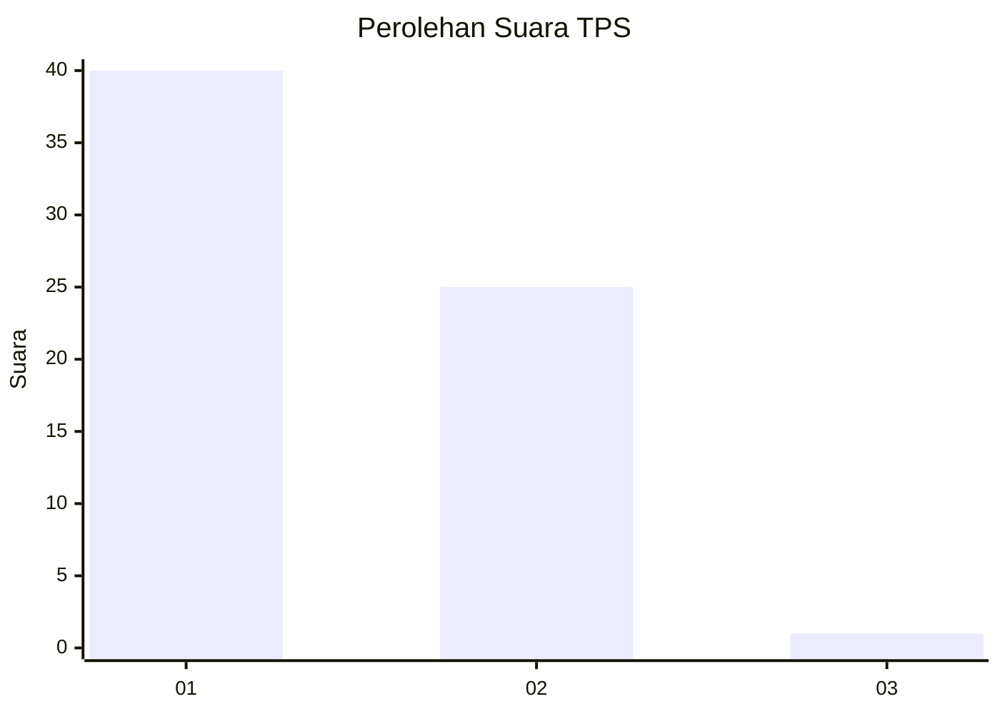
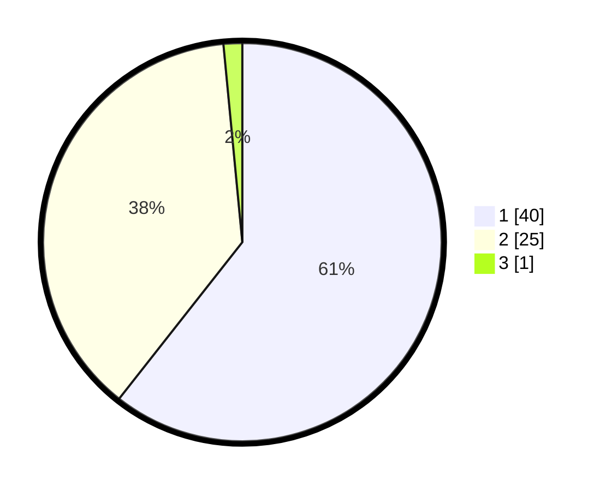

# Hasil

## Grafik

## Tabel

| No. | Nama Paslon    | Suara | Suara (raw) | Persentase |
|:--- |:-------------- | -----:| -----------:| ----------:|
| 1   | ANIES MUHAIMIN | 40    | [40][p-1]   | 60,61      |
| 2   | PRABOWO GIBRAN | 25    | [25][p-2]   | 37,88      |
| 3   | GANJAR MAHFUD  | 1     | [1][p-3]    | 1,52       |

[p-1]: https://github.com/gigit-pemilu/pemilu-2024-73-sulawesi-selatan/blob/main/pilpres/hitung-suara/sub/73-sulawesi-selatan/sub/16-enrekang/sub/10-buntu-batu/sub/2008-potok-ullin/sub/003-tps/sub/paslon-1.txt
[p-2]: https://github.com/gigit-pemilu/pemilu-2024-73-sulawesi-selatan/blob/main/pilpres/hitung-suara/sub/73-sulawesi-selatan/sub/16-enrekang/sub/10-buntu-batu/sub/2008-potok-ullin/sub/003-tps/sub/paslon-2.txt
[p-3]: https://github.com/gigit-pemilu/pemilu-2024-73-sulawesi-selatan/blob/main/pilpres/hitung-suara/sub/73-sulawesi-selatan/sub/16-enrekang/sub/10-buntu-batu/sub/2008-potok-ullin/sub/003-tps/sub/paslon-3.txt

## Foto C Plano

https://sirekap-obj-formc.kpu.go.id/c772/pemilu/ppwp/73/16/10/20/08/7316102008003-20240215-062435--17842284-adda-4a4f-8ba0-d0340c0a1b17.jpg

https://sirekap-obj-formc.kpu.go.id/c772/pemilu/ppwp/73/16/10/20/08/7316102008003-20240215-063028--962d3fd7-35d1-47b2-92ae-5f13b26a2c43.jpg

https://sirekap-obj-formc.kpu.go.id/c772/pemilu/ppwp/73/16/10/20/08/7316102008003-20240215-063543--c39c6b0d-c8ac-4f21-a7ab-b1c3cc7fa3e8.jpg

## Metadata

| Key        | Value               |
| ---------- | ------------------- |
| Time Stamp | 2024-02-17 18:30:00 |

